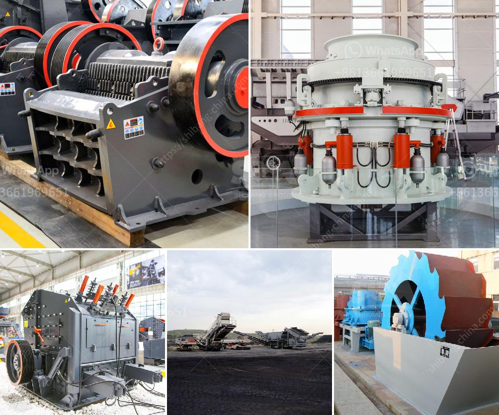

<h3>آلة صنع الرمل الاصطناعي</h3>
تعتبر آلة صنع الرمل الاصطناعي أحد التقنيات الحديثة في صناعة البناء والتشييد. تهدف هذه الآلة إلى إنتاج الرمل الصناعي باستخدام عملية تكسير الحجارة الطبيعية وتحويلها إلى جسيمات رملية ذات جودة عالية.

تعد الرمال الصناعية بديلاً جيدًا للرمال الطبيعية المحدودة الموجودة في الطبيعة. تقوم هذه الآلة بطحن الحجارة الكبيرة وتفتيتها إلى جزيئات صغيرة تشبه الرمل. يتم ذلك عن طريق استخدام جهاز تكسير خاص يعمل بواسطة قوة المكبس والاحتكاك لتكسير الأحجار وتحويلها إلى رمل صناعي.

أحد الميزات الرئيسية لآلة صنع الرمل الاصطناعي هي قدرتها على تحقيق توازن بين الجودة والكفاءة. يعني ذلك أن الرمل الصناعي الذي تنتجه الآلة لديه خصائص فيزيائية وكيميائية مناسبة للاستخدام في البناء، كما أن عملية الإنتاج تتم بطريقة سريعة وفعالة.

يعد الرمل الاصطناعي منتجًا قائمًا على التكنولوجيا وصديقًا للبيئة. فبدلاً من استخدام الرمال الطبيعية التي يتم استخراجها من الأنهار والبحيرات، يتم استخدام الحجارة الكبيرة التي يتم وجودها بكميات كبيرة في مواقع البناء. هذا يحمي البيئة الطبيعية ويحافظ على توازن النظام البيئي.

بالإضافة إلى ذلك، يعتبر الرمل الاصطناعي أيضًا مواد بناء متعددة الاستخدامات. فهو يمكن استخدامه في البناء والعمارة وصناعة الطرق والأعمال المدنية الأخرى. تعتبر القدرة على استخدامه في تشكيل الخرسانة أحد أكبر الفوائد التي يوفرها الرمل الاصطناعي.

بشكل عام، تعد آلة صنع الرمل الاصطناعي تقنية حديثة ومبتكرة تعزز الاستدامة وتحسن جودة المواد البنائية. تساهم في حماية البيئة وتلبية الاحتياجات المتزايدة للرمل في صناعة البناء والتشييد.
<h3>Contact us</h3><ul><li><strong>Whatsapp:&nbsp;<a href="https://wa.me/8613661969651">+8613661969651</a></strong></li><li><a href="https://swt.shibang-china.com/?git&amp;zhl&amp;آلة صنع الرمل الاصطناعي"><strong>Online Service(chat now)</strong></a></li></ul><h3>Related</h3><ul><li><a href='مطحنة هامر للحجر الجيري في جنوب أفريقيا.md'>مطحنة هامر للحجر الجيري في جنوب أفريقيا</a></li><li><a href='مصنع غسيل وفرز للتأجير في جنوب أفريقيا.md'>مصنع غسيل وفرز للتأجير في جنوب أفريقيا</a></li><li><a href='كسارات لآلة إعادة التدوير في الإمارات.md'>كسارات لآلة إعادة التدوير في الإمارات</a></li><li><a href='مطاحن الكرة في فيزاج.md'>مطاحن الكرة في فيزاج</a></li><li><a href='كسارات حجر محمولة أوغندا للبيع.md'>كسارات حجر محمولة أوغندا للبيع</a></li></ul>