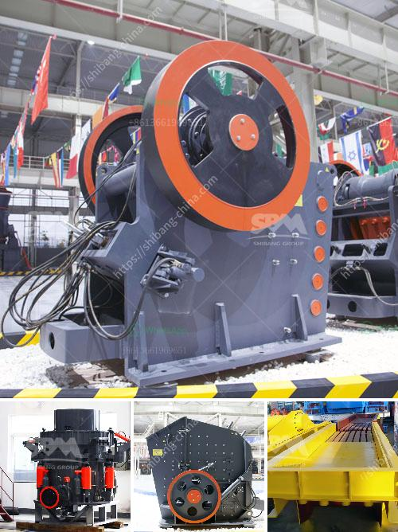

<h3>آلة صنع الرمل الحجر في نيجيريا</h3>
تعد آلة صنع الرمل الحجر واحدة من الآلات المستخدمة بكثرة في قطاع البناء في نيجيريا. هذه الآلة تعتبر جزءًا أساسيًا من عملية تكسير وطحن الصخور الكبيرة إلى جسيمات أصغر من الرمل والحصى المستخدمة في الإنشاءات والبناء.

تتكون آلة صنع الرمل الحجر من أجزاء مختلفة، مثل الفك المتحرك، الفك الثابت، الحلقة الدوارة، العمود الرأسي وغيرها. تتحرك الصخور الكبيرة داخل الماكينة وتتم عملية التكسير بواسطة الضغط والروتاري، وتنتقل الجسيمات الناعمة والخشنة إلى الجهاز الفاصل لفصلها بطريقة متناسقة.

تقدم آلة صنع الرمل الحجر في نيجيريا العديد من المزايا. أولاً، تعتبر هذه الآلة فعالة من حيث التكلفة، حيث توفر فرصة لإنتاج الرمل والحصى ذات الجودة العالية بكميات كبيرة وبتكلفة أقل مقارنة بطرق التصنيع التقليدية. ثانيًا، فإن آلة صنع الرمل الحجر تعمل بشكل آلي، مما يزيد من كفاءة الإنتاج ويقلل من تكاليف العمالة والوقت.

وبالإضافة إلى ذلك، تعتبر مكونات هذه الآلة متينة وقوية، مما يجعلها قادرة على التعامل مع صخور الحجم الكبير بكفاءة عالية ودقة. تُعد آلة صنع الرمل الحجر مثالية للاستخدام في مشاريع البنية التحتية مثل الطرق والجسور والأبنية المختلفة.

بالإضافة إلى التطبيقات العمرانية، يمكن أيضًا استخدام آلة صنع الرمل الحجر في صناعات أخرى مثل صناعة الزجاج والصناعات الكيماوية والصناعات الأخرى التي تحتاج إلى مواد خام ذات جودة عالية مثل الرمال والحصى.

في النهاية، تلعب آلة صنع الرمل الحجر دورًا حاسمًا في تطوير وبناء البنية التحتية في نيجيريا. تساهم في توفير الموارد الضرورية للبناء وتحسين جودة المباني والمشاريع. يمكن أن تؤدي هذه الآلة إلى زيادة الإنتاجية وتوفير الوقت والجهد في صناعة البناء.

لذا، يجب أن نولي اهتمامًا كبيرًا لتطوير وتعزيز هذه الآلات في نيجيريا، وتطوير الكفاءات المحلية للتخصص في صناعة صنع الرمل الحجر والحفاظ على جودتها وكفاءتها. هذا سيساهم في تعزيز التخطيط الحضري وتطوير قطاع البناء في البلاد وتحقيق التقدم الاقتصادي والاجتماعي.
<h3>Contact us</h3><ul><li><strong>Whatsapp:&nbsp;<a href="https://wa.me/8613661969651">+8613661969651</a></strong></li><li><a href="https://swt.shibang-china.com/?git&amp;zhl&amp;آلة صنع الرمل الحجر في نيجيريا"><strong>Online Service(chat now)</strong></a></li></ul><h3>Related</h3><ul><li><a href='كسارة الحجر بسعة 200 طن في الساعة.md'>كسارة الحجر بسعة 200 طن في الساعة</a></li><li><a href='تكلفة كسارة السيليكا.md'>تكلفة كسارة السيليكا</a></li><li><a href='سعر مطحنة صغيرة.md'>سعر مطحنة صغيرة</a></li><li><a href='كيماويات تعويم تحسين الفحم في الهند.md'>كيماويات تعويم تحسين الفحم في الهند</a></li><li><a href='آلة كسارة حجر للبيع.md'>آلة كسارة حجر للبيع</a></li></ul>