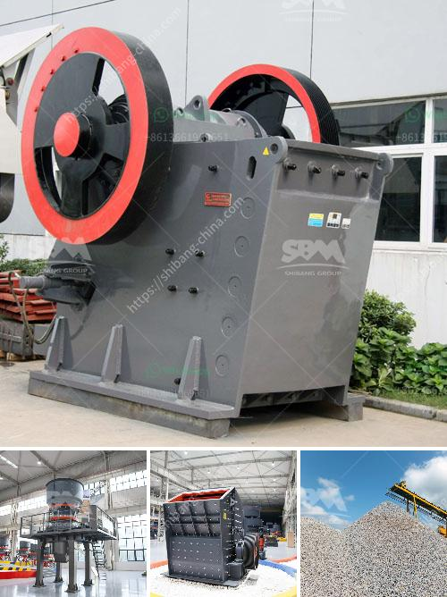

<h3>آلة صنع الرمل في جنوب أفريقيا</h3>
يعتبر الرمل من المواد الأساسية في صناعة البناء والبنى التحتية، ولذلك فإن ماكينة صنع الرمل تلعب دوراً هاماً في هذا المجال. وفي جنوب أفريقيا، تتمتع هذه الآلة بشهرة واسعة وتعتبر حجر الزاوية في العديد من المشاريع الكبيرة.

تتميز ماكينة صنع الرمل في جنوب أفريقيا بالقدرة على صنع الرمل عالي الجودة والنقاء، وذلك بفضل تقنياتها المتطورة واستخدامها لأحدث التقنيات في مجال التكسير والطحن. تعتمد هذه الآلة على مبدأ تحويل الصخور إلى الرمال، حيث يتم استخدام وحدة التكسير المطرقة لكسر الصخور الكبيرة إلى أجزاء صغيرة، ثم يتم تحويل هذه الأجزاء إلى الرمل المطلوب.

بفضل تكنولوجياها المتقدمة، تعتبر ماكينة صنع الرمل في جنوب أفريقيا قادرة على إنتاج الرمل بأحجام ومواصفات مختلفة وفقًا لاحتياجات المشروع المطلوب. كما أنها تعتمد على آلية الحركة المستمرة للمواد الخام، مما يؤدي إلى زيادة كفاءة العمل وتقليل التكلفة العامة.

تُستخدم ماكينة صنع الرمل في جنوب أفريقيا في العديد من الصناعات، بما في ذلك صناعة البناء والبنى التحتية، وكذلك صناعة الركام والأسفلت. تُعتبر هذه الآلة جزءًا أساسيًا في تحسين جودة الرمل وفحصه، حيث تزيل الشوائب وتفصل الرمال المختلفة حسب حجمها، مما يساعد على تحسين جودة المنتج النهائي وزيادة قدرته التحملية.

إضافة إلى ذلك، تُساعد ماكينة صنع الرمل في جنوب أفريقيا على تحسين سرعة البناء وتخفيض تكلفته. فبدلاً من شراء الرمال جاهزة، يمكن للشركات والمقاولين صنع الرمال التي يحتاجونها في الموقع مباشرة، مما يوفر الكثير من المال والوقت.

باختصار، تعتبر ماكينة صنع الرمل في جنوب أفريقيا أداة لا غنى عنها في صناعة البناء والبنى التحتية. بفضل تكنولوجياها المتقدمة وقدرتها على إنتاج الرمل بتنوع الأحجام والمواصفات، فهي تساهم في تحسين جودة الرمل وتقليل التكلفة العامة للمشروع. تستخدم هذه الآلة في العديد من الصناعات وتعتبر جزءًا أساسيًا في عملية البناء وتطوير الأعمال في جنوب أفريقيا.
<h3>Contact us</h3><ul><li><strong>Whatsapp:&nbsp;<a href="https://wa.me/8613661969651">+8613661969651</a></strong></li><li><a href="https://swt.shibang-china.com/?git&amp;zhl&amp;آلة صنع الرمل في جنوب أفريقيا"><strong>Online Service(chat now)</strong></a></li></ul><h3>Related</h3><ul><li><a href='مصنع غسيل الرمال للبيع في الإمارات.md'>مصنع غسيل الرمال للبيع في الإمارات</a></li><li><a href='كم عدد شركات تصنيع كسارات الفك في الهند.md'>كم عدد شركات تصنيع كسارات الفك في الهند</a></li><li><a href='نوع من مطحنة الكرة.md'>نوع من مطحنة الكرة</a></li><li><a href='مطحنة قضيب الطحن الجاف.md'>مطحنة قضيب الطحن الجاف</a></li><li><a href='إجراءات مكتبية لمصنع كسارة الحجر في مدى.md'>إجراءات مكتبية لمصنع كسارة الحجر في مدى</a></li></ul>