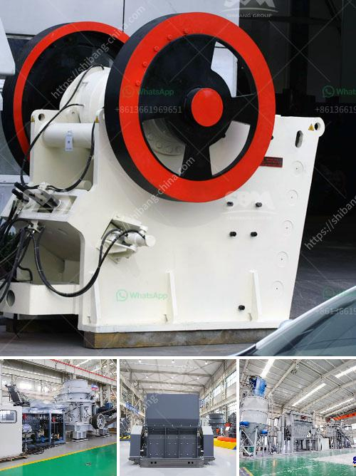

<h3>آلة صنع الرمل في كينيا</h3>
تعتبر آلة صنع الرمل من الأدوات الحديثة التي تم تطويرها لتلبية احتياجات صناعة البناء في كينيا. تعد هذه الآلة أحدث التقنيات التي تساعد في إنتاج الرمال الصناعية عالية الجودة بطريقة فعالة ومستدامة.

تعتبر كينيا من الدول التي تشتهر بصناعة البناء، ولكن من أكبر التحديات التي تواجه هذه الصناعة هو نقص الرمل الطبيعي الذي يستخدم عادة كمادة خام لإنتاج الخرسانة والطوب وغيرها من المواد الإنشائية.

تعتمد آلة صنع الرمل المستخدمة في كينيا على تقنية المطرقة العالقة. حيث تعمل بتحويل الصخور الكبيرة إلى الرمال الدقيقة من خلال تكسيرها وطحنها. يتم تشغيل الآلة بواسطة محرك يعمل بالكهرباء أو بوقود الديزل، ويتم تنظيم سرعة الإنتاج وحجم الرمل النهائي باستخدام أنظمة التحكم الآلية.

توفر آلة صنع الرمل في كينيا عدة مزايا. فمن بين هذه المزايا الرئيسية الجودة العالية للرمل المنتج واستدامته. حيث يتم الحصول على رمل منتج بحجم وشكل محدد يلبي متطلبات مختلفة في البناء. وبفضل استخدام التكنولوجيا الحديثة، تتمتع الآلة بكفاءة عالية وقدرة إنتاجية كبيرة، مما يؤدي إلى زيادة الإنتاجية وتحسين كفاءة العمل في صناعة البناء.

بالإضافة إلى ذلك، تساهم آلة صنع الرمل في حل المشكلة البيئية التي يعاني منها كينيا نتيجة استخراج الرمال الطبيعية بشكل غير مستدام. فبدلاً من الاعتماد على الرمال الطبيعية، يتم استخدام الصخور الموجودة في المنطقة لإنتاج الرمل الاصطناعي. هذا يقلل من تأثير استخراج الرمال الطبيعية على البيئة ويحقق استدامة العملية.

لن يكون لديك مقالة كاملة بعد الآن أتمنى أن يكون لديك يومًا سعيدًا!
<h3>Contact us</h3><ul><li><strong>Whatsapp:&nbsp;<a href="https://wa.me/8613661969651">+8613661969651</a></strong></li><li><a href="https://swt.shibang-china.com/?git&amp;zhl&amp;آلة صنع الرمل في كينيا"><strong>Online Service(chat now)</strong></a></li></ul><h3>Related</h3><ul><li><a href='مطحنة ليستر في كينيا.md'>مطحنة ليستر في كينيا</a></li><li><a href='سعر كسارة الطاحونة الصناعية.md'>سعر كسارة الطاحونة الصناعية</a></li><li><a href='معدات طحن الرماد الخشن.md'>معدات طحن الرماد الخشن</a></li><li><a href='كسارة الحجر في المغرب.md'>كسارة الحجر في المغرب</a></li><li><a href='آلة مسحوق الحجر الجيري.md'>آلة مسحوق الحجر الجيري</a></li></ul>