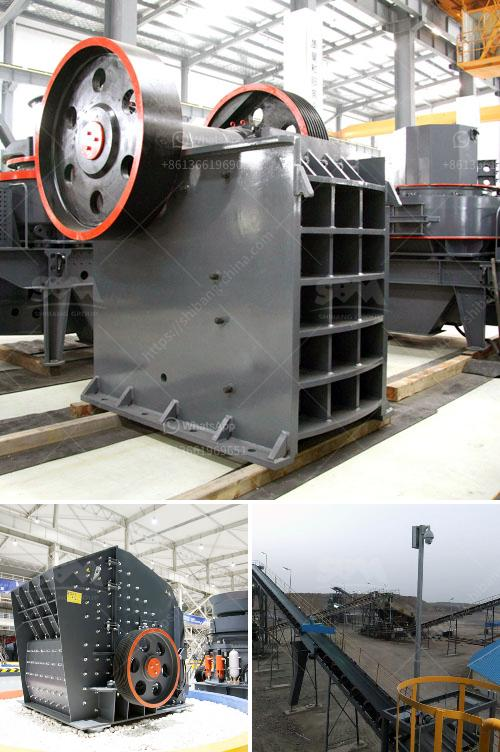

<h3>آلة صنع الطوب من الطين</h3>
تعتبر آلة صنع الطوب من الطين أحد الأدوات الحديثة التي تسهم في تسهيل وتسريع عملية إنتاج الطوب بطريقة ميكانيكية، مما يتيح فرصة للمزيد من إنتاج الطوب وفي وقت أقل. تتكون الآلة من عدة عناصر رئيسية تشمل خلية صب الطين، وحزام نقل المادة الخام، وأشكال التشكيل والقطع.

تعمل الآلة بتحويل الطين إلى خليط قابل للتشكيل، ثم يتم صبه في خلية التكوين التي تأخذ شكل الطوب المطلوب، وتمر من خلال عمليات الضغط والشد لتحسين المرونة والقوة. بعد ذلك، يتم قطع القالب إلى أجزاء متساوية حسب حجم الطوب المطلوب.

من أهم المميزات التي توفرها هذه الآلة هو توفير الوقت والجهد من خلال الآلية الآلية لإنتاج الطوب. فقد تكون عملية صنع الطوب تحتاج إلى الكثير من العمال والوقت والجهد البشري عند استخدام الطرق التقليدية. بالإضافة إلى ذلك، فإن الطوب الناتج من الآلة يتميز بجودة عالية ومقاومة قوية للعوامل الجوية، مما يزيد من عمره الافتراضي ويقلل من حاجة لصيانة مستقبلية.

بالإضافة إلى ذلك، آلة صنع الطوب من الطين تساهم في تقليل استهلاك الموارد الطبيعية، حيث يمكن إعادة استخدام الطين المتبقي من عملية الصنع في إنتاج الطوب الجديد. هذا يقلل من الحاجة إلى استخدام المزيد من المواد الخام ويحمي البيئة.

وفي الختام، يمكن القول إن آلة صنع الطوب من الطين هي ابتكار يساهم في تسهيل وتحسين مراحل إنتاج الطوب، حيث يمكن توفير الوقت والجهد والموارد، مع الحفاظ على جودة الطوب ومتانته. لذا، فإن استخدامها يعد خطوة مهمة نحو تطوير صناعة البناء والحفاظ على البيئة.
<h3>Contact us</h3><ul><li><strong>Whatsapp:&nbsp;<a href="https://wa.me/8613661969651">+8613661969651</a></strong></li><li><a href="https://swt.shibang-china.com/?git&amp;zhl&amp;آلة صنع الطوب من الطين"><strong>Online Service(chat now)</strong></a></li></ul><h3>Related</h3><ul><li><a href='كسارة بوزولانا الماليزية.md'>كسارة بوزولانا الماليزية</a></li><li><a href='معدات تعدين الذهب على نطاق صغير للبيع في مزاد.md'>معدات تعدين الذهب على نطاق صغير للبيع في مزاد</a></li><li><a href='مصنع مسحوق البنتونيت في الإمارات.md'>مصنع مسحوق البنتونيت في الإمارات</a></li><li><a href='كسارة كونيكا في إثيوبيا.md'>كسارة كونيكا في إثيوبيا</a></li><li><a href='كسارة الفك تيرميناتور.md'>كسارة الفك تيرميناتور</a></li></ul>