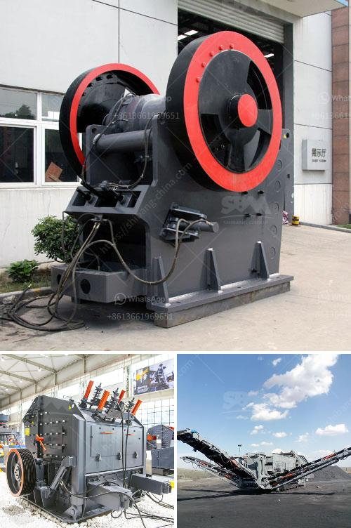

<h3>آلة صنع الكرةست</h3>
تعد آلة صنع الكرات واحدة من الأدوات المهمة في مجال الصناعة والتصنيع الحديث. تستخدم هذه الآلة لتصنيع الكرات المعدنية والبلاستيكية والمطاطية وغيرها من الكرات.

تتكون آلة صنع الكرات من عدة أجزاء رئيسية، بما في ذلك المكبس وقالب الكرة ونظام التحكم. عندما يعمل المكبس، يضغط المادة الخام في قالب يحدد شكل الكرة المطلوبة. ثم يتم تحرير الكرة من القالب وإزالة الفائض من المادة الخام. تقوم الآلة بتحديد حجم وشكل الكرة وفقًا للمواصفات المحددة.

تستخدم آلة صنع الكرات في العديد من الصناعات. في صناعة الألعاب الرياضية، تستخدم لصنع الكرات المستخدمة في الألعاب مثل كرة القدم وكرة السلة وكرة التنس. في صناعة السيارات، تستخدم آلة صنع الكرات لتصنيع الأجزاء المعدنية الدقيقة مثل محامل الكرة. كما تستخدم في صناعة الألعاب والألعاب الترفيهية لتصنيع الكرات المستخدمة في الألعاب وألعاب البولينج وغيرها.

يعتبر استخدام آلة صنع الكرات فعالًا من ناحية تقليل التكاليف وزيادة الإنتاجية. فبفضل هذه الآلة، يمكن صنع الكرات بسرعة ودقة متناهية، وبالتالي يتم تحسين عملية الإنتاج وتقليل الهدر وتوفير الموارد.

علاوة على ذلك، تعتبر آلة صنع الكرات آمنة وسهلة الاستخدام. فهي تحتوي على نظام تحكم متطور يمكن تخصيصه وبرمجته وفقًا لاحتياجات المستخدم. وتستخدم تقنيات السلامة المتقدمة لحماية المشغلين ومعدات الآلة.

إجمالًا، تعتبر آلة صنع الكرات أداة حديثة وضرورية في صناعة تصنيع الكرات. فهي تساعد في تحقيق الدقة والفعالية في عملية الإنتاج ، وتحسن جودة المنتج النهائي وتوفير التكاليف. تطورت هذه الآلات على مر السنين وازدهرت في صناعات متعددة، مما يؤكد أهميتها وفعاليتها في عمليات التصنيع الحديثة.
<h3>Contact us</h3><ul><li><strong>Whatsapp:&nbsp;<a href="https://wa.me/8613661969651">+8613661969651</a></strong></li><li><a href="https://swt.shibang-china.com/?git&amp;zhl&amp;آلة صنع الكرةست"><strong>Online Service(chat now)</strong></a></li></ul><h3>Related</h3><ul><li><a href='آلة مسحوق الدولوميت.md'>آلة مسحوق الدولوميت</a></li><li><a href='آلة تكسير وطحن مناجم الذهب.md'>آلة تكسير وطحن مناجم الذهب</a></li><li><a href='كسارة الحجر في بيرو.md'>كسارة الحجر في بيرو</a></li><li><a href='معدات سحق الجرانيت.md'>معدات سحق الجرانيت</a></li><li><a href='آلة فحص الرمال المصنعة.md'>آلة فحص الرمال المصنعة</a></li></ul>