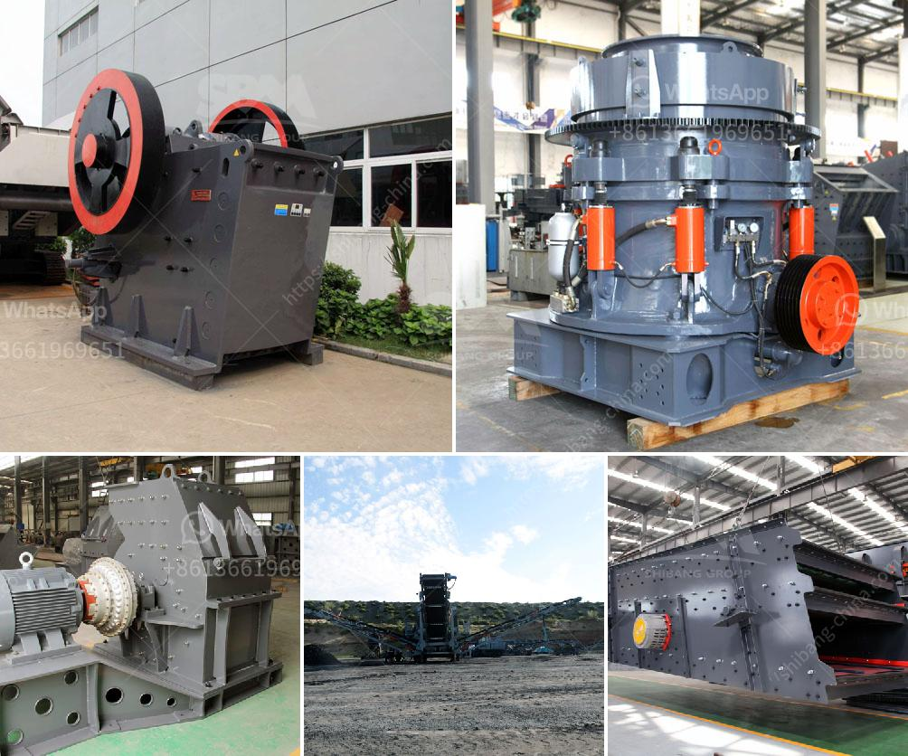

<h3>آلة صنع المسحوق في جنوب أفريقيا</h3>
تتميز جنوب أفريقيا بعدة صناعات مهمة ، ومن بين هذه الصناعات صناعة تصنيع المساحيق. تعتبر آلة صنع المسحوق واحدة من الآلات الرئيسية التي تستخدم في هذه الصناعة.

تعد صناعة تصنيع المساحيق من الصناعات المهمة في جنوب أفريقيا نظرًا لتوافر الموارد الطبيعية الغنية في البلاد. تُستخدم المساحيق في مجموعة واسعة من التطبيقات ، بدءًا من الصناعات الغذائية والمشروبات إلى الصناعات الكيماوية والصيدلانية والتجميلية.

تعمل آلة صنع المسحوق عن طريق طحن المواد الخام وتحويلها إلى مساحيق ناعمة. تختلف طرق صنع المسحوق حسب نوع الصناعة والتطبيق المرغوب فيه. يمكن استخدام آلة صنع المسحوق في تحويل مواد خام مثل المعادن والمواد الكيميائية والبلاستيك والأعشاب والتوابل والمواد الغذائية إلى مساحيق.

تعد آلة صنع المسحوق مهمة لتلبية احتياجات السوق المتزايدة في جنوب أفريقيا. فالطلب على المساحيق يزداد بسبب النمو الاقتصادي والزيادة في السكان والتحسين التكنولوجي. تشتهر جنوب أفريقيا بتصنيع المساحيق عالية الجودة والأداء ، مما يؤدي إلى زيادة الطلب على هذه المنتجات في الأسواق المحلية والعالمية.

توفر آلة صنع المسحوق فوائد عديدة للشركات المصنعة والمستهلكين على حد سواء. يمكن للشركات المصنعة تصنيع منتجات مختلفة ومتنوعة باستخدام هذه الآلة ، وبالتالي توسيع نطاق أعمالها وزيادة إنتاجيتها. بالنسبة للمستهلكين ، يمكنهم الاستفادة من جودة المنتجات المصنعة والحصول على منتجات ذات جودة عالية.

بالإضافة إلى ذلك ، تعد صناعة تصنيع المساحيق مكونًا أساسيًا في التنمية الاقتصادية لجنوب أفريقيا. توفر هذه الصناعة فرص عمل للعديد من العاملين ، مما يساهم في زيادة الدخل الشخصي وتحسين مستوى المعيشة للسكان.

وفي النهاية ، يمكن القول أن صناعة تصنيع المساحيق في جنوب أفريقيا تشهد تطورًا كبيرًا وتلبية الاحتياجات المتزايدة للسوق المحلية والعالمية. تلعب آلة صنع المسحوق دورًا حاسمًا في تحقيق هذا التطور ، حيث توفر أداءً عاليًا وجودة مساحيق ممتازة وتساهم في التنمية الاقتصادية للبلاد.
<h3>Contact us</h3><ul><li><strong>Whatsapp:&nbsp;<a href="https://wa.me/8613661969651">+8613661969651</a></strong></li><li><a href="https://swt.shibang-china.com/?git&amp;zhl&amp;آلة صنع المسحوق في جنوب أفريقيا"><strong>Online Service(chat now)</strong></a></li></ul><h3>Related</h3><ul><li><a href='المواصفات الفنية لمطحنة الكرة.md'>المواصفات الفنية لمطحنة الكرة</a></li><li><a href='سعر كسارة الفك PE 400.md'>سعر كسارة الفك PE 400</a></li><li><a href='مطحنة تكسير فائقة الدقة لخام الذهب.md'>مطحنة تكسير فائقة الدقة لخام الذهب</a></li><li><a href='إنتاج خط الإنتاج لكسارة الطوب.md'>إنتاج خط الإنتاج لكسارة الطوب</a></li><li><a href='كم عدد شركات تصنيع كسارات الفك في الهند.md'>كم عدد شركات تصنيع كسارات الفك في الهند</a></li></ul>