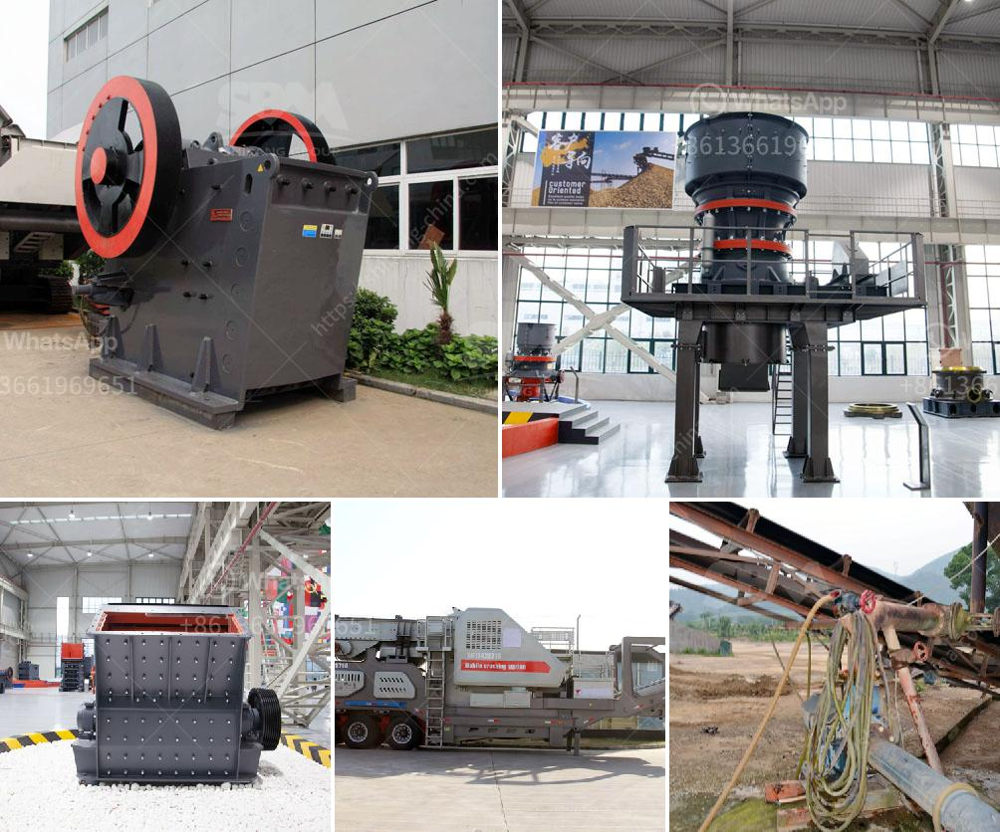

<h3>آلة صنع مسحوق الجبس</h3>
تعتبر آلة صنع مسحوق الجبس من الآلات الصناعية المستخدمة في مجال البناء والتشييد. تستخدم هذه الآلة لتحويل الجبس الخام إلى مسحوق جبس ناعم يستخدم في صناعة الأسقف المعلقة والقوالب الجبسية والتشطيبات الداخلية.

تعمل آلة صنع مسحوق الجبس على طحن الجبس الخام بواسطة الطحن والطحن الهوائي. تتكون الآلة من مجموعة من الأسطوانات الدوارة المتواجدة في داخلها، يتم تحميل الجبس الخام في الماكينة عبر ناقل الحزام ويتم طحنه عن طريق الأسطوانات المتحركة بشكل مستمر.

تعتبر آلة صنع مسحوق الجبس مهمة جدًا في العملية الإنتاجية، حيث تؤدي دورًا حيويًا في تحويل الجبس الخام إلى مسحوق جبس ناعم ورقيق الملمس. يتم ضبط درجة نعومة المسحوق بواسطة تعديل سرعة الطحن والضغط الذي يمارسه الأسطوانات على الجبس.

بالإضافة إلى ذلك، تتميز آلة صنع مسحوق الجبس بكفاءتها العالية وقدرتها على إنتاج كميات كبيرة من المسحوق في فترة زمنية قصيرة. وبفضل التكنولوجيا المتقدمة، فإن هذه الآلة تعمل بكفاءة عالية وتوفر الطاقة.

تستخدم آلة صنع مسحوق الجبس في مصانع الجبس وورش العمل المختلفة التي تعمل في صناعة البناء والتشييد. يتم استخدام المسحوق الناتج في عملية إنتاج الأسقف المعلقة والجدران الجبسية والديكورات الداخلية. كما يتم استخدام المسحوق أيضًا في العديد من التطبيقات الصناعية الأخرى.

إجمالًا، تعتبر آلة صنع مسحوق الجبس من الآلات الحديثة والمتطورة التي تلعب دورًا هامًا في صناعة البناء. فهي تساهم في تحويل الجبس الخام إلى مسحوق جبس ناعم يستخدم في عملية البناء والتشييد. كما يمكن استخدام هذه الآلة في صناعة الديكور الداخلي والأعمال الصناعية الأخرى.
<h3>Contact us</h3><ul><li><strong>Whatsapp:&nbsp;<a href="https://wa.me/8613661969651">+8613661969651</a></strong></li><li><a href="https://swt.shibang-china.com/?git&amp;zhl&amp;آلة صنع مسحوق الجبس"><strong>Online Service(chat now)</strong></a></li></ul><h3>Related</h3><ul><li><a href='قائمة الآلات المستخدمة في تعدين الفحم.md'>قائمة الآلات المستخدمة في تعدين الفحم</a></li><li><a href='أسعار كسارات الخرسانة.md'>أسعار كسارات الخرسانة</a></li><li><a href='مواصفات كسارة المخروط.md'>مواصفات كسارة المخروط</a></li><li><a href='كسارة الفك في مصنع معالجة البوكسيت.md'>كسارة الفك في مصنع معالجة البوكسيت</a></li><li><a href='مطحنة صناعية.md'>مطحنة صناعية</a></li></ul>