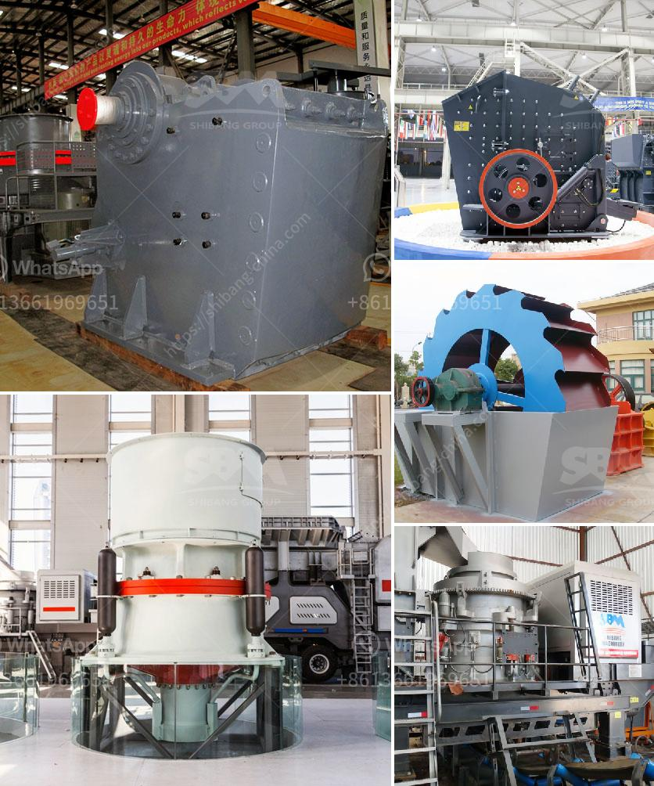

<h3>آلة صنع مسحوق الحجر الجيري في الهند</h3>
تعتبر الهند واحدة من أهم الدول المنتجة للحجر الجيري في العالم، وتمتلك العديد من المحاجر والمناجم التي تزود العالم بالحجر الجيري. يتم استخدام الحجر الجيري في العديد من الصناعات مثل صناعة الأسمنت والصلصال والزجاج وصناعة الحديد والصلب.

وتلعب الآلات في عملية صنع مسحوق الحجر الجيري دورًا حيويًا حيث تساعد في تحويل الحجر الجيري الخام إلى مسحوق دقيق يمكن استخدامه في العديد من التطبيقات. يتم استخدام معدات محطمة مختلفة في العملية لضمان تحطيم الحجر الجيري إلى حجم صغير، وتعتبر المطاحن الدوارة والكسارات الفكية والكسارات المخروطية من أكثر الأنواع شيوعًا.

تتكون الآلة من العديد من الأجزاء المهمة مثل المغذي الاهتزازي والكسارة والمطحنة والمصنف وأجهزة التحكم. يتم تسليم الحجر الجيري إلى المغذي الاهتزازي بشكل متساوٍ لتجنب تجميعه في منطقة واحدة. بعد ذلك يقوم المغذي الاهتزازي بتغذية الحجر الجيري إلى الكسارة، حيث يتم سحقه إلى قطع صغيرة. يتم تحويل القطع الصغيرة إلى قطع أصغر في المطحنة، وبعد ذلك يتم نقلها إلى مصنف لفصل الحجم المطلوب ومن ثم نقلها بواسطة منظومة النقل الآلية.

تعتبر الآلة الصناعية التي تستخدم في صنع مسحوق الحجر الجيري في الهند متقدمة تقنيًا وذات كفاءة عالية، وتتيح توفير الكثير من الوقت والجهد في عملية التصنيع. كما أنها تساهم في زيادة الإنتاجية وتحسين جودة المنتج النهائي.

تشهد الهند ارتفاعًا في الطلب على مسحوق الحجر الجيرة بسبب توسع صناعة البناء والتشييد في البلاد. لذلك، فإن آلة صنع مسحوق الحجر الجيري في الهند تلعب دورًا محوريًا في استجابة الصناعة لهذا الطلب المتزايد.

باختصار، تعتبر آلة صنع مسحوق الحجر الجيري في الهند ضرورية لصناعة البناء والتشييد والعديد من الصناعات الأخرى. تقوم الآلة بتحويل الحجر الجيري الخام إلى مسحوق دقيق يمكن استخدامه في العديد من التطبيقات المختلفة. ومن خلال الاعتماد على تكنولوجيا حديثة والاستفادة من التحسينات المستمرة، تساعد هذه الآلات في تلبية الطلب المتزايد على مسحوق الحجر الجيري في الهند.
<h3>Contact us</h3><ul><li><strong>Whatsapp:&nbsp;<a href="https://wa.me/8613661969651">+8613661969651</a></strong></li><li><a href="https://swt.shibang-china.com/?git&amp;zhl&amp;آلة صنع مسحوق الحجر الجيري في الهند"><strong>Online Service(chat now)</strong></a></li></ul><h3>Related</h3><ul><li><a href='سعر آلة غسيل الرمل الكوارتز.md'>سعر آلة غسيل الرمل الكوارتز</a></li><li><a href='محطة كسارة محمولة من الهند.md'>محطة كسارة محمولة من الهند</a></li><li><a href='بيع كسارة الصخور.md'>بيع كسارة الصخور</a></li><li><a href='معدات فحص الرمال للبيع في جنوب أفريقيا.md'>معدات فحص الرمال للبيع في جنوب أفريقيا</a></li><li><a href='آلات معالجة الأحجار الكريمة لإثيوبيا.md'>آلات معالجة الأحجار الكريمة لإثيوبيا</a></li></ul>