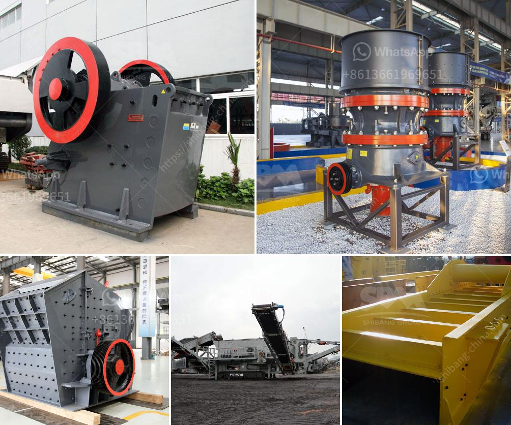

<h3>آلة صنع مسحوق الحجر الجيري في باكستان</h3>
تعتبر آلة صنع مسحوق الحجر الجيري في باكستان أحدث التكنولوجيا المستخدمة في صناعة المواد الخام للعديد من الصناعات. تستخدم هذه الآلة لتحويل الحجر الجيري إلى مسحوق ناعم يستخدم في البناء والتشييد والتعدين والتصنيع والسيراميك والمواد الكيميائية والزجاج.

تتميز آلة صنع مسحوق الحجر الجيري في باكستان بعدة ميزات، منها الكفاءة العالية والتشغيل البسيط. فهي تعمل على تكسير الحجر الجيري الخام إلى جزيئات صغيرة جداً، ثم تقوم بطحنها حتى تتحول إلى مسحوق ناعم.

تعتبر باكستان من أكبر المنتجين للحجر الجيري في العالم، مما يعني أن استغلال هذه الموارد الطبيعية في صناعة مسحوق الحجر الجيري سيكون له تأثير كبير على الاقتصاد المحلي. حيث يتم استخدام هذا المسحوق في إنتاج الأسمنت والجبس والزجاج والدهانات والملدنات والألوان ومجموعة واسعة من المواد الأخرى.

تستخدم آلة صنع مسحوق الحجر الجيري في باكستان تقنية المطارق والمطاحن التي تعمل بالسرعة العالية، وتقوم بتقطيع الحجر الجيري وطحنه إلى مسحوق دقيق. يتم تحقيق ذلك من خلال استخدام الطاقة، سواء الكهربائية أو الديزل، لتشغيل المحرك.

تعتبر هذه الآلة مفيدة جدًا في الصناعات التي تتطلب استخدام الحجر الجيري بشكل كبير، حيث تسمح بتحويل الحجر الجيري الخام إلى مسحوق ناعم في وقت قصير وبتكلفة منخفضة. وبالتالي، تقلل هذه الآلة من التكاليف المرتبطة بشراء المسحوق المصنع جاهزًا.

يمكن تغليف مسحوق الحجر الجيري المصنوع باستخدام آلة التعبئة، حيث توزن وتعبأ الكمية المطلوبة من المسحوق وتتم إغلاق الأكياس بإحكام. تعزز آلة التعبئة الدقة والكفاءة في عملية التعبئة وتقلل من الهدر.

باختصار، آلة صنع مسحوق الحجر الجيري في باكستان تعتبر تكنولوجيا حديثة تسهم في استخدام وتحويل الحجر الجيري بشكل أكثر فعالية واقتصادية. تحقيق وفرة موارد الحجر الجيري في باكستان واستخدامها في إنتاج المسحوق يساهم في تعزيز الاقتصاد المحلي ودعم الصناعات المختلفة.
<h3>Contact us</h3><ul><li><strong>Whatsapp:&nbsp;<a href="https://wa.me/8613661969651">+8613661969651</a></strong></li><li><a href="https://swt.shibang-china.com/?git&amp;zhl&amp;آلة صنع مسحوق الحجر الجيري في باكستان"><strong>Online Service(chat now)</strong></a></li></ul><h3>Related</h3><ul><li><a href='تكلفة مصنع تكسير الحجر.md'>تكلفة مصنع تكسير الحجر</a></li><li><a href='أسعار مطاحن الكرة في جنوب أفريقيا.md'>أسعار مطاحن الكرة في جنوب أفريقيا</a></li><li><a href='آلات كسارة الصخور.md'>آلات كسارة الصخور</a></li><li><a href='مطحنة MTM ترابيزيوم.md'>مطحنة MTM ترابيزيوم</a></li><li><a href='آلة تصنيع الكرة الجبسية.md'>آلة تصنيع الكرة الجبسية</a></li></ul>