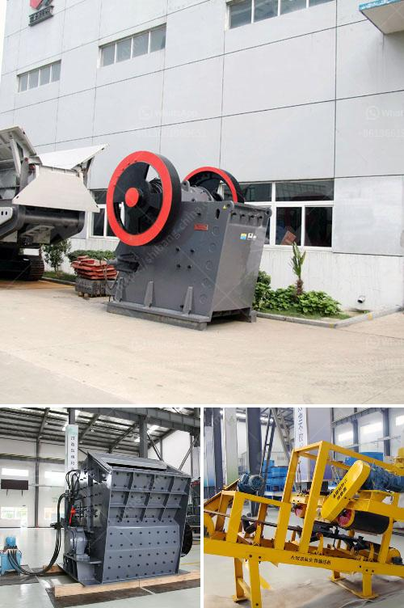

<h3>آلة صنع مسحوق الدولوميت لخط الإنتاج</h3>
تعتبر آلة صنع مسحوق الدولوميت لخط الإنتاج من الآلات الحديثة التي تستخدم في معالجة الدولوميت وتحويلها إلى مسحوق دقيق. والدولوميت هو معدن يتكون أساساً من الكالسيوم والمغنسيوم، ويستخدم في العديد من الصناعات بما في ذلك الصناعات الزراعية والمنسوجات والبناء.

تتكون آلة صنع مسحوق الدولوميت لخط الإنتاج عادةً من عدة مكونات رئيسية، بما في ذلك المغذي الاهتزازي، وكسارة الفك، والطاحونة العمودية، ومصعد الدلو، والمنفصل الدوامي، وحاوية الدولوميت، والمرشح الكيميائي، والنظام الكهربائي.

في بداية العملية، يتم تغذية الدولوميت الخام في المغذي الاهتزازي بطريقة متساوية، ثم يتم نقلها إلى كسارة الفك حيث يتم سحقها بواسطة الفك المتحرك والثابت. بعد ذلك، يتم نقل الدولوميت المسحوق إلى الطاحونة العمودية باستخدام المصعد الدلو.

تعتبر الطاحونة العمودية الجزء الرئيسي في عملية تحويل الدولوميت إلى مسحوق. تتكون الطاحونة العمودية من نظام تحديد السرعة، وجهاز التحكم الأوتوماتيكي، وجهاز الإعصار، والجهاز المجفف، ونظام التحكم في الوزن، ونظام المرشح الكيميائي.

بعد تحويل الدولوميت إلى مسحوق، يتم نقل المسحوق إلى المنفصل الدوامي حيث يتم فصله عن المعادن الأخرى وإعادة استخدامه. ثم يتم تفريغ المسحوق النهائي في حاوية الدولوميت.

يعمل النظام الكهربائي على تأمين وتشغيل آلة صنع مسحوق الدولوميت لخط الإنتاج بشكل صحيح. يشمل النظام الكهربائي تشغيل كل أجهزة الآلة بشكل متزامن ومنظم.

تعتبر آلة صنع مسحوق الدولوميت لخط الإنتاج مفيدة في عملية تحويل الدولوميت إلى مسحوق في كميات كبيرة وذلك بفضل تقنياتها المتطورة وأداءها الممتاز. تضمن الآلة جودة ونقاء المسحوق النهائي، مما يزيد من قيمته في السوق ويجعله مناسباً للاستخدام في العديد من الصناعات المختلفة.

بالاختصار، آلة صنع مسحوق الدولوميت لخط الإنتاج هي آلة حديثة وفعالة تستخدم في تحويل الدولوميت إلى مسحوق دقيق. تقدم الآلة أداء عالي الجودة وتعزز قيمة المنتج النهائي.
<h3>Contact us</h3><ul><li><strong>Whatsapp:&nbsp;<a href="https://wa.me/8613661969651">+8613661969651</a></strong></li><li><a href="https://swt.shibang-china.com/?git&amp;zhl&amp;آلة صنع مسحوق الدولوميت لخط الإنتاج"><strong>Online Service(chat now)</strong></a></li></ul><h3>Related</h3><ul><li><a href='سعر كسارة الحجر في إيران.md'>سعر كسارة الحجر في إيران</a></li><li><a href='أنظمة ناقلات الحصى للمسافة.md'>أنظمة ناقلات الحصى للمسافة</a></li><li><a href='سعر آلة تصنيع لوحات الجبس.md'>سعر آلة تصنيع لوحات الجبس</a></li><li><a href='محطة تكسير الصخور.md'>محطة تكسير الصخور</a></li><li><a href='مطحنة طحن ألمانية.md'>مطحنة طحن ألمانية</a></li></ul>