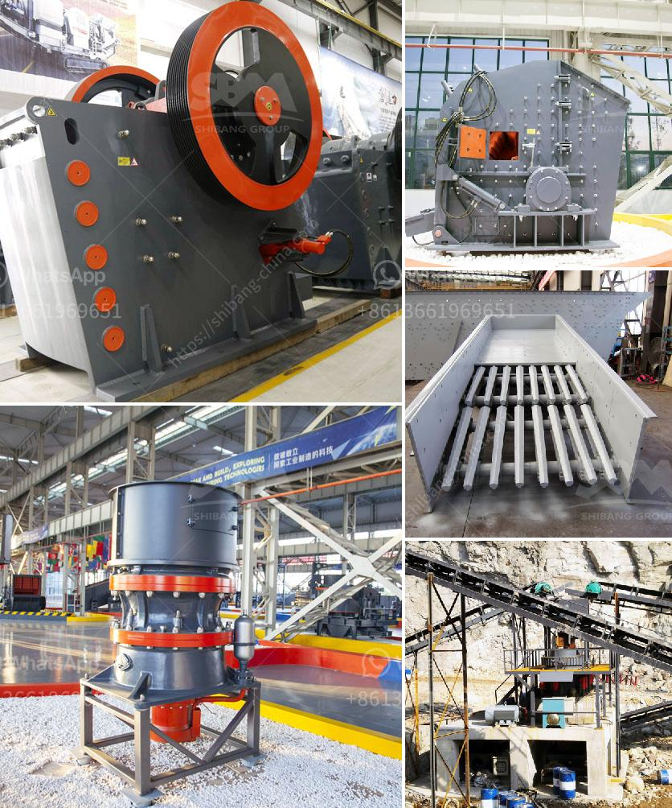

<h3>آلة صنع مسحوق الرخام</h3>
تعتبر آلة صنع مسحوق الرخام من التقنيات المبتكرة التي تمكن من تحويل الرخام الخام إلى مسحوق ناعم يستخدم في صناعة الدهانات والطلاء، وصناعة القراميد والأخشاب المطلية بالرخام. تعمل هذه الآلة بأحدث الأساليب التكنولوجية لتحطيم الرخام الخام وتحويله إلى مسحوق رخام ناعم.

تتكون آلة صناعة مسحوق الرخام من عدة أجزاء رئيسة، بدءًا من الكسارة الفكية التي تعمل على تكسير قطع الرخام الخام إلى جزيئات صغيرة. ثم يتم نقل الرخام المكسر إلى آلة الطحن، حيث يتم طحنها بواسطة الأسطوانة أو الكرة المعدنية للحصول على حجم الجسيمات المطلوب. بعد ذلك، يتم تجفيف المسحوق باستخدام جهاز التجفيف الخاص بالمسحوق لإزالة الرطوبة والرطوبة المتبقية.

تعتمد آلة صناعة مسحوق الرخام على تقنية متقدمة تعزز كفاءة الإنتاج وتجودة المسحوق المنتج. تحافظ هذه الآلة على حبيبات الرخام متجانسة ومتناسقة في الحجم، مما يضمن استخدامها بشكل فعال في مختلف الصناعات. كما تتميز هذه الآلة بسهولة الصيانة والتشغيل، حيث يمكن التحكم في إعدادات الآلة بسهولة وسرعة للحصول على الحجم المطلوب للمسحوق.

بالإضافة إلى ذلك، فإن آلة صناعة مسحوق الرخام تتميز بكفاءة عالية في استخدام الطاقة واستخدام الرواسب والفضلات بشكل فعال. تساهم هذه الآلة في تحسين عمليات الإنتاج وتقليل التلوث البيئي المرتبط بمخلفات الرخام. بالإضافة إلى ذلك، يمكن استخدام مسحوق الرخام المنتج بواسطة هذه الآلة في تعديل الأراضي وشق الطرق وتمهيد الأسطح، مما يشجع على استدامة الاستخدام والتوسع في مجالات التطبيق الجديدة.

بخلاصة، آلة صنع مسحوق الرخام هي تكنولوجيا مبتكرة تعزز استخدام الرخام بشكل فعال وفعال من حيث التكلفة. تساهم هذه الآلة في توفير المواد الخام وتحسين مساهمة الرخام في الصناعات المختلفة. إنها خطوة هامة في مجال التكنولوجيا الصناعية وتصنيع الرخام، وتساهم في تعزيز التنمية المستدامة بطرق عديدة.
<h3>Contact us</h3><ul><li><strong>Whatsapp:&nbsp;<a href="https://wa.me/8613661969651">+8613661969651</a></strong></li><li><a href="https://swt.shibang-china.com/?git&amp;zhl&amp;آلة صنع مسحوق الرخام"><strong>Online Service(chat now)</strong></a></li></ul><h3>Related</h3><ul><li><a href='مصنعو كسارات البلفرايزر في بون.md'>مصنعو كسارات البلفرايزر في بون</a></li><li><a href='مطحق الصخور في الفلبين.md'>مطحق الصخور في الفلبين</a></li><li><a href='سعر طاحونة المطرقة.md'>سعر طاحونة المطرقة</a></li><li><a href='بيع آلة مطحنة الأسطوانة.md'>بيع آلة مطحنة الأسطوانة</a></li><li><a href='عملية سحق الفحم 200 tph.md'>عملية سحق الفحم 200 tph</a></li></ul>