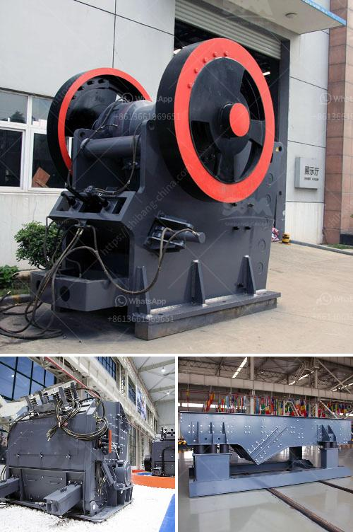

<h3>آلة صنع مسحوق قشر الجوز في الهند</h3>
في الهند، تعد آلة صنع مسحوق قشر الجوز واحدة من الآلات المهمة في صناعة معالجة وتحضير الأطعمة. يتم استخدام قشر الجوز في العديد من الأطعمة والمنتجات مثل الحلويات والمخللات والأعلاف الحيوانية. ولذلك، تلعب آلة صنع مسحوق قشر الجوز دورًا حيويًا في تلبية الطلب المتزايد على هذه المنتجات.

تتكون آلة صنع مسحوق قشر الجوز من عدة أجزاء رئيسية، بما في ذلك الهيكل الخارجي والمحرك والسكاكين. تعتمد هذه الآلة على قوة المحرك وتشغيل السكاكين لطحن قشور الجوز إلى مسحوق ناعم. يتم تحميل قشور الجوز في الآلة من خلال فتحة الشحن ومن ثم يتم تشغيل السكاكين لطحنها في وحدة الطحن. يتم جمع المسحوق المنتج في صندوق التجميع الموجود في الجزء السفلي من الآلة.

تحظى آلة صنع مسحوق قشر الجوز بشعبية كبيرة في الهند بسبب فوائدها الاقتصادية والبيئية. فعند استخدام هذه الآلة، يتم تحويل قشور الجوز المتبقية من صناعة الأطعمة إلى منتج قيم يمكن استخدامه في الصناعات الأخرى. هذا يقلل من النفايات ويساهم في الاستدامة البيئية. بالإضافة إلى ذلك، يتم استخدام مسحوق قشر الجوز في تحسين التربة وتعزيز صحة الأراضي، مما يجعله منتجًا مثاليًا للاستخدام في الزراعة.

تعمل الشركات المصنعة لهذه الآلة على تطوير تقنيات جديدة لزيادة كفاءتها وقدرتها على طحن المزيد من قشور الجوز في وقت قصير. وتتوفر هذه الآلات بأحجام وطاقات مختلفة لتلبية متطلبات العملاء المختلفة. بفضل هذه التقنيات المتطورة، يمكن للمزارعين وأصحاب صناعات الأغذية تحقيق استفادة قصوى من إمكانيات قشور الجوز وتحويلها إلى منتج ذو قيمة مضافة.

باختصار، تعد آلة صنع مسحوق قشر الجوز في الهند أداة هامة في صناعة معالجة الأطعمة. تلعب دورًا حيويًا في استغلال قشور الجوز وتحويلها إلى مسحوق قيم يمكن استخدامه في العديد من الصناعات. كما أنها تساهم في الاستدامة البيئية وتعزز تحسين التربة والارتقاء بالزراعة. تُعتبر هذه الآلة اختراعًا هنديًا فعّالًا ومهمًا يلبي احتياجات السوق المتزايدة على المنتجات ذات القيمة المضافة.
<h3>Contact us</h3><ul><li><strong>Whatsapp:&nbsp;<a href="https://wa.me/8613661969651">+8613661969651</a></strong></li><li><a href="https://swt.shibang-china.com/?git&amp;zhl&amp;آلة صنع مسحوق قشر الجوز في الهند"><strong>Online Service(chat now)</strong></a></li></ul><h3>Related</h3><ul><li><a href='مصانع الأسمنت الحجر في أفريقيا.md'>مصانع الأسمنت الحجر في أفريقيا</a></li><li><a href='خط إنتاج رمل السيليكا.md'>خط إنتاج رمل السيليكا</a></li><li><a href='عملية سحق التعدين لخام الحديد.md'>عملية سحق التعدين لخام الحديد</a></li><li><a href='مصنع لطحن الأسمنت في الهند.md'>مصنع لطحن الأسمنت في الهند</a></li><li><a href='مقترح مشروع أعمال لكسارة الحجر.md'>مقترح مشروع أعمال لكسارة الحجر</a></li></ul>