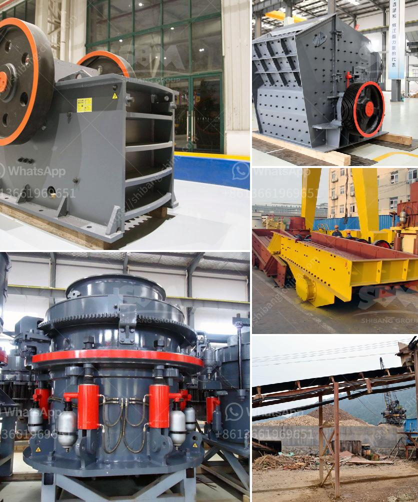

<h3>آلة طحن الأسمنت الصغيرة</h3>
تعد آلة طحن الأسمنت الصغيرة نوعًا من الآلات الهندسية التي تستخدم في صناعة الأسمنت. تتميز هذه الآلة بحجمها الصغير وقدرتها على طحن الكلنكر ومواد أخرى مثل الجبس والحجر الجيري لإنتاج الأسمنت النهائي.

تعمل آلة طحن الأسمنت الصغيرة بواسطة دوران أسطوانة الطحن الأفقية المضادة لتكسير المواد الخام. يتم سحق المواد الخام في الأسطوانة عن طريق الكرات الحديدية أو الأسطوانة المعدنية الأخرى الموجودة في داخل الأسطوانة. يتم ضبط سرعة أسطوانة الطحن لضمان حجم الجسيمات المنتجة المطلوبة.

أن آلة طحن الأسمنت الصغيرة تستخدم على نطاق واسع في صناعة البناء والهندسة المدنية. فهي تستخدم لإنتاج الأسمنت البورتلاندي العادي والأسمنت المقاوم للماء والأسمنت الأبيض والأسمنت المختلط.

تعد آلة طحن الأسمنت الصغيرة مفيدة بشكل خاص للشركات الصغيرة والمتوسطة الحجم التي ترغب في تصنيع الأسمنت في كميات محدودة. فهي توفر تكلفة منخفضة وأداء عالي وتسهل عملية الإنتاج.

بالإضافة إلى ذلك، تساهم آلة طحن الأسمنت الصغيرة في الحفاظ على البيئة، حيث تقوم بطحن مواد خام ذات جودة منخفضة لإنتاج الأسمنت. وبفضل تخصيصها للإنتاج في كميات صغيرة، تقلل الآلة من الهدر والفاقد في عملية التصنيع.

بشكل عام، تشكل آلة طحن الأسمنت الصغيرة جزءًا أساسيًا من صناعة الأسمنت، حيث توفر الأداء المطلوب والكفاءة العالية والتكلفة المنخفضة. وبهذه الطريقة، تساعد هذه الآلة على تلبية الطلب المتزايد على الأسمنت في السوق وتساهم في تطور صناعة البناء والتشييد.
<h3>Contact us</h3><ul><li><strong>Whatsapp:&nbsp;<a href="https://wa.me/8613661969651">+8613661969651</a></strong></li><li><a href="https://swt.shibang-china.com/?git&amp;zhl&amp;آلة طحن الأسمنت الصغيرة"><strong>Online Service(chat now)</strong></a></li></ul><h3>Related</h3><ul><li><a href='تكلفة مشروع طحن التلك.md'>تكلفة مشروع طحن التلك</a></li><li><a href='مصنع محطم للبيع في الإمارات.md'>مصنع محطم للبيع في الإمارات</a></li><li><a href='كسارة الحجر الجيري المتنقلة.md'>كسارة الحجر الجيري المتنقلة</a></li><li><a href='مطحنة طحن السخام في الهند.md'>مطحنة طحن السخام في الهند</a></li><li><a href='مكاتب CAD لمعدات التعدين.md'>مكاتب CAD لمعدات التعدين</a></li></ul>