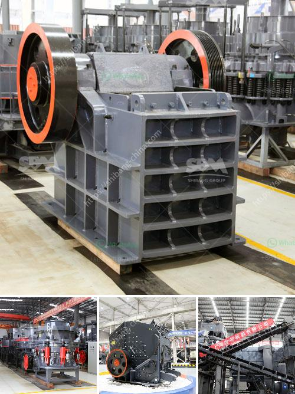

<h3>آلة طحن الجبس المصنع</h3>
الجبس هو مادة بناء هامة يتم استخدامها في صناعة البناء والديكور. ولكن قبل استخدامها، يجب طحنها بشكل دقيق للحصول على حبيبات صغيرة ومتجانسة. وهنا يأتي دور آلة طحن الجبس، فهي تعمل على طحن الجبس إلى مسحوق ناعم يمكن استخدامه في العديد من التطبيقات.

تتكون آلة طحن الجبس من عدة أجزاء أساسية. أولاً، تحتوي على وعاء كبير لوضع الجبس داخله. ثم يتم سحق الجبس باستخدام طاحونة المطرقة المزودة بشفرات حادة. هنا يتم تحويل الجبس إلى مسحوق بفضل عمل المطرقة والشفرات التي تقوم بدوران سريع. بعد ذلك، يتم نقل المسحوق إلى وعاء تخزين آخر.

يتم تشغيل آلة طحن الجبس عن طريق محرك كهربائي. يعتبر هذا المحرك القوة الدافعة التي تجعل الشفرات تدور بسرعة. يتم ضبط سرعة دوران الشفرات وفقًا لاحتياجات العملية. بالإضافة إلى ذلك، تحتوي الآلة على نظام تحكم يتيح للمشغل التحكم في العملية بسهولة ودقة.

تعتبر آلة طحن الجبس فعالة وقابلة للتشغيل لفترات طويلة دون توقف. فمع الاستخدام المناسب والصيانة الدورية، يمكن لهذه الآلة أن تحافظ على كفاءتها على مدار الساعة. ولا يمكن إنكار أن آلة طحن الجبس تساعد على توفير الوقت والجهد، وتعزيز عمليات الإنتاج.

يمكن استخدام مسحوق الجبس المطحون في العديد من التطبيقات، مثل صناعة الجص والجبس المضغوط. كما يستخدم في صناعة الدهانات والمواد العازلة. وبالإضافة إلى ذلك، يمكن استخدامه في صناعة الأسمنت وصناعة الورق.

في الختام، آلة طحن الجبس تعد وسيلة فعالة وموثوقة لطحن الجبس بسهولة وفعالية. تساهم في تحويل الجبس إلى مسحوق ناعم يمكن استخدامه في العديد من التطبيقات. وبفضل هذه الآلة، يتم تحسين عمليات الإنتاج في صناعة البناء والديكور.
<h3>Contact us</h3><ul><li><strong>Whatsapp:&nbsp;<a href="https://wa.me/8613661969651">+8613661969651</a></strong></li><li><a href="https://swt.shibang-china.com/?git&amp;zhl&amp;آلة طحن الجبس المصنع"><strong>Online Service(chat now)</strong></a></li></ul><h3>Related</h3><ul><li><a href='الشاشات الاهتزازية في إيطاليا.md'>الشاشات الاهتزازية في إيطاليا</a></li><li><a href='دراسة الجدوى لإنتاج مسحوق الجبس.md'>دراسة الجدوى لإنتاج مسحوق الجبس</a></li><li><a href='علامات مصنع كسارة المحجر مطحنة الكرة.md'>علامات مصنع كسارة المحجر مطحنة الكرة</a></li><li><a href='كم تكلفة كسارة الفك.md'>كم تكلفة كسارة الفك</a></li><li><a href='مصنع طحن الحجر.md'>مصنع طحن الحجر</a></li></ul>