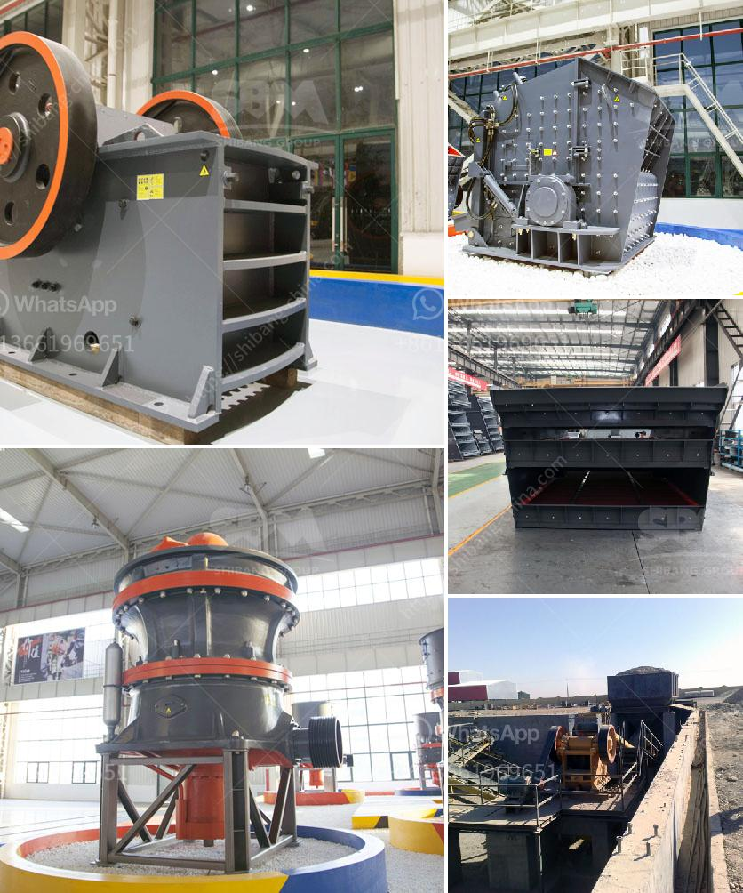

<h3>آلة طحن الجير</h3>
الجير هو مادة مهمة في العديد من الصناعات مثل صناعة الزجاج والصناعات الكيميائية والبناء. ولتحضير الجير، يتم استخدام آلات طحن الجير.

آلة طحن الجير هي آلة تستخدم لطحن حبيبات الجير إلى حجم صغير ومتجانس. وتتكون الآلة من عدة مكونات أساسية تشمل محرك الآلة، ووحدة الطحن، ووعاء التجميع.

يبدأ العمل بتحميل الجير في وعاء التجميع، وبعد ذلك يتم تشغيل محرك الآلة. ويعمل المحرك على تشغيل وحدة الطحن الموجودة في الآلة. وتتألف وحدة الطحن من عدة أسطوانات تمر عبر الجير الموجود في وعاء التجميع. وتعمل الأسطوانات على طحن الجير إلى حجم صغير ومتجانس.

بعد انتهاء عملية الطحن، يتم جمع الجير في وعاء آخر لتخزينه أو للاستخدام الفوري في العملية الصناعية. وتعتبر هذه الآلة فعالة جدًا في عملية طحن الجير بفضل الأسطوانات الدوارة التي تضمن تحقيق حجم جسيمات متجانس ودقيق.

تعد آلة طحن الجير أساسية للكثير من الصناعات التي تعتمد على الجير كمادة رئيسية. ففي صناعة الزجاج، يستخدم الجير المطحون في تكوين الزجاج، كما يستخدم في صناعة الجبس لتحسين خواصه. وفي الصناعات الكيميائية، يستخدم الجير المطحون في إنتاج المواد الكيميائية. وفي صناعة البناء، يستخدم الجير المطحون في تحضير الأسمنت والجص.

إن آلة طحن الجير لها دور كبير في تحضير هذه المواد الهامة. فهي توفر عملية طحن سريعة وفعالة للجير، مما يسهل استخدامه في الصناعات المختلفة.

لخلاصة القول، آلة طحن الجير هي آلة مهمة في صناعات مختلفة. تستخدم لطحن حبيبات الجير وتحويلها إلى حجم صغير ومتجانس. وتسهم في تحضير الجير للاستخدام في العديد من الصناعات مثل الزجاج والكيمياء والبناء. إن آلة طحن الجير تعد فعالة وفعالة من حيث الوقت والجهد، مما يجعلها اختيارًا مثاليًا للشركات والمصانع التي تعتمد على الجير في عملياتها.
<h3>Contact us</h3><ul><li><strong>Whatsapp:&nbsp;<a href="https://wa.me/8613661969651">+8613661969651</a></strong></li><li><a href="https://swt.shibang-china.com/?git&amp;zhl&amp;آلة طحن الجير"><strong>Online Service(chat now)</strong></a></li></ul><h3>Related</h3><ul><li><a href='مصنع كسارة الحجر.md'>مصنع كسارة الحجر</a></li><li><a href='مصنع سلاغ السيليكو من الحديد في ألمانيا.md'>مصنع سلاغ السيليكو من الحديد في ألمانيا</a></li><li><a href='تكلفة الكسارة المحمولة.md'>تكلفة الكسارة المحمولة</a></li><li><a href='مطحنة الهامر للحبوب.md'>مطحنة الهامر للحبوب</a></li><li><a href='خط إنتاج الجرانيت.md'>خط إنتاج الجرانيت</a></li></ul>