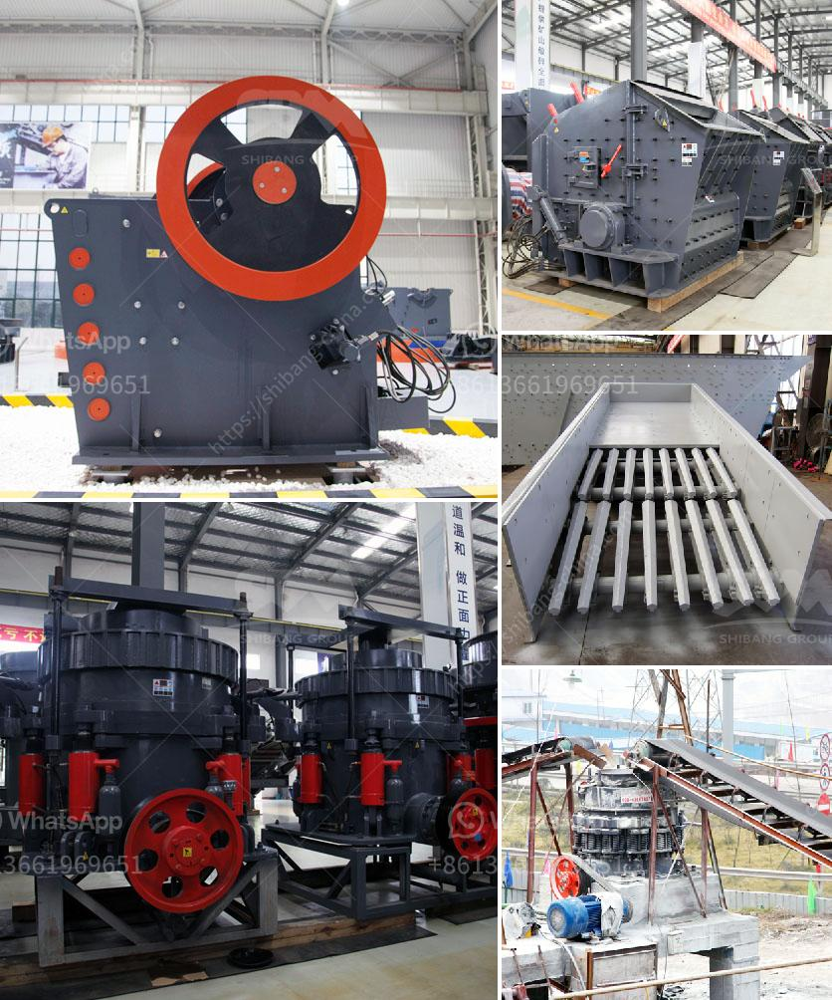

<h3>آلة طحن الحجر الجيري المصنع</h3>
تُعتبر آلة طحن الحجر الجيري من الآلات المهمة في صناعة التعدين. تستخدم هذه الآلة لطحن الحجر الجيري إلى مسحوق ناعم يُستخدم في العديد من الصناعات، مثل صناعة الإسمنت وعمليات تنقية مياه الشرب وإزالة تلوث الهواء.

تتألف آلة طحن الحجر الجيري من عدة أجزاء. أبرز هذه الأجزاء هي المحرك الذي يقوم بتشغيل الآلة ودفعها لطحن الحجر. تحتوي الآلة أيضًا على حلقة طحن مسننة تدور بسرعة عالية، وتعمل على سحق الحجر الجيري وتحويله إلى مسحوق ناعم.

تعتبر سرعة طحن الحجر الجيري في هذه الآلة عاملاً مهماً في الحصول على النتائج المطلوبة. يمكن للمشغل ضبط سرعة الطحن وفقًا لمتطلبات الإنتاج ونوع الصناعة المستخدمة لهذا المسحوق. التحكم في سرعة الطحن يتم عادةً من خلال ضبط زمام القيادة للمحرك الذي يقوم بتشغيل الآلة.

يحتوي جهاز طحن الحجر الجيري على أيضًا فتحتين، فتحة إدخال لإدخال الحجر الجيري الخام وفتحة إخراج لإخراج المسحوق المطحون. يتم إدخال الحجر الجيري بواسطة السير الناقل أو المصعد الذي ينقل الخام إلى الفتحة الأمامية للجهاز. بعد الطحن، يتم استخلاص المسحوق من الفتحة الخلفية باستخدام سلة التلى أو جهاز الفرز.

تتميز آلة طحن الحجر الجيري بقدرتها على طحن الحجر بشكل سريع وفعال، مما يسهم في زيادة الإنتاجية في صناعة التعدين. كما يمكن تعديل درجة نعومة المسحوق المطحون من خلال ضبط أجزاء الآلة وتغيير سرعة الطحن.

بشكل عام، تُعتبر آلة طحن الحجر الجيري أحد الأدوات الأساسية والفعالة في صناعة التعدين. تساهم في تحويل الحجر الجيري إلى منتج نهائي قابل للاستخدام في العديد من الصناعات المختلفة. توفر هذه الآلة فرصة للتعدين المستدام وتحقيق الفوائد الاقتصادية والبيئية.
<h3>Contact us</h3><ul><li><strong>Whatsapp:&nbsp;<a href="https://wa.me/8613661969651">+8613661969651</a></strong></li><li><a href="https://swt.shibang-china.com/?git&amp;zhl&amp;آلة طحن الحجر الجيري المصنع"><strong>Online Service(chat now)</strong></a></li></ul><h3>Related</h3><ul><li><a href='معدات تعدين الرمال والحصى للبيع.md'>معدات تعدين الرمال والحصى للبيع</a></li><li><a href='تقرير جدوى المشروع حول كسارة الحجر.md'>تقرير جدوى المشروع حول كسارة الحجر</a></li><li><a href='موردي مطحنة ريموند.md'>موردي مطحنة ريموند</a></li><li><a href='بيع كسارة الصخور.md'>بيع كسارة الصخور</a></li><li><a href='كيفية بناء مصنع استفادة من المنغنيز.md'>كيفية بناء مصنع استفادة من المنغنيز</a></li></ul>