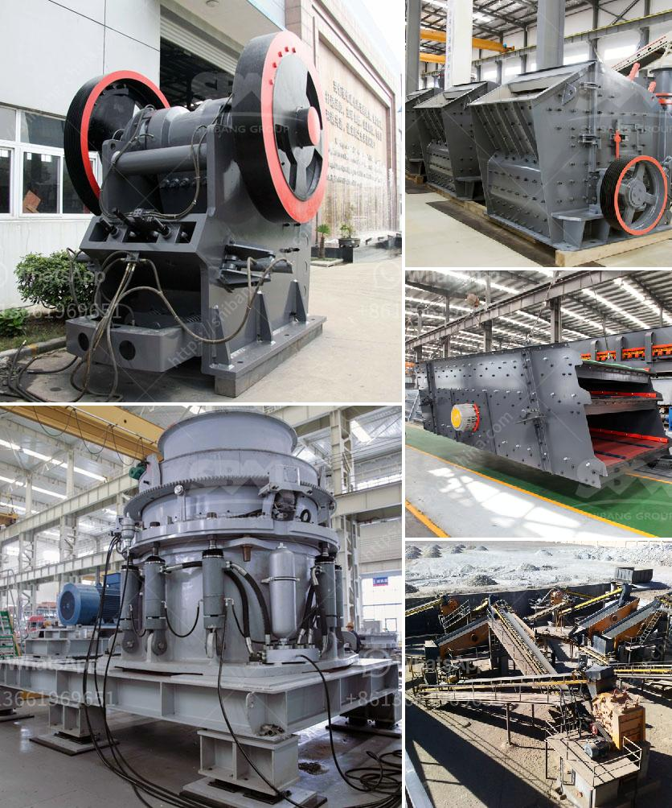

<h3>آلة طحن الرخام للبيع</h3>
تعتبر آلة طحن الرخام من الأدوات المهمة واللازمة لعملية تجهيز الرخام وتصنيع المنتجات المصنوعة منه. إذ يتم استخدام آلات طحن الرخام لتجهيز الألواح الكبيرة والقطع الصغيرة من الرخام لإنتاج الأرضيات والجدران المصقولة والتماثيل والمصابيح وغيرها من المنتجات.

بصفة عامة، تتكون آلة طحن الرخام من ثلاثة أجزاء رئيسية: رأس الطحن، واستبدال الأدوات، وسقف الحماية. يتم تثبيت رأس الطحن على جهاز يتحرك بسرعة عالية ليقوم بطحن سطح الرخام بشكل متساوٍ. كما يتم استخدام أدوات مختلفة للطحن وفقًا لنوع العمل المطلوب. أما سقف الحماية فيقوم بحماية المشغل من الحطام والغبار الناشئ أثناء عملية الطحن.

تتوفر آلات طحن الرخام بمختلف الأحجام والقدرات، ويمكن شراء آلة بسعر يتراوح من 200 إلى 400 دولار، حسب الحجم والمواصفات. وبالإضافة إلى ذلك، يمكن العثور على مجموعة واسعة من آلات طحن الرخام المستعملة للبيع بأسعار أرخص.

تعتبر آلات طحن الرخام من الأدوات الضرورية في صناعة تجهيز الرخام وتصنيع منتجاته. فهي تقوم بتحسين التشطيب النهائي للرخام وتوفر سطحًا لامعًا ومتساويًا للمنتجات المصنوعة منه. كما أن استخدام آلة طحن الرخام يساعد على توفير الوقت والجهد اللازمين لإنتاج منتجات عالية الجودة.

بالإضافة إلى آلات طحن الرخام الأساسية، يمكن شراء الملحقات الإضافية التي تزيد من كفاءة العمل. ومن هذه الملحقات: فوهات الرش التي تستخدم لتبريد وتنظيف الرخام أثناء العمل، وجهاز الشفط الذي يسحب الغبار والحطام الناتج عن العملية، وما إلى ذلك.

في الختام، آلة طحن الرخام هي أداة لا غنى عنها في صناعة تجهيز الرخام وتصنيع المنتجات المصنوعة منه. يمكن العثور على آلات طحن الرخام المختلفة للبيع بأسعار متنوعة تناسب ميزانيات مختلفة. وباستخدام هذه الأداة، يمكن إنتاج منتجات ذات جودة عالية وتشطيب نهائي متقن.
<h3>Contact us</h3><ul><li><strong>Whatsapp:&nbsp;<a href="https://wa.me/8613661969651">+8613661969651</a></strong></li><li><a href="https://swt.shibang-china.com/?git&amp;zhl&amp;آلة طحن الرخام للبيع"><strong>Online Service(chat now)</strong></a></li></ul><h3>Related</h3><ul><li><a href='كسارة لفة معدات مستخدمة tph الفحم الروسية.md'>كسارة لفة معدات مستخدمة tph الفحم الروسية</a></li><li><a href='كيفية بدء عمل في مجال صناعة الكتل الخرسانية.md'>كيفية بدء عمل في مجال صناعة الكتل الخرسانية</a></li><li><a href='آلة طحن السلاغ الفرن العالي في الهند.md'>آلة طحن السلاغ الفرن العالي في الهند</a></li><li><a href='مصنع تحسين الكروم في الصين.md'>مصنع تحسين الكروم في الصين</a></li><li><a href='سعر آلة تكسير الذهب في الولايات المتحدة.md'>سعر آلة تكسير الذهب في الولايات المتحدة</a></li></ul>