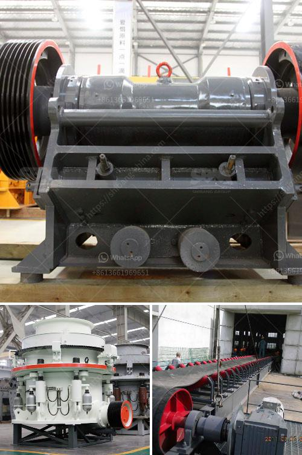

<h3>آلة طحن الرخام</h3>
تعتبر آلة طحن الرخام من الأدوات الهامة في صناعة الأثاث والتشطيبات التجارية والمنازل. تساعد هذه الآلة في تحويل الأسطح الخشنة والغير مستوية إلى أسطح ناعمة وملساء، مما يضيف لمسة من الجمال والأناقة إلى المساحات التي تستخدم فيها.

تتكون آلة طحن الرخام من قاعدة مستقرة وقوية، ورأس للطحن يحتوي على محرك وأقراص طحن بمختلف الحبيبات، ومقبض للتحكم والتوجيه. قد تتطلب الآلات الأكثر تقدمًا أيضًا نظامًا للرش المائي لتبريد وتنظيف الأقراص الدوارة أثناء العمل.

باستخدام آلة طحن الرخام، يمكن تحقيق نتائج رائعة في وقت قصير. إنها تزيل العيوب والخدوش والاحتكاك الناتج عن الاستخدام اليومي، كما أنها تستطيع تنعيم الأطراف وتصقل الأحجار الطبيعية والأسطح الرخامية. تعتبر هذه الآلة ضرورية في صناعة الحجر والبلاط والأثاث، وتستخدم أيضًا في تجديد العمليات البنائية والصناعية.

توفر آلة طحن الرخام عدة فوائد. فقد تجعل السطح أكثر سلاسة ومقاومة للتآكل والبلى. كما تعزز الشكل العام للأثاث والأرضيات والجدران. تساعد الآلة أيضًا في توزيع الضغط الواقع على السطح بشكل متساوٍ، مما يجعلها أكثر استدامة وطول العمر.

لكنه يجب أيضًا التعامل بحذر مع هذه الآلة لتجنب حدوث أي ضرر. يجب على الفنيين والعمال الاحترافيين اتباع إرشادات السلامة كالعمل بأقراص ملحومة مع زاوية مائلة وارتداء معدات الوقاية الشخصية واتباع تعليمات العمل الآمنة.

باختصار، آلة طحن الرخام هي أداة المستقبل في تحقيق أسطح جميلة وعمر طويل. تساعد هذه الآلة في تنعيم الرخام وصقله بإتقان. إذا كنت ترغب في تحويل منزلك أو مكتبك إلى مساحة رائعة وفخمة، فإن استخدام آلة طحن الرخام هو الطريق المناسب لتحقيق ذلك.
<h3>Contact us</h3><ul><li><strong>Whatsapp:&nbsp;<a href="https://wa.me/8613661969651">+8613661969651</a></strong></li><li><a href="https://swt.shibang-china.com/?git&amp;zhl&amp;آلة طحن الرخام"><strong>Online Service(chat now)</strong></a></li></ul><h3>Related</h3><ul><li><a href='سعر تريتورادورا دي تييرراس في باكستان.md'>سعر تريتورادورا دي تييرراس في باكستان</a></li><li><a href='معدات طحن الباريت.md'>معدات طحن الباريت</a></li><li><a href='استئجار سير ناقل.md'>استئجار سير ناقل</a></li><li><a href='تكلفة سيور النقل.md'>تكلفة سيور النقل</a></li><li><a href='معدات كسارة قشر الجوز.md'>معدات كسارة قشر الجوز</a></li></ul>