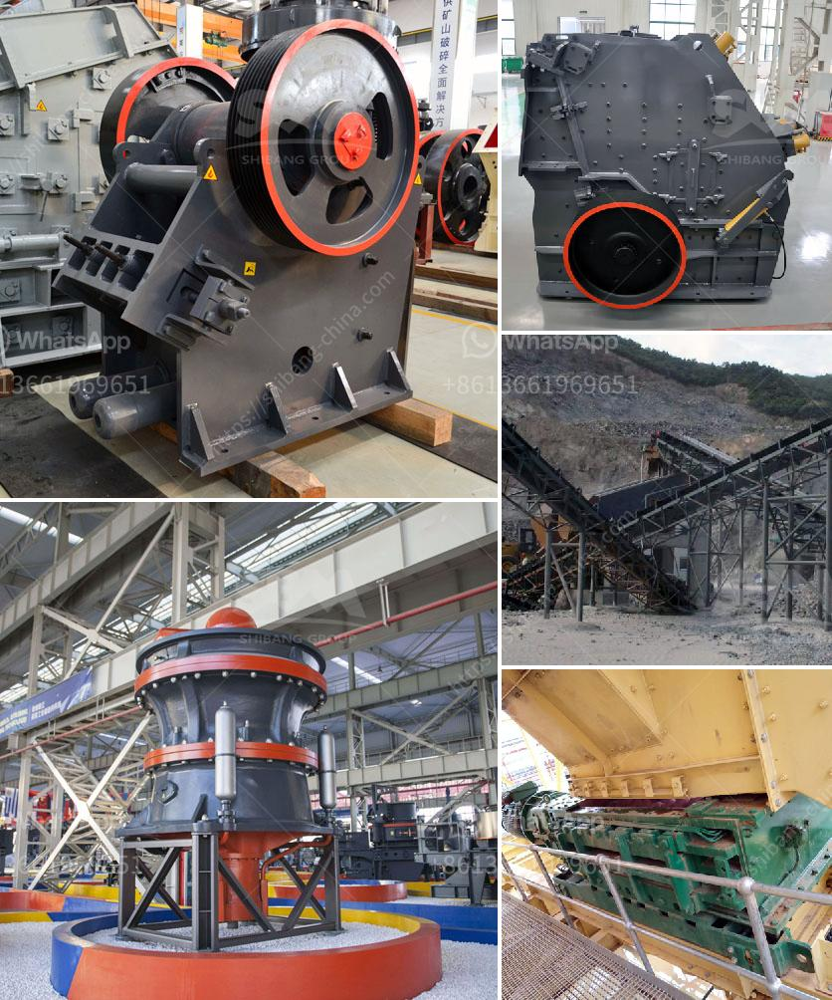

<h3>آلة طحن الرمل السيليكا</h3>
تعتبر آلة طحن الرمل السيليكا أحد الأدوات الهامة في صناعة المواد الخام والمنتجات المشتقة من الرمل السيليكا. تُستخدم هذه الآلة لطحن وتكسير حبيبات الرمل السيليكا إلى حجم معين يتناسب مع احتياجات الصناعة.

تتألف آلة طحن الرمل السيليكا من محرك كهربائي قوي يعمل على تشغيل أسطوانة معدنية تحتوي على كرات صلبة مصنوعة من المعدن. تتحرك الأسطوانة بسرعة عالية، مما يسبب دوران الكرات وتحركها في الأسطوانة. بتلك الحركة الدورانية، يتم طحن حبيبات الرمل السيليكا بفعل ارتطام الكرات بها وضغطها.

تتميز آلة طحن الرمل السيليكا بعدة مزايا. فمن بينها سهولة الاستخدام والتشغيل والصيانة. إضافة إلى ذلك، فإنها تعمل بكفاءة عالية وتساهم في زيادة الإنتاجية وتحسين جودة المنتجات النهائية. تتوفر هذه الآلة بمختلف الأحجام والأشكال لتتناسب مع متطلبات الإنتاج المختلفة، مما يجعلها قابلة للاستخدام في مجموعة متنوعة من الصناعات.

تستخدم آلة طحن الرمل السيليكا في العديد من الصناعات المختلفة، من بينها صناعة الزجاج والسيراميك والطلاء واللدائن. ففي صناعة الزجاج مثلاً، تدخل الرمل السيليكا في صناعة الزجاج الشفاف والعديد من المنتجات الزجاجية الأخرى. ولضمان جودة المنتج النهائي، يتم طحن حبيبات الرمل السيليكا بواسطة آلة الطحن لتكون بمقاس معين يسهم في تحسين مواصفات الزجاج وتجنب احتوائه على أي شوائب.

بالإضافة إلى ذلك، تستخدم آلة طحن الرمل السيليكا في صناعة السيراميك، حيث تكون الحبيبات المطحونة من الرمل السيليكا جزءًا من خليط المواد الخام لإنتاج السيراميك. وتعود الفائدة الرئيسية للتكسير بواسطة هذه الآلة إلى تحسين توزيع الحبيبات في المزيج السيراميكي وتكسير الأجزاء الكبيرة المتشابكة.

في الختام، تعتبر آلة طحن الرمل السيليكا أداة هامة في صناعة المواد الخام والمنتجات المشتقة من الرمل السيليكا. تُستخدم هذه الآلة لتحسين جودة المنتجات النهائية وتحسين كفاءة الإنتاج وتوزيع الحبيبات. تتوفر العديد من الأحجام والأشكال من هذه الآلة، مما يجعلها مناسبة لمختلف الصناعات المستخدمة للرمل السيليكا.
<h3>Contact us</h3><ul><li><strong>Whatsapp:&nbsp;<a href="https://wa.me/8613661969651">+8613661969651</a></strong></li><li><a href="https://swt.shibang-china.com/?git&amp;zhl&amp;آلة طحن الرمل السيليكا"><strong>Online Service(chat now)</strong></a></li></ul><h3>Related</h3><ul><li><a href='المعدات المطلوبة لعمل محجر الجرانيت.md'>المعدات المطلوبة لعمل محجر الجرانيت</a></li><li><a href='مطحنة الكرة المستخدمة للبيع في الهند.md'>مطحنة الكرة المستخدمة للبيع في الهند</a></li><li><a href='عملية كربونات الكالسيوم المترسبة.md'>عملية كربونات الكالسيوم المترسبة</a></li><li><a href='تقرير مشروع مصنع كسارة الحجر.md'>تقرير مشروع مصنع كسارة الحجر</a></li><li><a href='محطة كسارة نيجيريا.md'>محطة كسارة نيجيريا</a></li></ul>