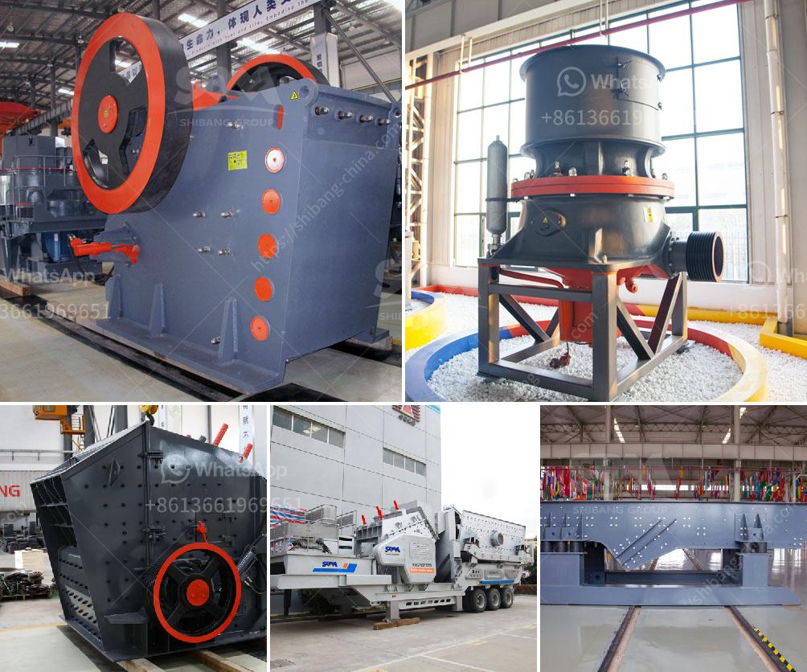

<h3>آلة طحن السلاغ الفرن العالي في الهند</h3>
تعتبر آلة طحن السلاغ الفرن العالي في الهند من أهم الأدوات التي تستخدم في صناعة الفولاذ. تعمل هذه الآلة على طحن وتحويل مخلفات صناعة الفولاذ إلى مادة سلاغ مستخدمة في تصنيع منتجات أخرى.

يستخدم السلاغ في العديد من الصناعات مثل صناعة الأسمنت والخرسانة والطرق والجدران الداخلية. تؤثر آلة طحن السلاغ الفرن العالي في الهند بشكل كبير على تلوث البيئة الذي يرتبط بإعادة استخدام وإعادة تدوير مخلفات صناعة الفولاذ. فبدلاً من التخلص من السلاغ بطرق ضارة مثل التخلص منه في المصبات العامة أو إلقائه في الأنهار، يتم استخدام آلة طحن السلاغ لتحويله إلى مادة مفيدة وتكون لها قيمة اقتصادية.

تعتمد آلات طحن السلاغ على تقنية متقدمة وتصميم فريد لتحقيق أداء فعال وعالي الجودة. تتميز هذه الآلات بكفاءة عالية في طحن السلاغ وفصل المواد الغير مرغوب فيها، مما يتيح الحصول على منتج نهائي ذو جودة عالية. كما تتميز أيضًا بخصائص ميكانيكية ممتازة وفترات صيانة قليلة، مما يعزز كفاءة العمل وتوفير التكاليف.

يعتبر قطاع صناعة الفولاذ في الهند أحد أهم قطاعات الاقتصاد، وتعد آلات طحن السلاغ الفرن العالي أحد العوامل الرئيسية التي تساهم في تطوير هذا القطاع. تعمل هذه الآلات على زيادة كفاءة صناعة الفولاذ وتقليل التلوث البيئي، مما يساهم في تعزيز الاقتصاد المستدام وحماية البيئة.

يجب أن يولي القطاع الصناعي والحكومة الهندية اهتمامًا كبيرًا لتعزيز استخدام آلات طحن السلاغ الفرن العالي في صناعة الفولاذ وتشجيع الشركات على استخدام هذه التقنيات المتقدمة. يجب أيضًا تعزيز البحث والتطوير لتحسين أداء هذه الآلات وتطويرها لتلبية احتياجات القطاع الصناعي وتحقيق التنمية المستدامة في الهند.
<h3>Contact us</h3><ul><li><strong>Whatsapp:&nbsp;<a href="https://wa.me/8613661969651">+8613661969651</a></strong></li><li><a href="https://swt.shibang-china.com/?git&amp;zhl&amp;آلة طحن السلاغ الفرن العالي في الهند"><strong>Online Service(chat now)</strong></a></li></ul><h3>Related</h3><ul><li><a href='فاصل عالي التدرج في زينغتشو.md'>فاصل عالي التدرج في زينغتشو</a></li><li><a href='مطاحن الكرة في ماليزيا.md'>مطاحن الكرة في ماليزيا</a></li><li><a href='عمل المطحنة الكرة بالهندية.md'>عمل المطحنة الكرة بالهندية</a></li><li><a href='كيفية إعداد شركة محجر حجر.md'>كيفية إعداد شركة محجر حجر</a></li><li><a href='تكلفة وحدة طحن الأسمنت tpd كسارة.md'>تكلفة وحدة طحن الأسمنت tpd كسارة</a></li></ul>