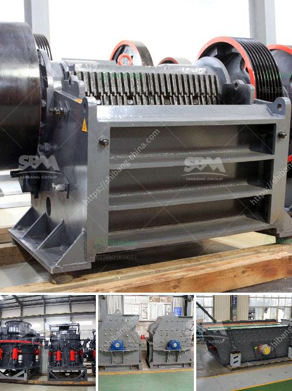

<h3>آلة طحن السليكات في الهند</h3>
تعتبر آلة طحن السليكات من الأجهزة الحديثة والمتطورة التي تستخدم في عمليات الطحن والتكسير في الصناعات المختلفة. وتُستخدم هذه الآلة بشكل رئيسي في صناعة السيراميك والزجاج، والتي تتطلب طحن السليكات للحصول على مسحوق ناعم يستخدم في إنتاج المواد الخام.

توفر آلة طحن السليكات في الهند تقنيات حديثة لطحن السليكات بشكل فعال وسريع. حيث تتميز بالقدرة على طحن السليكات بجودة عالية ودقة متناهية. وتستخدم هذه الآلة تقنيات حديثة مثل التحكم الرقمي بالحاسوب، والذي يساعد على تحقيق أعلى درجات الدقة في عملية الطحن.

تأتي آلة طحن السليكات في الهند بأحجام وأشكال مختلفة تناسب احتياجات العملاء المختلفة. كما تتميز بالقوة العالية والكفاءة التشغيلية، مما يجعلها الخيار المثالي للصناعات المختلفة في الهند.

تساهم ماكينة طحن السليكات في تحسين إنتاجية العملية الصناعية بشكل عام. فهي تقلل من الوقت والجهد المبذول في عملية الطحن، كما أنها توفر درجة عالية من الدقة والجودة في المنتج النهائي. وبالتالي، فإن استخدام آلة طحن السليكات في الهند يسهم في تحسين كفاءة العمل وزيادة الإنتاجية.

بالإضافة إلى ذلك، تساهم آلة طحن السليكات في توفير الكثير من التكاليف. حيث تقلل من التكاليف المرتبطة بشراء المواد الخام بشكل مباشر، كما أنها تحسن جودة المنتج النهائي، مما يساعد في زيادة قيمته وتحقيق أعلى مستويات الربح.

بصفة عامة، تعد آلة طحن السليكات في الهند أداة حاسمة في عملية الإنتاج الصناعي. فهي تساهم في تحسين الكفاءة والجودة وتوفير الوقت والتكاليف. وبفضل التطور التكنولوجي المستمر، يمكن توقع المزيد من التحسينات في هذه الآلة في المستقبل.
<h3>Contact us</h3><ul><li><strong>Whatsapp:&nbsp;<a href="https://wa.me/8613661969651">+8613661969651</a></strong></li><li><a href="https://swt.shibang-china.com/?git&amp;zhl&amp;آلة طحن السليكات في الهند"><strong>Online Service(chat now)</strong></a></li></ul><h3>Related</h3><ul><li><a href='آلة غسيل الرمل السيليكا في جنوب أفريقيا.md'>آلة غسيل الرمل السيليكا في جنوب أفريقيا</a></li><li><a href='مطاحن ريموند في الصين.md'>مطاحن ريموند في الصين</a></li><li><a href='شركة تصنيع آلات الحجر في إيروود.md'>شركة تصنيع آلات الحجر في إيروود</a></li><li><a href='كسارة الفك لتعدين الفحم.md'>كسارة الفك لتعدين الفحم</a></li><li><a href='صيغة بسيطة لناقل الحزام.md'>صيغة بسيطة لناقل الحزام</a></li></ul>