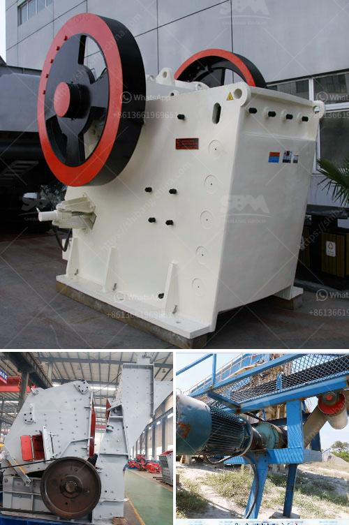

<h3>آلة طحن الصخور والألغام والخامات المسحوقة</h3>
تعتبر آلة طحن الصخور والألغام والخامات المسحوقة من الأدوات الهامة في صناعة التعدين والمعادن وغيرها من الصناعات. تستخدم هذه الآلة لطحن الصخور الكبيرة أو الألغام وتحويلها إلى مادة مسحوقة رقيقة ودقيقة يمكن استخدامها أو بيعها في صناعات أخرى.

تعمل آلة طحن الصخور والألغام والخامات المسحوقة عن طريق تطبيق القوة والضغط على المواد الخام. تتكون الآلة عادةً من مطحنة طحن رأسية أو أفقية وقد تشمل أيضًا نظامًا لفصل المواد المسحوقة بعد الطحن.

تتوفر العديد من أنواع آلات طحن الصخور والألغام والخامات المسحوقة، وتتفاوت في الحجم والسعة والقدرة. تستخدم الآلات الصغيرة عادة في المختبرات أو في البحوث العلمية، بينما تستخدم الآلات الكبيرة في الصناعات التجارية والتعدين. عادةً ما تكون مزودة بمحرك كهربائي يتحكم في سرعتها وقوتها.

تساهم آلة طحن الصخور والألغام والخامات المسحوقة في تحسين كفاءة العمل عن طريق تقليل حجم الصخور أو الخامات وتسهيل تعاملها واستخدامها في العمليات اللاحقة. فالمواد المطحونة يمكن تحويلها إلى منتجات جاهزة للإستخدام أو استخدامها في عمليات تصنيع أخرى كتعدين المعادن.

تعد آلة طحن الصخور والألغام والخامات المسحوقة ذات أهمية كبيرة في صناعة المواد الأولية والمعادن. فالمواد المسحوقة أكثر سهولة في الاستخدام والتخزين بالمقارنة مع الصخور الكبيرة أو الخامات غير المعالجة. كما أنها تساهم في زيادة القيمة المضافة للمنتجات وتوفر موارد طبيعية قيمة للاستفادة منها.

بالإضافة إلى ذلك، تساهم آلة طحن الصخور والألغام والخامات المسحوقة في حماية البيئة. فعندما تكون المواد مطحونة، يتم تقليل الحاجة إلى استخدام الكيماويات الضارة أو العمليات الصناعية الضارة بالبيئة. وبالتالي، يتم تقليل تأثير صناعة التعدين والمواد الأولية على البيئة والتقليل من تلوث الهواء والماء.

في النهاية، تلعب آلة طحن الصخور والألغام والخامات المسحوقة دورًا مهمًا في صناعة التعدين والمعادن والصناعات الأخرى. تحسن كفاءة العمل وتقلل التكلفة وتحمي البيئة. تعتبر هذه الآلة ابتكارًا هامًا في مجال تحويل المواد الخام إلى منتجات قابلة للاستخدام، وتساعد في تحقيق التنمية المستدامة والاستدامة البيئية.
<h3>Contact us</h3><ul><li><strong>Whatsapp:&nbsp;<a href="https://wa.me/8613661969651">+8613661969651</a></strong></li><li><a href="https://swt.shibang-china.com/?git&amp;zhl&amp;آلة طحن الصخور والألغام والخامات المسحوقة"><strong>Online Service(chat now)</strong></a></li></ul><h3>Related</h3><ul><li><a href='فاصل رمل وحجر لغسيل الشمندر.md'>فاصل رمل وحجر لغسيل الشمندر</a></li><li><a href='تاجر كسارة الحجر في الصين.md'>تاجر كسارة الحجر في الصين</a></li><li><a href='شراء آلة محجر من أوروبا.md'>شراء آلة محجر من أوروبا</a></li><li><a href='كسارة البليت في كينيا.md'>كسارة البليت في كينيا</a></li><li><a href='كسارة الصدم المحمولة في إثيوبيا.md'>كسارة الصدم المحمولة في إثيوبيا</a></li></ul>