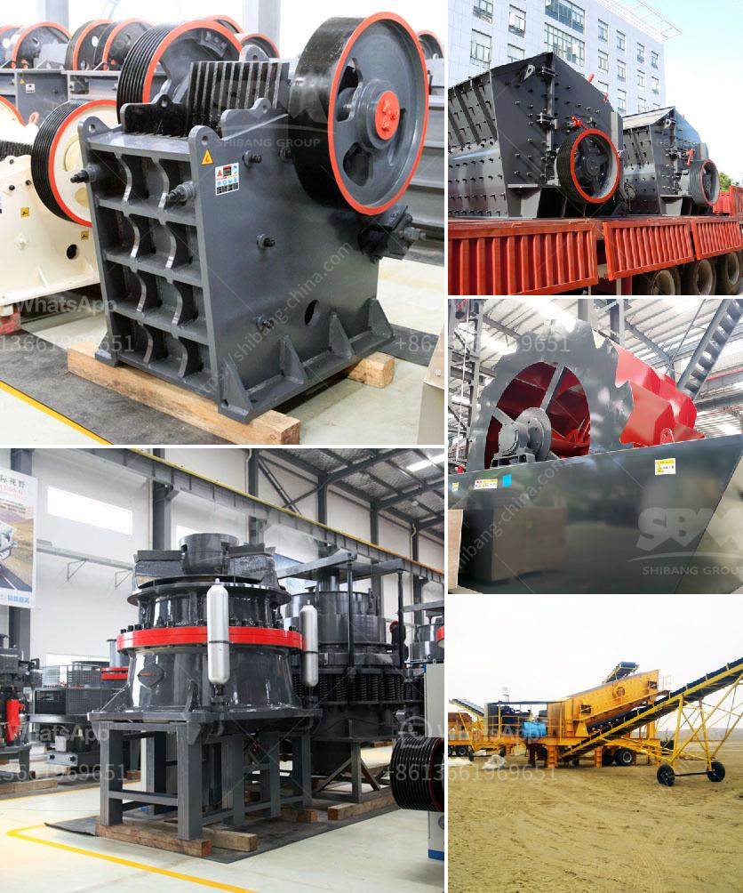

<h3>آلة طحن الطين الصيني</h3>
تُعد آلة طحن الطين الصيني واحدة من أهم الأدوات التي تستخدم في طحن الطين وتشكيله بشكل متساوٍ ومناسب للحرفيين والفنانين. تعتبر الصين واحدة من أقدم الدول التي تعتمد على صناعة الفخار والسيراميك، ولذا فإن وجود آلة طحن الطين الصيني أمر أساسي لإنتاج الأعمال الفنية والمنتجات التقليدية التي تمتاز بالتفاصيل الدقيقة والجودة العالية.

تصنع آلة طحن الطين الصيني بأن تكون مصنوعة من مادة تحمل الطين الرطب والثقيل بدون أن تتعرض للتآكل. تتكون الآلة من جسم كبير واسطواني، يتم تحميله بالطين ويجبل بهلوان بحركة دائرية. إضافةً إلى ذلك، يحتوي جهاز الطحن على مرجل لتوليد القوة اللازمة لتشغيل الجسم الهليكويدي وجهازي تبريد وتسخين للسيراميك المطحون. يمكن تعديل السرعة وشدة الطحن حسب متطلبات كل فنان عن طريق زيادة أو تخفيف قوة الحركة الدوارة.

يعتبر استخدام آلة طحن الطين الصيني مرحلة حاسمة في عملية تجهيز الطين قبل أن يتم تشكيله وصنعه. فهي تساعد في تحطيم القطع الصلبة وتنعيم الطين لتسهيل عملية التشكيل. كما أنها تساعد على توزيع الماء بشكل متساوٍ داخل الطين وإزالة الهواء المتحجر داخله. هذه العمليات المجتمعة تساعد على زيادة قابلية الطين للعمل والتأكد من أن جميع قطع الطين تحتوي على تركيبة متجانسة وجودة عالية.

يُعتبر آلة طحن الطين الصيني أداة لا غنى عنها في صناعة الفخار والسيراميك. فهي تسهل عملية التشكيل والنحت على الطين بدقة وسلاسة. تستخدم هذه الآلة في مختلف الصناعات، مثل حرفة صنع الأواني والمعروفة باسم "الفخار الصيني" وفن السيراميك وإنتاج التحف الفنية.

اختراع آلة طحن الطين الصيني يعتبر اختراقًا في صناعة الفخار والسيراميك. حيث ساهمت هذه الآلة في تبسيط وتسريع عملية تجهيز الطين وتشكيله، مما أدى إلى زيادة إنتاجية الحرفيين وتحسين جودة الأعمال الصينية. كما تُعد الآلة من الابتكارات التقنية التي تعكس تطور وتقدم الصناعة الفنية بشكل عام.
<h3>Contact us</h3><ul><li><strong>Whatsapp:&nbsp;<a href="https://wa.me/8613661969651">+8613661969651</a></strong></li><li><a href="https://swt.shibang-china.com/?git&amp;zhl&amp;آلة طحن الطين الصيني"><strong>Online Service(chat now)</strong></a></li></ul><h3>Related</h3><ul><li><a href='كيفية بدء منجم المحاجر.md'>كيفية بدء منجم المحاجر</a></li><li><a href='عملية سحق الصخور في الركام.md'>عملية سحق الصخور في الركام</a></li><li><a href='آلة طحن الرخام للبيع.md'>آلة طحن الرخام للبيع</a></li><li><a href='حجم الشبكة لمطحنة الكرة.md'>حجم الشبكة لمطحنة الكرة</a></li><li><a href='مصنعون صينيون للمعدات الإنشائية.md'>مصنعون صينيون للمعدات الإنشائية</a></li></ul>