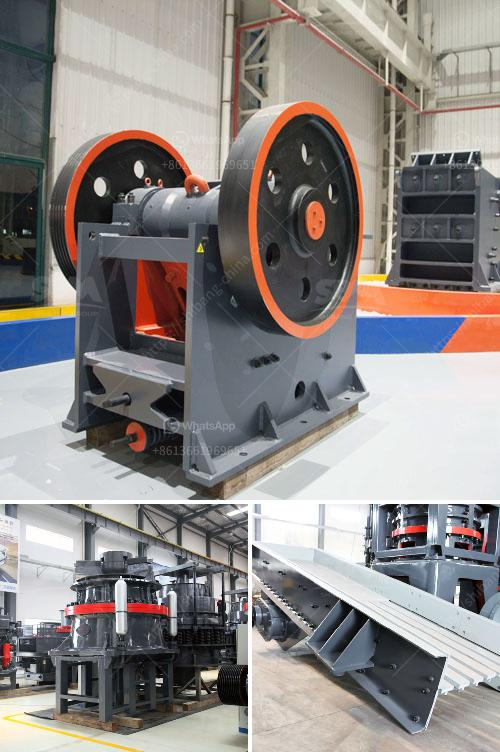

<h3>آلة طحن الطين المستخدمة للبيع</h3>
آلة طحن الطين هي آلة تستخدم في عملية طحن وتكسير الطين ومواد أخرى لصنع الفخار والسيراميك والبلاط وغيرها من المنتجات الخزفية. يتم استخدام هذه الآلة منذ آلاف السنين في صناعة الفخار والسيراميك التقليدية، وتعتبر حتى اليوم أحد الأدوات المُهمة للقطاع الخزفي.

تتكون آلة طحن الطين من عدة أجزاء أساسية، بما في ذلك الطاحونة أو الطاحونة الدوارة، والهيكل الداعم والناقل المركزي. يعمل الطاحونة على طحن وتكسير الطين المختلف ومنحه نعومة تسمح بتشكيله وتشكيله حسب الرغبة. يتم تشغيل الطاحونة عن طريق ناقل مركزي يحرك الأحجار الطحن بسرعة عالية لتكسير الطين والمواد الأخرى.

إن هناك عدة أنواع مختلفة من آلات طحن الطين المستخدمة في صناعة الفخار والسيراميك، مثل الطواحين الرطبة والطحونة الأفقية والطحونة العمودية. تختلف هذه الأنواع في الهيكل والتصميم والأداء، وتستخدم بشكل رئيسي في تصنيع منتجات خزفية مختلفة.

يتم استخدام آلة طحن الطين بشكل واسع في صناعة الفخار والسيراميك لعدة أسباب. أولاً، فإنها تساعد في تحسين جودة المنتجات النهائية، حيث تسمح بطحن الطين بشكل متساوٍ وتوزيع الجسيمات بشكل مناسب. ثانياً، توفر الآلة سرعة وكفاءة في عملية الطحن، مما يزيد من إنتاجية المصنع ويقلل من تكاليف العمالة. وأخيراً، تساهم الآلة أيضاً في تقليل تكاليف التشغيل، حيث تعمل بكفاءة عالية وتتطلب صيانة واهتمام أقل.

يمكن العثور على آلة طحن الطين المستخدمة للبيع في العديد من المواقع والأسواق المختلفة. تتوفر مجموعة واسعة من الآلات المستخدمة بالأحجام والقدرات المختلفة لتلبية احتياجات الصناعة المختلفة. قد تكون تكلفة هذه الآلات متفاوتة حسب العلامة التجارية والحجم وشرط الآلة.

في الختام، آلة طحن الطين هي أداة رئيسية في صناعة الفخار والسيراميك، تقوم بطحن وتكسير الطين والمواد الأخرى لتشكيلها وصنع منتجات خزفية مميزة. وتعد أنواع مختلفة من هذه الآلات متاحة للبيع، مما يلبي احتياجات الشركات المصنعة المختلفة.
<h3>Contact us</h3><ul><li><strong>Whatsapp:&nbsp;<a href="https://wa.me/8613661969651">+8613661969651</a></strong></li><li><a href="https://swt.shibang-china.com/?git&amp;zhl&amp;آلة طحن الطين المستخدمة للبيع"><strong>Online Service(chat now)</strong></a></li></ul><h3>Related</h3><ul><li><a href='مطحنة الهامر من إيديبيسا.md'>مطحنة الهامر من إيديبيسا</a></li><li><a href='ورقة حساب حزام الناقل.md'>ورقة حساب حزام الناقل</a></li><li><a href='كيفية صنع مسحوق الطين الأحمر للغراز.md'>كيفية صنع مسحوق الطين الأحمر للغراز</a></li><li><a href='محطة كسارة في الفلبين.md'>محطة كسارة في الفلبين</a></li><li><a href='مطحنة طحن ريموند في أوروبا.md'>مطحنة طحن ريموند في أوروبا</a></li></ul>