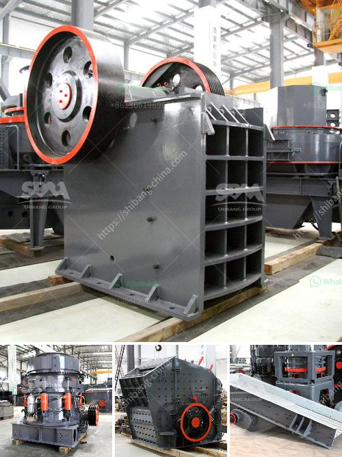

<h3>آلة طحن الكالسايت للبيع</h3>
تعد آلة طحن الكالسايت عبارة عن جهاز يستخدم لطحن الحجارة الجيرية ، وهي مادة صخرية شائعة من المعادن الكربوناتية. يتم استخدام الكالسايت في العديد من الصناعات مثل صناعة الأسمدة والزجاج والبلاستيك والدهانات والورق.

ثمن الآلة يتراوح ما بين 200 إلى 400 دولار ، وهو ثمن معقول جدًا بالنسبة لفوائدها واستخداماتها المتعددة في المصانع وورش العمل. تلك الآلة تتألف عادة من محرك كهربائي قوي يستخدم لتشغيل الأسطوانات الدوارة التي توجد داخل الآلة.

قد يتسائل البعض عن أهمية هذه الآلة ولماذا يجب شراؤها؟ إليكم بعض الأسباب التي تجعلها ضرورية:

1. سرعة وكفاءة العمل: تعمل آلة طحن الكالسايت على تحويل الحجارة الكبيرة إلى حجم صغير بسرعة فائقة. هذا يساعد على زيادة كفاءة العمل وتوفير الوقت والجهد للعمال.

2. جودة المنتج النهائي: بفضل هذه الآلة المتطورة ، يمكن الحصول على كالسايت مطحون عالي الجودة ومتجانس. هذا يعني أن المنتج النهائي سيكون قادرًا على تلبية معايير الجودة المطلوبة في الصناعات المختلفة التي تحتاج إلى الكالسايت كمادة خام.

3. الاقتصاد: تعمل آلة طحن الكالسايت على تحسين الكفاءة وتوفير الوقت والموارد. هذا يعني أنه يمكن توفير المزيد من الموارد والتكاليف المالية على المدى الطويل. بالإضافة إلى ذلك ، يمكن أيضًا بيع الكالسايت المطحون كمنتج جاهز للاستخدام في السوق ، مما يزيد من العائد المالي.

4. التحكم في حجم الجسيمات: يمكن ضبط الآلة لتحقيق مستوى محدد من الدقة في حجم الجسيمات التي تخرج. هذا يعني أنه يمكن تلبية احتياجات العديد من الصناعات المختلفة التي تحتاج إلى حجم جسيمات معين.

في الختام ، آلة طحن الكالسايت هي أداة ضرورية في العديد من الصناعات التي تستخدم الكالسايت كمادة خام. وبفضل كفاءتها وتوفيرها الوقت والتكاليف ، فهي تعتبر استثمارًا جيدًا للشركات والمصانع. إذا كنت تعمل في إحدى تلك الصناعات أو ترغب في استغلال الموارد الطبيعية بشكل أكبر ، فإن شراء آلة طحن الكالسايت هو اختيار مثالي لك.
<h3>Contact us</h3><ul><li><strong>Whatsapp:&nbsp;<a href="https://wa.me/8613661969651">+8613661969651</a></strong></li><li><a href="https://swt.shibang-china.com/?git&amp;zhl&amp;آلة طحن الكالسايت للبيع"><strong>Online Service(chat now)</strong></a></li></ul><h3>Related</h3><ul><li><a href='كسارة الحجر المحمولة.md'>كسارة الحجر المحمولة</a></li><li><a href='كسارة الكرة النحاس آلة كسارة النحاس.md'>كسارة الكرة النحاس آلة كسارة النحاس</a></li><li><a href='صيانة مطحنة الأسطوانة العمودية  تنزيل PDF.md'>صيانة مطحنة الأسطوانة العمودية - تنزيل PDF</a></li><li><a href='معدات طحن لمسحوق التلك.md'>معدات طحن لمسحوق التلك</a></li><li><a href='مصنع الحجر الجيري والآلات في تاميل نادو للبيع.md'>مصنع الحجر الجيري والآلات في تاميل نادو للبيع</a></li></ul>