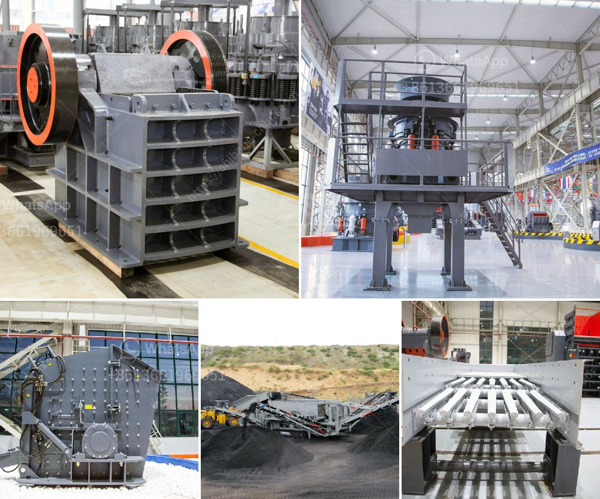

<h3>آلة طحن الكرات بتقنية ألمانية</h3>
تُعَد آلة طحن الكرات من أحد أهم الأجهزة التي تستخدم في صناعة الأسمنت والكيماويات ومجالات أخرى. تُستخدم هذه الآلة لطحن المواد الصلبة إلى جسيمات صغيرة جدًا تُعرف بالكرات، وتستخدم هذه الكرات في مجالات عديدة مثل صناعة الأسمدة والصناعات الكيماوية الأخرى.

تمتاز آلة طحن الكرات بتقنية ألمانية بعدة عوامل تجعلها تتفوق على آلات الطحن الأخرى. تعتبر التقنية الألمانية معيارًا دوليًا للتكنولوجيا العالية والاستدامة، وتعد من أفضل التقنيات المستخدمة في صناعة المعدات الصناعية.

تتميز آلة طحن الكرات بتقنية ألمانية بقدرتها على طحن المواد الخام بكفاءة عالية وبسرعة كبيرة. تعمل هذه الآلة عن طريق دوران الكرات داخل الأسطوانة، والتي تسبب طحن المواد الخام عن طريق الاصطدام بين الكرات والمواد. تساهم السرعة العالية في إنتاج جسيمات صغيرة جدًا ومتجانسة، مما يساعد في تحسين جودة المنتج النهائي.

بجانب ذلك، تعمل آلة طحن الكرات بتقنية ألمانية على توفير نظام تبريد متقدم يحافظ على درجة حرارة مستقرة داخل الأسطوانة أثناء العملية. يعتبر التبريد المناسب أمرًا هامًا للحفاظ على جودة المنتج ومنع الاحتكاك الزائد بين الكرات والمواد الخام.

وتعد تقنية ألمانية في آلة طحن الكرات أيضًا مبتكرة من حيث تصميم الأسطوانة وأجزائها الأخرى. تم تطوير هذه الآلة لتكون قوية ومتينة، وتعمل بكفاءة عالية طوال فترة الاستخدام. يعتبر تصميم الأسطوانة مهمًا في تحقيق الأداء العالي والاستدامة للآلة.

باختصار، آلة طحن الكرات بتقنية ألمانية تعتبر من الآلات الرائدة في مجال صناعة الغذاء والكيماويات والأسمنت وغيرها. تتميز هذه الآلة بقدرتها على طحن المواد الخام بكفاءة عالية، وتوفير نظام تبريد متقدم، وتصميم متين يضمن استدامتها. تجمع الآلة بين الأداء الممتاز والجودة العالية، مما يجعلها الخيار الأمثل للعديد من الصناعات في جميع أنحاء العالم.
<h3>Contact us</h3><ul><li><strong>Whatsapp:&nbsp;<a href="https://wa.me/8613661969651">+8613661969651</a></strong></li><li><a href="https://swt.shibang-china.com/?git&amp;zhl&amp;آلة طحن الكرات بتقنية ألمانية"><strong>Online Service(chat now)</strong></a></li></ul><h3>Related</h3><ul><li><a href='مطاحن الذهب الصينية للبيع في جنوب أفريقيا.md'>مطاحن الذهب الصينية للبيع في جنوب أفريقيا</a></li><li><a href='سلاسل ناقلات للكسارات.md'>سلاسل ناقلات للكسارات</a></li><li><a href='مصنع سحق في ماليزيا.md'>مصنع سحق في ماليزيا</a></li><li><a href='تكلفة مشروع إنتاج الرمل في الهند.md'>تكلفة مشروع إنتاج الرمل في الهند</a></li><li><a href='مطحنة رايموند مستخدمة في إندونيسيا.md'>مطحنة رايموند مستخدمة في إندونيسيا</a></li></ul>