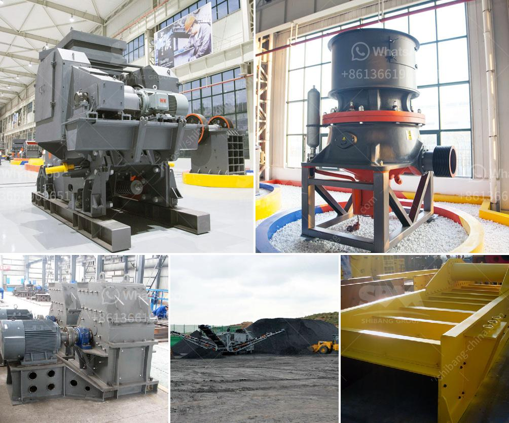

<h3>آلة طحن الكرة في الهند</h3>
آلة طحن الكرة هي واحدة من المعدات الرئيسية المستخدمة في عمليات الطحن في صناعة التعدين. تتكون الآلة من جسم دائري مصنوع من الصلب، ومجموعة من مطارق الطحن التي تدور في الجسم. تستخدم هذه المطارق لطحن المواد الخام إلى حجم صغير جداً.

تعتبر الهند واحدة من أكبر دول العالم المنتجة للمواد الخام مثل الفحم الحجري وخام الحديد والبوكسيت (خام الألومنيوم). لذلك، فإن صناعة التعدين تلعب دورا هاما في الهند وتعد آلة طحن الكرة أحد الأجهزة الرئيسية المستخدمة في هذا القطاع.

واحدة من مزايا آلة طحن الكرة هي قدرتها على طحن المواد الخام بفعالية عالية. تستخدم المطارق في دوران الجسم لسحق المواد الخام بلطف داخل الآلة، مما يؤدي إلى تفتيتها إلى حجم صغير. يتم استخدام هذه الآلة لإنتاج مواد خام مناسبة لعمليات التصنيع اللاحقة مثل صناعة الإسمنت والسيراميك والأسمدة.

بالإضافة إلى ذلك، يتم استخدام آلة طحن الكرة أيضا في صناعة الشوكولاتة ومنتجات المعجنات. وتقدم الآلة تحسينا كبيرا في عمليات الطحن التقليدية، حيث يمكنها طحن المكونات بسرعة وبشكل متجانس.

يوجد في الهند العديد من الشركات المصنعة لآلات طحن الكرة، وهي تتنافس في تقديم أحدث التكنولوجيات والابتكارات في هذا المجال. كما تعمل هذه الشركات على ضمان توفير معدات ذات جودة عالية وأداء موثوق به لقطاع التعدين والصناعات المرتبطة به.

وفي الختام، آلة طحن الكرة تلعب دورا حاسما في صناعة التعدين وتصنيع المواد الخام في الهند. تتميز بقدرتها على طحن المواد الخام بفعالية وسرعة، مما يجعلها لا غنى عنها في عمليات الإنتاج. وبفضل التطورات في هذا المجال وتوفر الشركات المصنعة لآلات الطحن الكرة في الهند، يمكن تعزيز الإنتاجية والكفاءة في صناعة التعدين والصناعات المرتبطة بها في البلاد.
<h3>Contact us</h3><ul><li><strong>Whatsapp:&nbsp;<a href="https://wa.me/8613661969651">+8613661969651</a></strong></li><li><a href="https://swt.shibang-china.com/?git&amp;zhl&amp;آلة طحن الكرة في الهند"><strong>Online Service(chat now)</strong></a></li></ul><h3>Related</h3><ul><li><a href='وزن كسارة الحجر.md'>وزن كسارة الحجر</a></li><li><a href='معدات تعدين مستعملة للبيع في غانا.md'>معدات تعدين مستعملة للبيع في غانا</a></li><li><a href='آلة صنع مسحوق الكوارتز.md'>آلة صنع مسحوق الكوارتز</a></li><li><a href='كسارة الخرسانة المصنوعة في اليابان.md'>كسارة الخرسانة المصنوعة في اليابان</a></li><li><a href='مطاحن الأسطوانة العليا للبيع.md'>مطاحن الأسطوانة العليا للبيع</a></li></ul>