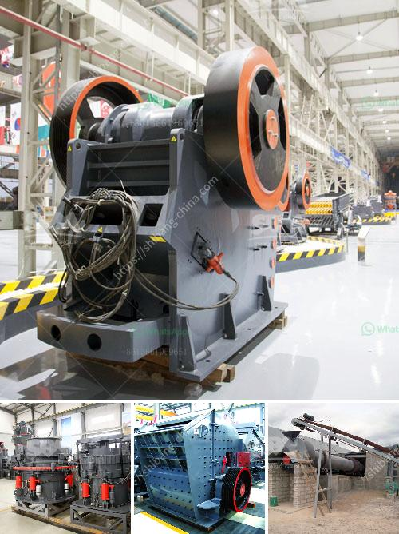

<h3>آلة طحن الكرة من المنغنيز</h3>
تُستخدم آلة طحن الكرة من المنغنيز في صناعة الأسمنت والكيماويات والصناعات الأخرى التي تتطلب طحن المواد الخام. تُستخدم هذه الآلة لطحن وسحق المواد الصلبة إلى قطع صغيرة بحجم معين. تُعد طاحونة الكرة من أكثر الآلات استخدامًا في عمليات التكسير والطحن الصناعية.

تتكوّن آلة طحن الكرة من أسطوانة دوارة عمودية، والتي تُدار بواسطة محرّك. يتم تعبئة الأسطوانة بالكرات المعدنية المصنوعة من المنغنيز أو الفولاذ المقاوم للصدأ، والتي تعمل على طحن المواد الخام بداخلها. يتم إدخال المواد الخام من الجانب العلوي للأسطوانة بواسطة ناقل، ويتم طحنها وسحقها بفعل ارتطام الكرات الموجودة داخل الأسطوانة مع المواد الخام.

وتعتمد كفاءة آلة طحن الكرة من المنغنيز على عدة عوامل، مثل حجم الكرات وشكلها، وسرعة الدوران للأسطوانة وزمن الطحن. يجب أن تكون نسبة الكرات إلى المواد الخام متوازنة جيدًا لتحقيق نتائج جيدة في عملية الطحن. كما يجب تحديد سرعة الدوران المثلى للأسطوانة، حيث يمكن للسرعة العالية جدًا أن تُؤدي إلى تآكل الكرات والأسطوانة، في حين أن السرعة المنخفضة قد لا تكون كافية للحصول على طحن كافٍ.

تُستخدم آلة طحن الكرة من المنغنيز لطحن مجموعة متنوعة من المواد الصلبة، مثل المواد الخام في صناعة الأسمنت، والمواد الكيماوية مثل الأسمدة، والمواد اللاصقة مثل الفلسبار والكوارتز. تُستخدم الكرات المصنوعة من المنغنيز للطحن والسحق بسبب صلابتها العالية وقوتها التحملية، والتي تمكّنها من سحق المواد الخام بفعالية وكفاءة. كما أن المنغنيز مادة مقاومة للتآكل، مما يجعلها مثالية للاستخدام في آلات الطحن.

بالاختصار، تُعتبر آلة طحن الكرة من المنغنيز من الآلات الأساسية في صناعة الأسمنت والكيماويات وصناعات أخرى، حيث تُستخدم لطحن المواد الخام وتحويلها إلى قطع صغيرة. يتم تعبئة الآلة بالكرات المصنوعة من المنغنيز، التي تعمل على طحن المواد الخام بفعالية وبكفاءة عالية. تعد آلة طحن الكرة من المنغنيز أحد أهم الأدوات في صناعات التكسير والطحن الصناعية، حيث تساهم في تحسين العملية الإنتاجية وزيادة الإنتاجية.
<h3>Contact us</h3><ul><li><strong>Whatsapp:&nbsp;<a href="https://wa.me/8613661969651">+8613661969651</a></strong></li><li><a href="https://swt.shibang-china.com/?git&amp;zhl&amp;آلة طحن الكرة من المنغنيز"><strong>Online Service(chat now)</strong></a></li></ul><h3>Related</h3><ul><li><a href='كسارة محمولة.md'>كسارة محمولة</a></li><li><a href='عملية سحق الصخور في الركام.md'>عملية سحق الصخور في الركام</a></li><li><a href='كسارات الحجر الرئيسية.md'>كسارات الحجر الرئيسية</a></li><li><a href='معلمات كسارة الهامر المقدمة بالتفصيل.md'>معلمات كسارة الهامر المقدمة بالتفصيل</a></li><li><a href='سعر كسارة الطاحونة الصناعية.md'>سعر كسارة الطاحونة الصناعية</a></li></ul>