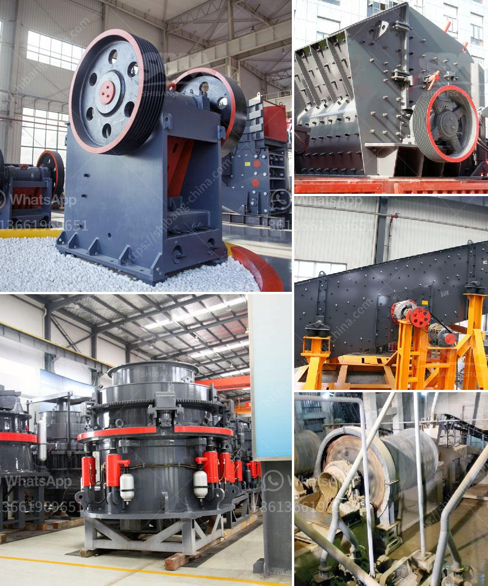

<h3>آلة طحن الكلنكر الإسمنتية</h3>
تُعتبر آلة طحن الكلنكر الإسمنتية من الآلات الهامة في صناعة الإسمنت. تُستخدم هذه الآلة لطحن الكلنكر الذي يتكون من الحجر الجيري والسيليكا والألومينا والأكسيد الحديدي، وهي المكونات الرئيسية للإسمنت.

يتم طحن الكلنكر في آلة طحن الكلنكر الإسمنتية للحصول على مسحوق الإسمنت النهائي. تعمل هذه الآلة بواسطة طحن الكلنكر بواسطة حركة دورانية وقوة احتكاك عالية. تركيبة الكلنكر ودرجة الطحن تحددان جودة الإسمنت النهائية.

تتكون الآلة من عدة أجزاء رئيسية، بما في ذلك جهاز تغذية المواد الخام وأسطوانة الطحن وجهاز الفحص. يتم إدخال الكلنكر من خلال جهاز التغذية، حيث يتم سحقه بواسطة الأسطوانة الموجودة في الآلة. تحتوي الأسطوانة على مجموعة من الكرات المعدنية الصلبة التي تقوم بطحن الكلنكر بفعل الحركة الدورانية والاحتكاك.

بعد طحن الكلنكر، يتم إزالة الغبار والشوائب باستخدام جهاز الفحص. يتم تصنيف الإسمنت النهائي وفقًا لحجم الجسيمات باستخدام شبكة الفحص المتوفرة في الجهاز. يصدر الإسمنت النهائي بشكل مسحوق وتخزنه في الحاويات لاستخدامه في عمليات البناء والإنشاء.

يقدم طحن الكلنكر الإسمنتية العديد من المزايا، بما في ذلك زيادة سرعة الهيدرات وتحسين خصائص الإسمنت. بالإضافة إلى ذلك، يتم تقليل استهلاك الطاقة في عملية الطحن، مما يؤدي إلى توفير تكاليف الإنتاج وتقليل الانبعاثات الضارة للبيئة.

في الختام، آلة طحن الكلنكر الإسمنتية تلعب دورًا حيويًا في صناعة الإسمنت. تمكن هذه الآلة من طحن الكلنكر للحصول على مسحوق الإسمنت النهائي، وهي تتميز بالكفاءة والدقة والمرونة. من خلال تحسين عملية الطحن، يمكن توفير تكاليف الإنتاج وزيادة جودة الإسمنت المنتج.
<h3>Contact us</h3><ul><li><strong>Whatsapp:&nbsp;<a href="https://wa.me/8613661969651">+8613661969651</a></strong></li><li><a href="https://swt.shibang-china.com/?git&amp;zhl&amp;آلة طحن الكلنكر الإسمنتية"><strong>Online Service(chat now)</strong></a></li></ul><h3>Related</h3><ul><li><a href='بيع آلة مطحنة الأسطوانة.md'>بيع آلة مطحنة الأسطوانة</a></li><li><a href='آلة معالجة الجبس بسعة طن واحد.md'>آلة معالجة الجبس بسعة طن واحد</a></li><li><a href='إنتاج الإسمنت الأبيض من مسحوق الرخام.md'>إنتاج الإسمنت الأبيض من مسحوق الرخام</a></li><li><a href='استفادة من خام الحديد بوسائل جافة.md'>استفادة من خام الحديد بوسائل جافة</a></li><li><a href='سعة مطحنة الكرة للطين.md'>سعة مطحنة الكرة للطين</a></li></ul>