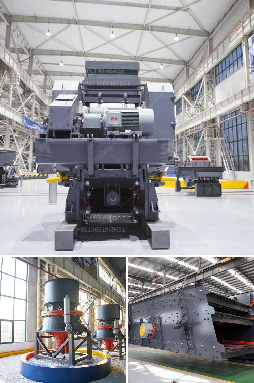

<h3>آلة طحن الكوارتز المستعملة للبيع</h3>
تعد آلة طحن الكوارتز إحدى الأدوات الأساسية التي يستخدمها عاملو مصانع الخامات المعدنية وصناعة الزجاج والسيراميك. تتميز هذه الآلة بقدرتها على طحن الكوارتز، وهو معدن مكون من السيليكا، إلى حجم أصغر، وذلك لتحسين عملية الإنتاج وتحسين الجودة.

تستخدم آلة طحن الكوارتز أساسًا لتحويل قطع الكوارتز الكبيرة إلى حبيبات صغيرة، وتقوم بذلك من خلال فرك أو طحن الكوارتز بواسطة الحجارة أو المعادن الصلبة. تعمل هذه الآلة عادة بواسطة محرك كهربائي يعمل على تشغيل مطارق أو غرابيل أو طواحين، تعمل على تفتيت الكوارتز إلى جزيئات صغيرة تسهل عملية المعالجة اللاحقة.

تتوفر آلات طحن الكوارتز بمجموعة متنوعة من الأحجام والقدرات حسب متطلبات العمل. وتتراوح الأسعار لآلات الطحن المستعملة بين 200 و 400 دولار، وهذا يعتمد على حجم الآلة وقوتها وحالتها العامة.

يمكنك العثور على آلة طحن الكوارتز المستعملة للبيع في عدة أماكن مثل المزادات أو الشركات المتخصصة في بيع المعدات الثقيلة المستعملة. قبل شراء آلة طحن الكوارتز المستعملة، ينبغي عليك التأكد من حالتها العامة وقوتها، وإذا كانت تعمل بكفاءة عالية وتلبي متطلبات عملك.

من المهم أيضًا اتباع توصيات السلامة أثناء استخدام آلة طحن الكوارتز، مثل ارتداء المعدات الواقية وقفازات الأمان، والعمل في بيئة جيدة التهوية لتجنب استنشاق الغبار والحفاظ على سلامة العاملين.

باختصار، آلة طحن الكوارتز هي أداة أساسية في عمليات التحضير والمعالجة للكوارتز، وتتوفر بأحجام وقدرات مختلفة. يمكن العثور على آلات الطحن المستعملة للبيع بأسعار مختلفة تتراوح بين 200 و 400 دولار، ويتوجب التأكد من حالة الآلة والالتزام بإجراءات السلامة أثناء العمل بها.
<h3>Contact us</h3><ul><li><strong>Whatsapp:&nbsp;<a href="https://wa.me/8613661969651">+8613661969651</a></strong></li><li><a href="https://swt.shibang-china.com/?git&amp;zhl&amp;آلة طحن الكوارتز المستعملة للبيع"><strong>Online Service(chat now)</strong></a></li></ul><h3>Related</h3><ul><li><a href='آلات محجر الجرانيت للبيع.md'>آلات محجر الجرانيت للبيع</a></li><li><a href='مصنع غسل الذهب msi المستخدم.md'>مصنع غسل الذهب msi المستخدم</a></li><li><a href='آلة مسحوق الدولوميت.md'>آلة مسحوق الدولوميت</a></li><li><a href='كسارة الكوارتز السيليكون.md'>كسارة الكوارتز السيليكون</a></li><li><a href='أسعار كسارات الخرسانة.md'>أسعار كسارات الخرسانة</a></li></ul>