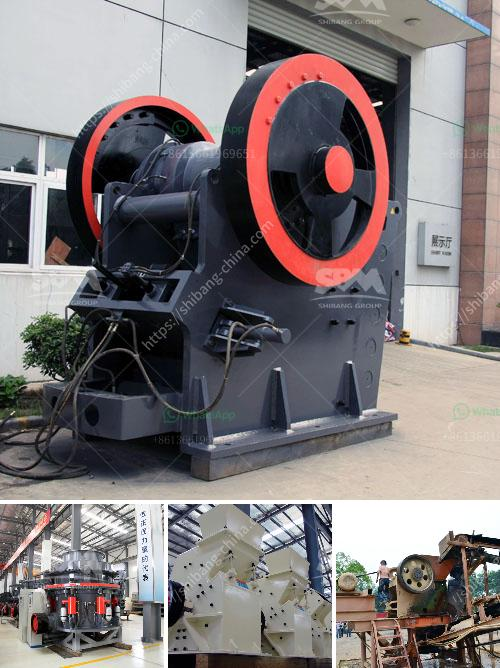

<h3>آلة طحن المطحنة في نيجيريا</h3>
تعد آلة طحن المطحنة واحدة من الآلات الرئيسية المستخدمة في صناعة الغذاء في نيجيريا. فهي تستخدم لطحن الحبوب مثل الذرة والقمح والأرز والشعير والفول السوداني والفلفل والتوابل الأخرى. تلعب آلة المطحنة دورًا حيويًا في صناعة الغذاء في نيجيريا حيث تساهم في تعزيز الإنتاجية وتحسين جودة المنتجات.

تتميز آلة طحن المطحنة بوجود مجموعة من الاسطوانات واللوحات التي تستخدم لسحق الحبوب بفعالية عالية. تعتمد آلة المطحنة على القوة الميكانيكية لدفع الحبوب خلال الفجوة بين الأسطوانات، مما يؤدي إلى سحق الحبوب وتجزئتها إلى قطع صغيرة. تعمل الأسطوانات واللوحات على تحويل الحبوب الكاملة إلى دقيق يمكن استخدامه في عدة منتجات غذائية مثل الخبز والعجائن والحلويات.

تتميز آلة المطحنة في نيجيريا بعدة مزايا. أحدها هو التحكم في حجم الحبيبات المطحونة. يمكن للمشغل ضبط الفجوة بين الأسطوانات للحصول على حجم مطحون محدد وفقًا لاحتياجات العميل. كما أن طول فتحة الأسطوانة قابل للتعديل أيضًا، مما يسمح بإنتاج مجموعة متنوعة من المنتجات.

بالإضافة إلى ذلك، فإن آلة المطحنة تتميز بكفاءة عالية وتوفير الوقت والجهد للمزارعين والمصانع الغذائية. يمكن أن تعمل هذه الآلة بشكل مستمر لفترات طويلة دون توقف، وبذلك تتيح إنتاجية عالية مع تكلفة منخفضة.

علاوة على ذلك، فإن آلة المطحنة في نيجيريا تساهم في تحسين جودة المنتجات المصنعة. فعملية الطحن المكثفة تقلل من تواجد الشوائب والقشور والأجزاء غير المرغوب فيها في المنتج النهائي، مما يؤدي إلى إنتاج منتجات عالية الجودة.

في الختام، آلة طحن المطحنة تعد أحد الأدوات الرئيسية في صناعة الغذاء في نيجيريا. تساهم هذه الآلة في تعزيز الإنتاجية وتحسين جودة المنتجات، بالإضافة إلى توفير الوقت والجهد للمزارعين والمصانع الغذائية. يتوقع أن يستمر الاعتماد على هذه الآلة في النمو في المستقبل، نظرًا لدورها الحيوي في صناعة الغذاء.
<h3>Contact us</h3><ul><li><strong>Whatsapp:&nbsp;<a href="https://wa.me/8613661969651">+8613661969651</a></strong></li><li><a href="https://swt.shibang-china.com/?git&amp;zhl&amp;آلة طحن المطحنة في نيجيريا"><strong>Online Service(chat now)</strong></a></li></ul><h3>Related</h3><ul><li><a href='كسارة صخور محمولة للذهب.md'>كسارة صخور محمولة للذهب</a></li><li><a href='قائمة الشركات المحاجر في نيجيريا.md'>قائمة الشركات المحاجر في نيجيريا</a></li><li><a href='كسارة الفحم 10 مم.md'>كسارة الفحم 10 مم</a></li><li><a href='طحن الكرة الصين.md'>طحن الكرة الصين</a></li><li><a href='آلة كسارة للبيع.md'>آلة كسارة للبيع</a></li></ul>