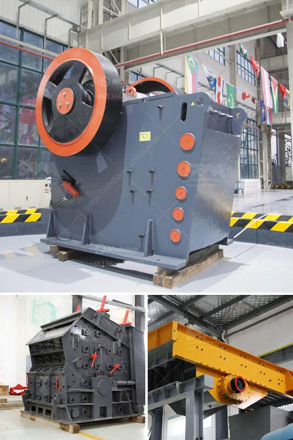

<h3>آلة طحن المطرقة بمعدل طن في الساعة</h3>
تُعتبر آلة طحن المطرقة واحدة من أهم الآلات التي تستخدم في صناعة الأعلاف وتحطيم المواد الخام. تتميز هذه الآلة بقدرتها على طحن المواد الصلبة والهشة بسرعة وفعالية، وتساعد في تحقيق الكفاءة العالية في عمليات تصنيع الأعلاف.

تعمل آلة طحن المطرقة على نقل المواد الخام إلى الغرفة الداخلية للآلة عن طريق السحب الجاذب. ثم تتم عملية التحطيم عن طريق القوة الصاعدة للمطرقة جاعلةً المواد تصطدم بسطح الشبكة المعدنية الموجودة داخل الغرفة. تساعد هذه العملية في تفتيت المواد وطحنها إلى قطع صغيرة وسهلة الهضم والامتصاص.

توفر آلة طحن المطرقة مجموعة متنوعة من المزايا. فهي تتميز بالقدرة على التعامل مع مجموعة واسعة من المواد، بدءًا من الحبوب والأعشاب إلى المواد الغذائية والبلاستيك والخشب. تتكون هذه الآلة من قطع قوية ومتينة، مما يجعلها تتحمل الاستخدام الشاق والمستمر دون التأثير على أدائها.

تستخدم آلة طحن المطرقة بشكل واسع في صناعة الأعلاف، حيث تهدف لتحطيم المكونات الخام، مثل الحبوب والأعشاب، لتحقيق توازن التغذية للحيوانات. فالحبوب والأعشاب الكاملة عادة ما تكون كبيرة وصعبة الهضم، لذا يتطلب تحطيمها إلى قطع صغيرة قبل إعطائها للحيوانات. وتساهم آلة طحن المطرقة في توفير أعلاف ذات جودة عالية للحيوانات وتسهم في زيادة إنتاجيتها.

وتعتبر آلة طحن المطرقة أيضًا أحد الخيارات الشائعة للمعامل والشركات الصغيرة والمتوسطة الحجم في صناعات أخرى، مثل التكسير وإعادة التدوير. فهي تمكن من تحطيم المواد البلاستيكية والخشبية والزجاجية بسهولة وفعالية، مما يساعد في إعادة تدويرها واستخدامها مرة أخرى في صناعة أخرى.

في النهاية، تتميز آلة طحن المطرقة بقدرتها على العمل بسرعة وفعالية، وتحطيم مجموعة واسعة من المواد الصلبة والهشة. تساهم في توازن التغذية للحيوانات من خلال تحويل الحبوب الكبيرة إلى قطع صغيرة قابلة للهضم والامتصاص. كما تعتبر خيارًا مناسبًا للمعامل والشركات الصغيرة والمتوسطة الحجم في صناعات أخرى، مثل التكسير وإعادة التدوير.
<h3>Contact us</h3><ul><li><strong>Whatsapp:&nbsp;<a href="https://wa.me/8613661969651">+8613661969651</a></strong></li><li><a href="https://swt.shibang-china.com/?git&amp;zhl&amp;آلة طحن المطرقة بمعدل طن في الساعة"><strong>Online Service(chat now)</strong></a></li></ul><h3>Related</h3><ul><li><a href='كسارات الفك في تنزانيا.md'>كسارات الفك في تنزانيا</a></li><li><a href='سيور ناقلة معدنية في الألواح.md'>سيور ناقلة معدنية في الألواح</a></li><li><a href='آلة طحن صناعية في نيجيريا.md'>آلة طحن صناعية في نيجيريا</a></li><li><a href='كسارة فكية لتكسير الجرانيت.md'>كسارة فكية لتكسير الجرانيت</a></li><li><a href='أحزمة ناقلة الشيفرون في الفلبين.md'>أحزمة ناقلة الشيفرون في الفلبين</a></li></ul>