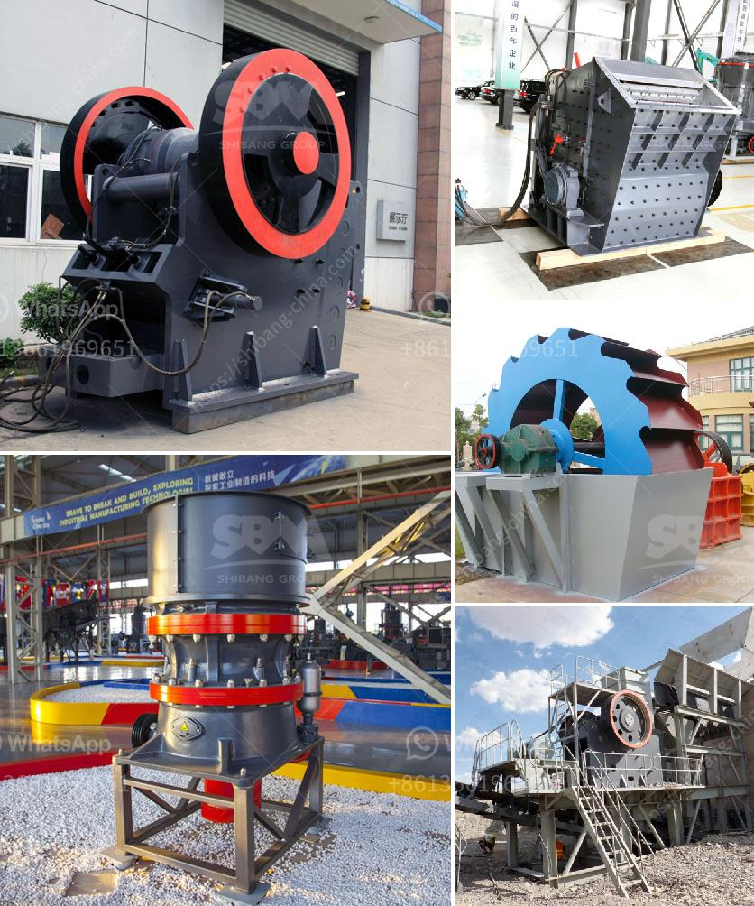

<h3>آلة طحن دقيقة في الصين</h3>
تعتبر آلة طحن الدقيق من أهم الآلات المستخدمة في صناعة الغذاء، وتلعب دورًا حاسمًا في إنتاج الدقيق عالي الجودة. يعود أصل هذه الآلة إلى الصين حيث تاريخها يمتد لآلاف السنين. وقد تطورت هذه الآلة عبر الزمن لتصبح أكثر كفاءة وتقنية.

تستخدم آلة طحن الدقيق الصينية لطحن الحبوب المختلفة مثل القمح والذرة والشعير والأرز إلى دقيق ناعم يستخدم في صناعة الخبز والمعجنات والمخابز والحلويات. تتميز هذه الآلة بالقدرة على طحن الحبوب بشكل متساوٍ وسريع، مما يسمح للصناع بتحقيق إنتاجية عالية وجودة مستدامة.

تتكون آلة طحن الدقيق الصينية من عدة أجزاء أساسية، بما في ذلك المحرك ومطحنة الطحن والمغذي والبوابة الدوارة ونظام التحكم. يعتبر المحرك نقطة البدء في الآلة حيث يتم توصيل القوة اللازمة لتشغيل المطحنة. تعتمد فعالية الآلة بشكل كبير على أداء المحرك في توفير الطاقة والسرعة المناسبة للطحن.

تعتبر مطحنة الطحن جزءًا حاسمًا من آلة طحن الدقيق الصينية، حيث يتم فيها تحويل الحبوب إلى دقيق. وعادة ما يتم استخدام طريقتين للطحن وهما طحن الأسطوانة وطحن الحجر. تعتبر طريقة طحن الأسطوانة أكثر شيوعًا حيث يتم استخدام طاحونة تقوم بدوران الأسطوانات الثابتة والمتحركة لطحن الحبوب.

تحتوي آلة طحن الدقيق الصينية أيضًا على مغذي يقوم بتوجيه الحبوب إلى مطحنة الطحن. يتم التحكم في توجيه تدفق الحبوب وكمية الحبوب المغذاة إلى المطحنة من خلال هذا الجزء. ومن المهم أن يعمل المغذي بشكل صحيح لضمان توزيع متساوٍ للحبوب داخل المطحنة.

تعتبر البوابة الدوارة أحد الأجزاء الرئيسية في آلة طحن الدقيق الصينية. يعمل هذا الجزء على تحكم تدفق الدقيق المطحون وتوجيهه خلال العملية. بالإضافة إلى ذلك، يتم التحكم في حجم الدقيق المطحون والحبيبات من خلال هذا الجزء.

يتم التحكم في عمل آلة طحن الدقيق الصينية من خلال نظام التحكم الذي يعمل على ضبط السرعة وتوجيه الحبوب والدقيق. يعتبر هذا النظام مهمًا للحفاظ على جودة الدقيق المطحون وضمان أعلى مستويات الأداء.

في الاختتام، تعد آلة طحن الدقيق الصينية ذات أهمية كبيرة في صناعة الدقيق. تفخر الصين بتاريخ طويل وخبرة غنية في تطوير هذه الآلة، وتستمر في تحسين أداء وجودة الآلة لتلبية احتياجات الصناعة الغذائية. بفضل تكنولوجيا متقدمة وابتكارات دائمة، يمكن أن توفر الآلة الصينية للمنتجين دقيقًا عالي الجودة وإنتاجية مرتفعة.
<h3>Contact us</h3><ul><li><strong>Whatsapp:&nbsp;<a href="https://wa.me/8613661969651">+8613661969651</a></strong></li><li><a href="https://swt.shibang-china.com/?git&amp;zhl&amp;آلة طحن دقيقة في الصين"><strong>Online Service(chat now)</strong></a></li></ul><h3>Related</h3><ul><li><a href='كسارة التعدين في تنزانيا.md'>كسارة التعدين في تنزانيا</a></li><li><a href='مورد كسارة الرخام.md'>مورد كسارة الرخام</a></li><li><a href='معدات فحص الرمال للبيع في جنوب أفريقيا.md'>معدات فحص الرمال للبيع في جنوب أفريقيا</a></li><li><a href='آلة كسارة الحجر في المملكة العربية السعودية.md'>آلة كسارة الحجر في المملكة العربية السعودية</a></li><li><a href='آلة طحن وتلميع الصخور.md'>آلة طحن وتلميع الصخور</a></li></ul>