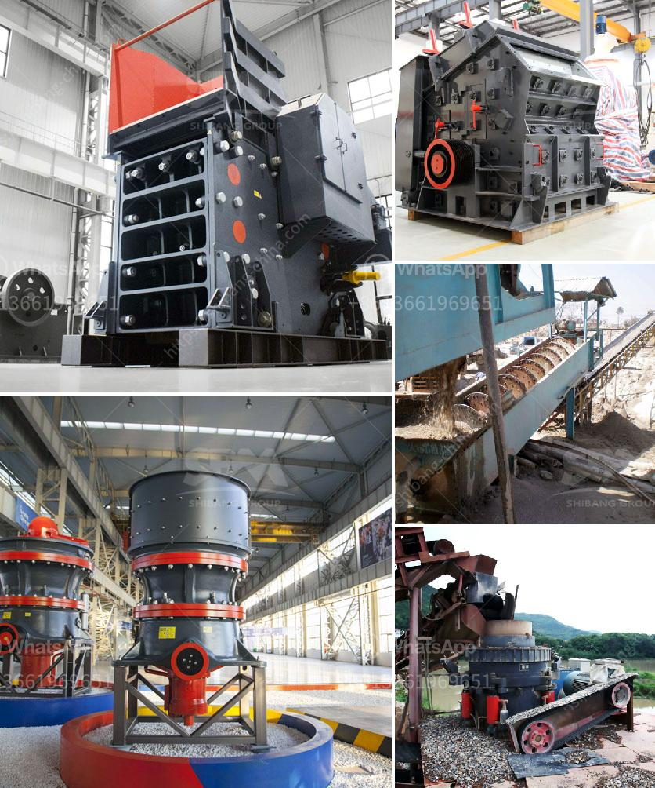

<h3>آلة طحن صناعية في نيجيريا</h3>
تعتبر آلة الطحن الصناعية من الأدوات الحديثة التي تستخدم في عمليات التحضير والتصنيع في مختلف الصناعات، ونيجيريا ليست استثناء. تعد صناعة الطحن في نيجيريا من الصناعات الحيوية التي تقدم خدماتها للصناعات الأخرى.

توفر الآلة الطحن الصناعية في نيجيريا عملية فعالة لطحن المواد الخام إلى مسحوق ناعم يمكن استخدامه في إنتاج مجموعة متنوعة من المنتجات. تستخدم آلات الطحن في الصناعات الزراعية والأغذية والكيميائية والصيدلانية والأعلاف الحيوانية والمعادن والعديد من الصناعات الأخرى.

تعد آلة الطحن الصناعية في نيجيريا من التقنيات المتقدمة في عملية الإنتاج، مما يؤدي إلى توفير الوقت والجهد والموارد المالية. تعود أهمية استخدام هذه الآلات إلى القدرة على تحويل المواد الخام الصلبة إلى مسحوق ناعم دون فقدان أي من خواص المادة الأصلية. هذا يوفر فرصًا أكبر للاستفادة القصوى من المواد الخام واستغلالها بشكل كامل.

تمتاز آلات الطحن الصناعية في نيجيريا بقدرتها على معالجة مجموعة واسعة من المواد الخام وتلبية متطلبات مختلف الصناعات. بغض النظر عن حجم المواد الخام أو خصائصها، تعتبر هذه الآلات قادرة على إجراء عمليات طحن دقيقة وفعالة.

تساعد آلات الطحن الصناعية في نيجيريا على تحسين جودة المنتج وزيادة الإنتاجية. فعمليات الطحن تساهم في التخلص من أي شوائب أو جسيمات غير مرغوب فيها في المواد الخام، وبالتالي تحسين جودة المنتج النهائي. كما تساهم في زيادة الإنتاجية بفضل قدرتها على طحن كميات كبيرة من المواد بسرعة وكفاءة عالية.

يمكن القول أن آلة الطحن الصناعية تعد أداة حاسمة في صناعة الطحين والمواد الغذائية الأخرى في نيجيريا. تنقل هذه الآلات الصناعية الصناعة إلى مرحلة جديدة من التكنولوجيا والكفاءة. تساهم في توفير حلول مستدامة وفعالة للصناعات المحلية، وتعزز النمو الاقتصادي وتوفر فرص عمل للعديد من السكان.
<h3>Contact us</h3><ul><li><strong>Whatsapp:&nbsp;<a href="https://wa.me/8613661969651">+8613661969651</a></strong></li><li><a href="https://swt.shibang-china.com/?git&amp;zhl&amp;آلة طحن صناعية في نيجيريا"><strong>Online Service(chat now)</strong></a></li></ul><h3>Related</h3><ul><li><a href='معالجة كسارة الكوارتز.md'>معالجة كسارة الكوارتز</a></li><li><a href='طحن معدات الطحن الطحن.md'>طحن معدات الطحن الطحن</a></li><li><a href='مصانع معدات مصانع رمال الفراك.md'>مصانع معدات مصانع رمال الفراك</a></li><li><a href='كم تكلف كسارات الصخور.md'>كم تكلف كسارات الصخور</a></li><li><a href='مطحنة الكرة في كازاخستان.md'>مطحنة الكرة في كازاخستان</a></li></ul>