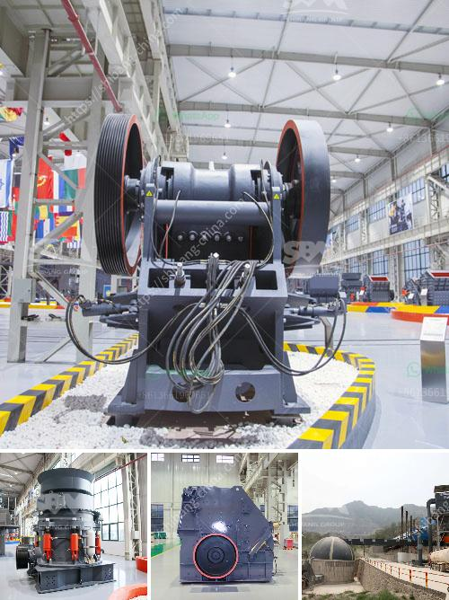

<h3>آلة طحن في سريلانكا</h3>
تعتبر آلة طحن واحدة من الآلات الهامة في صناعة الطحين في سريلانكا. تضم سريلانكا العديد من المطاحن المتخصصة في طحن الحبوب وتحويلها إلى طحين عالي الجودة.

تعود آلة الطحن في سريلانكا إلى قرون مضت حيث كان يتم استخدام الحجارة اليدوية لطحن الحبوب في الماضي. ومع تطور التكنولوجيا، ظهرت المطاحن الآلية التي أسهمت في تسهيل وتسريع عملية الطحن.

تجدر الإشارة إلى أن آلة الطحن في سريلانكا تستخدم عادةً لطحن الأرز والقمح والشعير والشوفان والذرة. كما أنها تتوفر بعدة أحجام وطاقات مختلفة لتلبية متطلبات الإنتاج المختلفة.

تعتبر مطاحن الطحن في سريلانكا آلات متقدمة وعالية الكفاءة. تتكون عادةً من أجزاء مهمة مثل البلى والشفرات والموتور، وجميعها تعمل بشكل متناغم لتحقيق عملية طحن فعالة.

يتم تشغيل هذه الآلات عن طريق الموتور الكهربائي، حيث يتم تحويل الحبوب إلى مدخل الآلة. يمر الغذاء عبر مجموعة من الشفرات الحادة داخل القمينة والبلى، مما يؤدي إلى تفتيت الحبوب إلى جسيمات أصغر.

تتميز آلة الطحن في سريلانكا بقدرتها على طحن الحبوب بشكل متساوٍ وسريع، مما يؤدي إلى الحصول على طحين ذو نوعية عالية ومتجانسة. يتم تجميع الطحين في حاويات خاصة تُخزن بعد ذلك في مستودعات التخزين.

تلعب آلة الطحن في سريلانكا دورًا كبيرًا في تلبية احتياجات السوق المحلية والخارجية. فهي تساهم في توفير مجموعة متنوعة من المنتجات المطحونة مثل الطحين الأبيض والأسمر والدقيق منخفض الجلوتين وغيرها.

بالإضافة إلى ذلك، تعتبر صناعة الطحين في سريلانكا مصدرًا رئيسيًا للدخل للعديد من الأسر، حيث يتم استخدام الطحين في إعداد الأطعمة المحلية الشهية مثل الروتي والهوبير والدوسا.

لخلاصة القول، يمكن القول إن آلة الطحن في سريلانكا تعد أحد الأدوات الأساسية في صناعة الطحين وتساهم في تلبية احتياجات السوق المحلية والعالمية. إنها تجمع بين التكنولوجيا المتقدمة والأداء العالي لتحقيق نوعية طحين ممتازة للاستخدام في العديد من المنتجات الغذائية.
<h3>Contact us</h3><ul><li><strong>Whatsapp:&nbsp;<a href="https://wa.me/8613661969651">+8613661969651</a></strong></li><li><a href="https://swt.shibang-china.com/?git&amp;zhl&amp;آلة طحن في سريلانكا"><strong>Online Service(chat now)</strong></a></li></ul><h3>Related</h3><ul><li><a href='تكلفة منخفضة لسعر كسارة الفك في أوغندا.md'>تكلفة منخفضة لسعر كسارة الفك في أوغندا</a></li><li><a href='سعر فحص الرمل بسعة كبيرة للبيع.md'>سعر فحص الرمل بسعة كبيرة للبيع</a></li><li><a href='مصنع إسمنت مربح للبيع في تاميل نادو.md'>مصنع إسمنت مربح للبيع في تاميل نادو</a></li><li><a href='موردين مطاحن الطحن في ججرانوالا.md'>موردين مطاحن الطحن في ججرانوالا</a></li><li><a href='تقرير المشروع على كسارة الخرسانة pdf.md'>تقرير المشروع على كسارة الخرسانة pdf</a></li></ul>