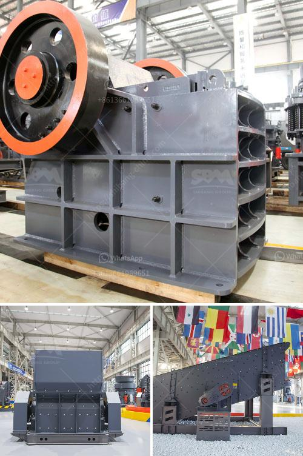

<h3>آلة طحن لكربونات الكالسيوم من ألمانيا</h3>
يعتبر كربونات الكالسيوم مادة مهمة في صناعة العديد من المنتجات المستهلكة يوميًا، مثل الورق والأدوية والبلاستيك والدهانات وصناعة الزجاج. ولتصنيع هذه المنتجات بجودة عالية وكفاءة أعلى، يتم استخدام آلة طحن لكربونات الكالسيوم.

إحدى الآلات الشهيرة في هذا المجال مصنوعة في ألمانيا. تتميز هذه الآلة بالدقة في الطحن والكفاءة العالية في تحقيق النتائج المرجوة. تستخدم معظم الشركات الكبيرة في صناعة العديد من المنتجات هذا النوع من الآلات للحصول على نتائج ممتازة.

تتكون الآلة من العديد من الأجزاء المهمة، والتي تعمل سويًا لتحقيق عملية طحن مثالية. تتضمن هذه الأجزاء المطحنة، والمحرك، ومعدات الفرز، والناقلات. توجد نسخ مختلفة من هذه الآلة، تختلف في القدرة والحجم والاستخدام المطلوب. يمكن للشركات اختيار النسخة المناسبة لاحتياجاتها المحددة.

تُعد الطاقة الضرورية لتشغيل هذه الآلة ملائمة، مما يعني أنها توفر كفاءة في استهلاك الطاقة وتوفير الوقت والجهد. تتميز هذه الآلة بالاستجابة السريعة والقدرة على معالجة كميات كبيرة من المواد في وقت قصير. كما تتميز أيضًا بتوفير الدقة في الطحن والحفاظ على حجم ونقاء الجزيئات.

توفر هذه الآلة القدرة على ضبط حجم الجسيمات المطلوب. يعتبر هذا الأمر مهمًا جدًا في صناعة العديد من المنتجات، حيث تحتاج إلى أحجام جسيمات محددة لتحقيق الأداء المثلى. يمكن للمشغلين ضبط قابلية الآلة لتناسب الحجم المطلوب.

في النهاية، تُعد آلة طحن لكربونات الكالسيوم من ألمانيا خيارًا مثاليًا للشركات التي تحتاج إلى طحن وتصنيع كربونات الكالسيوم بجودة عالية. من خلال استخدام هذه الآلة، يمكن للشركات تحقيق الكفاءة والدقة في العملية وضمان تلبية الاحتياجات المحددة لمنتجاتها.
<h3>Contact us</h3><ul><li><strong>Whatsapp:&nbsp;<a href="https://wa.me/8613661969651">+8613661969651</a></strong></li><li><a href="https://swt.shibang-china.com/?git&amp;zhl&amp;آلة طحن لكربونات الكالسيوم من ألمانيا"><strong>Online Service(chat now)</strong></a></li></ul><h3>Related</h3><ul><li><a href='سحق الخرسانة والحديد.md'>سحق الخرسانة والحديد</a></li><li><a href='الآلات المستخدمة في تصنيع الأسمنت.md'>الآلات المستخدمة في تصنيع الأسمنت</a></li><li><a href='آلة تكسير الصخور في الفلبين.md'>آلة تكسير الصخور في الفلبين</a></li><li><a href='كسارة متنقلة القطرة.md'>كسارة متنقلة القطرة</a></li><li><a href='عملية تعويم التلك.md'>عملية تعويم التلك</a></li></ul>