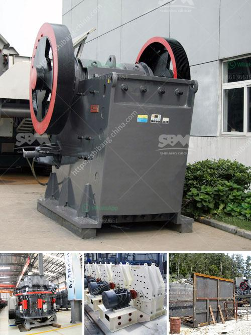

<h3>آلة طحن مسحوق الحجر الصغيرة</h3>
تعتبر آلة طحن مسحوق الحجر الصغيرة من الآلات الهامة التي تستخدم في صناعة البناء والتعدين. تهدف هذه الآلة إلى طحن الحجارة الصغيرة إلى مسحوق ناعم يمكن استخدامه في العديد من التطبيقات المختلفة.

تتكون آلة طحن مسحوق الحجر الصغيرة من مجموعة من المكونات الأساسية التي تعمل بالتعاون لتحقيق الهدف المطلوب. تتضمن هذه المكونات الأساسية المحرك، الوحدة الطحن، واقيات السلامة والشبكة الفاصلة. يستخدم المحرك لتشغيل الآلة وتحويل الطاقة الكهربائية إلى طاقة ميكانيكية. يقوم الوحدة الطحن بطحن الحجارة الصغيرة حتى تصبح مسحوقًا ناعمًا. يحمى المشغلين من الأخطار المحتملة باستخدام واقيات السلامة التي تحمي الأيدي والجسم من الإصابات الناجمة عن التعامل مع الآلة. وأخيرًا، يتم من خلال الشبكة الفاصلة فرز المسحوق المطحون وفصله عن الحجارة الغير مطحونة لضمان جودة المنتج النهائي.

تتميز آلة طحن مسحوق الحجر الصغيرة بالعديد من الفوائد. أبرز هذه الفوائد هي الكفاءة والدقة والمرونة. فبفضل التكنولوجيا المتقدمة المستخدمة في تصميم الآلة، يمكنها طحن الحجارة الصغيرة بكفاءة عالية وبدقة متناهية، مما يتيح الحصول على مسحوق ناعم جدًا بأحجام جسيمات صغيرة. بالإضافة إلى ذلك، يمكن تعديل إعدادات الآلة لتلبية احتياجات مختلفة، مما يجعلها مرونة في الاستخدام وتناسب مختلف التطبيقات.

تتميز هذه الآلة أيضًا بالموثوقية والتوفير في استهلاك الطاقة. فبفضل المواد عالية الجودة المستخدمة في تصنيع الآلة والاهتمام بالتفاصيل الصغيرة خلال عملية التصنيع، فإن الآلة مصممة لتكون قوية ومتينة تدوم لفترة طويلة. بالإضافة إلى ذلك، تم تصميم الآلة بطريقة تقلل من استهلاك الطاقة، مما يوفر التكاليف ويساهم في الحفاظ على البيئة.

ستساهم آلة طحن مسحوق الحجر الصغيرة في تطوير صناعة البناء والتعدين. فهي تعتبر أداة أساسية للحصول على مسحوق الحجر الناعم الذي يمكن استخدامه في تصنيع الخرسانة والأسفلت ومواد العزل والدهانات وغيرها من التطبيقات الصناعية الأخرى. لذا، يجب الاستثمار في هذه الآلة المهمة لضمان تحقيق السلامة والكفاءة والجودة في عمليات التصنيع.
<h3>Contact us</h3><ul><li><strong>Whatsapp:&nbsp;<a href="https://wa.me/8613661969651">+8613661969651</a></strong></li><li><a href="https://swt.shibang-china.com/?git&amp;zhl&amp;آلة طحن مسحوق الحجر الصغيرة"><strong>Online Service(chat now)</strong></a></li></ul><h3>Related</h3><ul><li><a href='بيع آلة مطحنة الأسطوانة.md'>بيع آلة مطحنة الأسطوانة</a></li><li><a href='آلة تعبئة مسحوق الجير.md'>آلة تعبئة مسحوق الجير</a></li><li><a href='معدات غسيل الباريت.md'>معدات غسيل الباريت</a></li><li><a href='آلات تصنيع الجبس.md'>آلات تصنيع الجبس</a></li><li><a href='كسارات الحجر الرخيصة.md'>كسارات الحجر الرخيصة</a></li></ul>