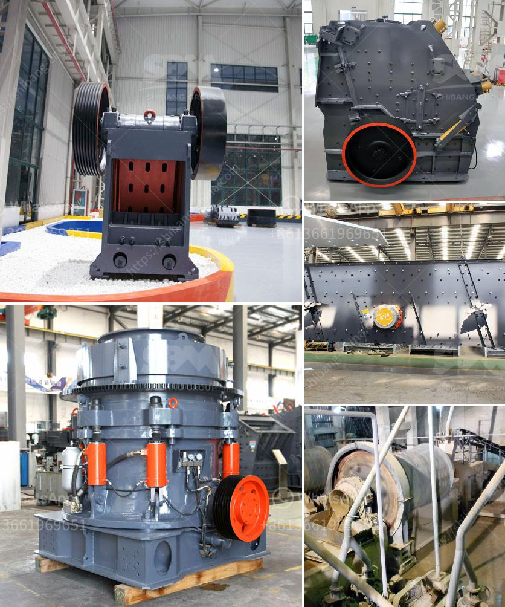

<h3>آلة طحن مسحوق فائقة الدقة</h3>
آلة طحن مسحوق فائقة الدقة هي جهاز يتم استخدامه لطحن المواد الصلبة إلى مسحوق دقيق بأحجام جسيمات صغيرة جدًا. تُستخدم هذه الآلات في العديد من الصناعات مثل صناعة الأدوية، وصناعة الأغذية، وصناعة الطلاء، وصناعة مواد البناء، لذلك تجد تواجدها في المختبرات والمصانع.

تتميز آلة طحن المسحوق الفائقة الدقة بقدرتها على طحن المواد بشكل متساوٍ ودقيق بفضل وجود نظام تحكم عالي الدقة. تعمل هذه الآلة عن طريق إدخال المادة الصلبة في حجرة الطحن، ثم يتم تحميلها على شفرة طحن دوارة سريعة الدوران. وتقوم الآلة بطحن المادة تحت ضغط عالٍ وسرعة عالية للحصول على الأدق الجسيمات المطلوبة.

توفر آلة طحن المسحوق الفائقة الدقة نتائج دقيقة وموثوقة، حيث تتحكم في توزيع حجم الجسيمات وتفتلها حسب الحاجة. يمكن تعديل سرعة الدوران والضغط لتناسب المواد المطحونة والنتائج المطلوبة. بالإضافة إلى ذلك، يمكن تجهيز الآلة بمجموعة متنوعة من الشفرات والشبكات النافذة للتحكم في الحجم وشكل الجسيمات النهائية.

تتميز آلة طحن المسحوق الفائقة الدقة بالعديد من المزايا. فهي تحسن كفاءة عملية الطحن وتقلل الفاقد من المواد المطحونة. كما أنها تساعد في تجنب التلوث المتبقي للمواد المطحونة، حيث يتم جمع المسحوق في جهاز امتصاص الغبار أثناء العملية. بالإضافة إلى ذلك، فإن الآلة توفر تحكماً دقيقاً في حجم الجسيمات وتوزيعها، مما يسمح بتحقيق الخصائص المطلوبة للمنتج النهائي.

بشكل عام، يمكن القول أن آلة طحن المسحوق الفائقة الدقة هي أداة مهمة في صناعة العديد من المواد. فهي تساعد على تحسين جودة المنتجات وزيادة الإنتاجية. كما أنها تساهم في تحسين سلامة العمل وحماية البيئة. ومن المتوقع أن تشهد هذه الآلات تطورًا مستمرًا في المستقبل، مما سيسهم في تحسين أداء العديد من الصناعات والتقنيات.
<h3>Contact us</h3><ul><li><strong>Whatsapp:&nbsp;<a href="https://wa.me/8613661969651">+8613661969651</a></strong></li><li><a href="https://swt.shibang-china.com/?git&amp;zhl&amp;آلة طحن مسحوق فائقة الدقة"><strong>Online Service(chat now)</strong></a></li></ul><h3>Related</h3><ul><li><a href='تكلفة الكسارة المستعملة للجرانيت.md'>تكلفة الكسارة المستعملة للجرانيت</a></li><li><a href='معدات طحن في أستراليا.md'>معدات طحن في أستراليا</a></li><li><a href='مصنع معالجة مسحوق الجبس في الهند.md'>مصنع معالجة مسحوق الجبس في الهند</a></li><li><a href='كسارة للبيع في ماليزيا.md'>كسارة للبيع في ماليزيا</a></li><li><a href='أسعار كسارات الخرسانة.md'>أسعار كسارات الخرسانة</a></li></ul>