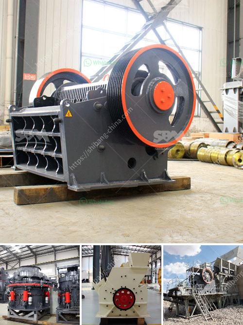

<h3>آلة طحن مطحنة الأسطوانة</h3>
مطحنة الأسطوانة هي آلة تستخدم لطحن المواد الصلبة إلى مسحوق ناعم. وهي تتألف من اثنين أو أكثر من الأسطوانات الملتفة بشكل موازٍ، حيث يتم وضع المواد بين الأسطوانات وتمر خلالها للحصول على المنتج النهائي.

تعتبر مطحنة الأسطوانة من الآلات الأساسية في صناعة الأغذية وصناعة المواد الكيميائية والمعادن. ففيما يتعلق بصناعة الأغذية، تستخدم المطاحن لطحن الحبوب والبذور والتوابل لإنتاج مساحيق قابلة للتوزيع والاستخدام في العديد من المنتجات الغذائية. وفي صناعة المواد الكيميائية والمعادن، تستخدم المطاحن لطحن المواد الخام وتحويلها إلى مساحيق تستخدم في عمليات الإنتاج اللاحقة.

تتميز مطاحن الأسطوانة بعدة مزايا. فأولاً، فهي قادرة على تحقيق درجات طحن متنوعة من خلال تعديل فجوة الأسطوانات. وهذا يعني أنه يمكن ضبط المطحنة لتحقيق الدقة المطلوبة في الغربلة المطلوبة. ثانياً، فإن الطحن بواسطة مطحنة الأسطوانة يتم بطريقة قوية وفعالة، مما ينتج عنه توزيع جيد للجزيئات وتوزيع الأحجام في المسحوق النهائي.

علاوة على ذلك، فإن مطاحن الأسطوانة عملية وسهلة الصيانة. فهي تعمل بكفاءة عالية وتحتاج إلى صيانة أقل بالمقارنة مع آلات الطحن الأخرى. وبفضل التصميم المبتكر للآلة، فإنه يمكن الوصول بسهولة إلى الأسطوانات لغرض التنظيف والإصلاح. هذا يعني أنه يمكن الحفاظ على جودة الأداء على المدى الطويل مع تكاليف الصيانة المنخفضة.

باختصار، مطاحن الأسطوانة هي آلات قوية وفعالة لطحن المواد الصلبة. وبفضل مزاياها المتعددة، فإنها تستخدم على نطاق واسع في العديد من الصناعات. سواء كنت تعمل في صناعة الأغذية أو الكيمياء أو المعادن، فإن مطحنة الأسطوانة ستكون اختيارًا مثاليًا لاحتياجات طحنك.
<h3>Contact us</h3><ul><li><strong>Whatsapp:&nbsp;<a href="https://wa.me/8613661969651">+8613661969651</a></strong></li><li><a href="https://swt.shibang-china.com/?git&amp;zhl&amp;آلة طحن مطحنة الأسطوانة"><strong>Online Service(chat now)</strong></a></li></ul><h3>Related</h3><ul><li><a href='كيفية صنع كسارة فك صغيرة لنفسك.md'>كيفية صنع كسارة فك صغيرة لنفسك</a></li><li><a href='الهيدروليك في مطحنة الكرة الرأسية.md'>الهيدروليك في مطحنة الكرة الرأسية</a></li><li><a href='استخدام مطحنة ريموند.md'>استخدام مطحنة ريموند</a></li><li><a href='مصانع قديمة للبيع، استخدمت مطاحن الكرات.md'>مصانع قديمة للبيع، استخدمت مطاحن الكرات</a></li><li><a href='قائمة أسعار كسارة الحجر بسعة 300 طن في الساعة.md'>قائمة أسعار كسارة الحجر بسعة 300 طن في الساعة</a></li></ul>