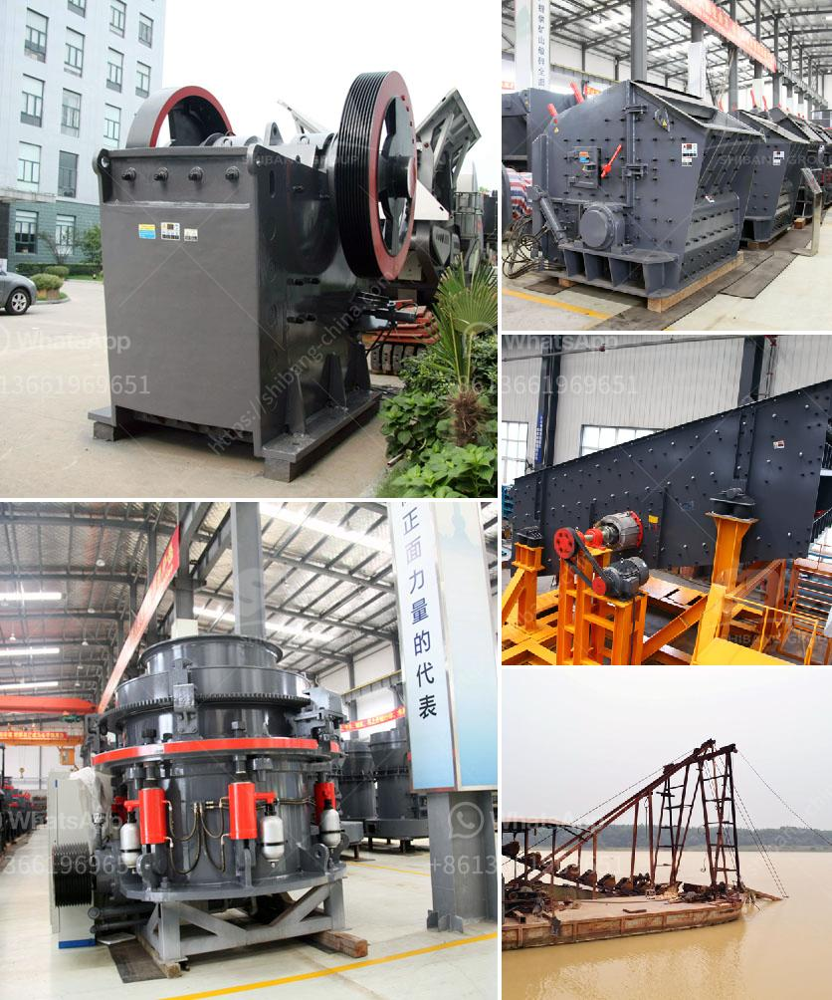

<h3>آلة طحن مطحنة الرمل السيليكا</h3>
المطحنة الرملية السيليكا هي آلة مهمة في صناعة الرمل والتعدين. تستخدم هذه الآلة لطحن وتكسير الحجارة والمواد الخام الأخرى لتحويلها إلى رمل ناعم يستخدم في البناء والصناعات الأخرى.

تعتبر المطحنة الرملية السيليكا جزءًا أساسيًا من عملية إنتاج الرمل. تعمل المطحنة عن طريق طحن المواد الخام بواسطة الاحتكاك والضغط بين الحبيبات المعدنية المتجاورة. وتتكون المطحنة من جزئين رئيسيين: الجزء الداخلي المحتوي على كرات صلبة تعمل على طحن المواد والجزء الخارجي الذي يحتوي على غربال يسمح بمرور الرمل الناعم.

تتمتع مطاحن الرمل السيليكا بعدة مزايا. فهي تعمل بكفاءة عالية وقوة كبيرة لطحن المواد الصلبة. تعد الآلة أيضًا متعددة الاستخدامات، حيث يمكن استخدامها لطحن العديد من المواد الخام المختلفة. بالإضافة إلى ذلك، يمكن للمطحنة الرملية السيليكا ضبط حجم الجسيمات المتجمعة وفقًا لاحتياجات المستخدم.

وتستخدم مطاحن الرمل السيليكا في الصناعات العديدة. فهي تستخدم في صناعة البناء لإنتاج الرمل الناعم المستخدم في صنع الخرسانة والأعمال المعمارية الأخرى. بالإضافة إلى ذلك، يمكن استخدام المطاحن الرملية أيضًا في صناعة التعدين لطحن الخامات واستخلاص المعادن.

على الرغم من جميع الفوائد المذكورة، يجب أخذ بعض الاحتياطات عند استخدام مطاحن الرمل السيليكا. يجب مراقبة الآلة باستمرار وضبط الضغط والسرعة بدقة لتحقيق أفضل النتائج. يجب أيضًا تنظيف الآلة بانتظام وإجراء الصيانة الوقائية لضمان عمر طويل للآلة والحفاظ على أدائها الأمثل.

وفي الختام، تعتبر مطاحن الرمل السيليكا آلة ضرورية في صناعة الرمل، حيث تساهم في تحويل المواد الخام إلى رمل ناعم يستخدم في العديد من الصناعات. تتميز هذه الآلة بقوتها وكفاءتها في طحن الحجارة والمعادن، مما يسهم في تحقيق أفضل النتائج في عملية إنتاج الرمل.
<h3>Contact us</h3><ul><li><strong>Whatsapp:&nbsp;<a href="https://wa.me/8613661969651">+8613661969651</a></strong></li><li><a href="https://swt.shibang-china.com/?git&amp;zhl&amp;آلة طحن مطحنة الرمل السيليكا"><strong>Online Service(chat now)</strong></a></li></ul><h3>Related</h3><ul><li><a href='تكلفة مصنع سحق bmw 200tph stage.md'>تكلفة مصنع سحق bmw 200tph stage</a></li><li><a href='مصنع كسارة الحجر التلقائي.md'>مصنع كسارة الحجر التلقائي</a></li><li><a href='مصانع إعادة تدوير النحاس في الصين.md'>مصانع إعادة تدوير النحاس في الصين</a></li><li><a href='مصنع غسيل رمل السيليكا في الهند.md'>مصنع غسيل رمل السيليكا في الهند</a></li><li><a href='مقترح مشروع أعمال لكسارة الحجر.md'>مقترح مشروع أعمال لكسارة الحجر</a></li></ul>