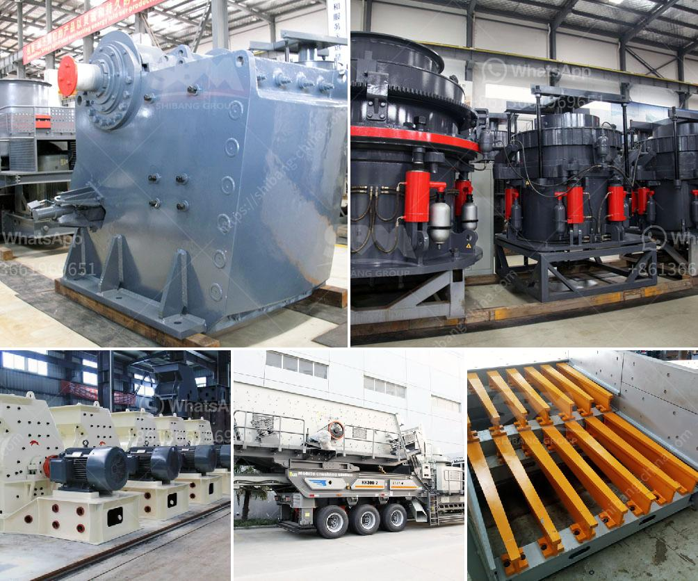

<h3>آلة طحن وخلط الكوارتز</h3>
تُعد آلة طحن وخلط الكوارتز من أدوات التصنيع الحديثة التي تُستخدم بشكل واسع في صناعة المواد الخام والمعادن. يتم استخدامها بشكل خاص في عمليات طحن وتجهيز الكوارتز، وهي عملية تهدف إلى تحويل الكوارتز الخام إلى مسحوق ناعم يمكن استخدامه في تصنيع مجموعة متنوعة من المنتجات.

تتميز هذه الآلة بعدة مزايا مهمة تجعلها الاختيار الأمثل للعديد من الشركات والمصانع. تتضمن هذه المزايا القدرة على طحن وخلط الكوارتز بشكل سريع وفعال، مما يساعد على زيادة الإنتاجية وتوفير الوقت والجهد. كما أنها تعمل بدقة عالية، مما يضمن حجم الجسيمات المطلوب وجودة المنتج النهائي.

عملية الطحن والخلط تتطلب العديد من الخطوات والعوامل المهمة للحصول على نتائج مميزة. يوجد في الآلة مطحنة تستخدم قوة عالية لتكسير حبيبات الكوارتز إلى جزيئات صغيرة. بعد ذلك، يتم خلط الكوارتز المطحون مع المواد الأخرى المطلوبة لإنتاج المنتج النهائي.

علاوة على ذلك، تتميز الآلة بالقدرة على التحكم في مدى نعومة المسحوق المراد الحصول عليه. يمكن ضبط إعدادات آلة الطحن والخلط لتلبية متطلبات العميل واحتياجات التصنيع المحددة. بالإضافة إلى ذلك، يمكن للآلة أن تتعامل مع كميات كبيرة من الكوارتز في وقت واحد، مما يجعلها مثالية للمصانع التي تحتاج إلى إنتاج متواصل وسريع.

تعتبر آلة طحن وخلط الكوارتز استثمارًا مهمًا لأي شركة تعمل في مجال صناعة المواد الخام. تمتاز بالكفاءة والقوة والتحكم الدقيق، الأمر الذي يعني زيادة في الإنتاج وتقديم المنتجات ذات الجودة العالية للعملاء. بفضل هذه الآلة المبتكرة، يمكن للشركات تطوير وتوسيع نشاطها وتقديم منتجات مميزة تلبي احتياجات السوق وتمكنها من المنافسة في الصناعة.
<h3>Contact us</h3><ul><li><strong>Whatsapp:&nbsp;<a href="https://wa.me/8613661969651">+8613661969651</a></strong></li><li><a href="https://swt.shibang-china.com/?git&amp;zhl&amp;آلة طحن وخلط الكوارتز"><strong>Online Service(chat now)</strong></a></li></ul><h3>Related</h3><ul><li><a href='كسارة سريلانكا.md'>كسارة سريلانكا</a></li><li><a href='مورد آلة كسارة الأسطوانة.md'>مورد آلة كسارة الأسطوانة</a></li><li><a href='معدات طحن في أستراليا.md'>معدات طحن في أستراليا</a></li><li><a href='تأجير كسارة إعادة تدوير الخرسانة.md'>تأجير كسارة إعادة تدوير الخرسانة</a></li><li><a href='مصنع معدات تعدين الرمال في جنوب أفريقيا.md'>مصنع معدات تعدين الرمال في جنوب أفريقيا</a></li></ul>