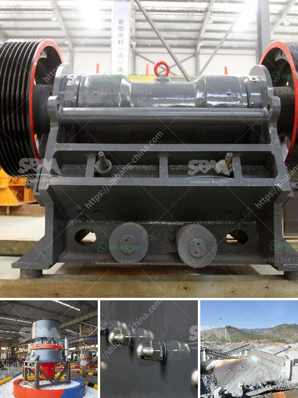

<h3>آلة طلاء مسحوق كربونات الكالسيوم في الهند</h3>
تعتبر آلة طلاء مسحوق كربونات الكالسيوم واحدة من الآلات الحديثة المستخدمة في صناعة الدهانات والطلاء. وتستخدم هذه الآلة على نطاق واسع في الهند وعلى مستوى العالم، نظرًا لفعاليتها وجودتها العالية في الطلاء.

يعتبر كربونات الكالسيوم أحد المواد الرئيسية التي تستخدم في الطلاء، حيث يعتبر من المواد صديقة للبيئة ومتوفر بشكل وفير في الطبيعة. وعند استخدام آلة طلاء مسحوق كربونات الكالسيوم، يتم ضخ البودرة في آلة الرش، حيث تتم معالجتها وتطبيقها على السطح المراد طلاؤه بواسطة ضغط الهواء.

تتميز آلة طلاء مسحوق كربونات الكالسيوم بعدة مميزات. فهي توفر طلاءً متساويًا ومتجانسًا على السطح المراد طلاؤه، وهذا يعزز مظهر السطح ويخفي أي عيوب أو تشققات قد تكون موجودة. كما أنها تعطي نتائج رائعة من حيث اللمعان والمتانة، كما أنها تسهل عملية التنظيف والصيانة للسطح المطلوب.

تستخدم آلة طلاء مسحوق كربونات الكالسيوم في العديد من الصناعات مثل صناعة السيارات والأثاث والمنتجات المعدنية والأجهزة الكهربائية، وغيرها. وقد استفادت الهند كثيرًا من هذه الآلة، حيث أصبحت واحدة من أكبر الدول المصدرة للطلاءات والدهانات.

وتتمثل الفوائد الرئيسية لاستخدام آلة طلاء مسحوق كربونات الكالسيوم في الهند في زيادة الإنتاجية وتقليل تكلفة العمل والوقت. فهذه الآلة تعمل بشكل سريع وفعال وتسهل عملية الطلاء بشكل كبير. كما أنها تساعد في تحسين جودة الطلاء وتقديمه بشكل أفضل وأكثر انتظامًا.

وتعتبر آلة طلاء مسحوق كربونات الكالسيوم استثماراً مستدامًا للعديد من الشركات الهندية، حيث تساعد في تحقيق الاستدامة البيئية وتقليل التأثير البيئي السلبي لعمليات الطلاء التقليدية.

وباختصار، تعتبر آلة طلاء مسحوق كربونات الكالسيوم في الهند تقنية حديثة للطلاء توفر جودة عالية واقتصادية في صناعة الدهانات والطلاء. تساهم هذه الآلة في تقليل التكاليف وتحسين جودة الطلاء، مما يساهم في تعزيز نمو القطاع الصناعي وتحقيق الاستدامة البيئية.
<h3>Contact us</h3><ul><li><strong>Whatsapp:&nbsp;<a href="https://wa.me/8613661969651">+8613661969651</a></strong></li><li><a href="https://swt.shibang-china.com/?git&amp;zhl&amp;آلة طلاء مسحوق كربونات الكالسيوم في الهند"><strong>Online Service(chat now)</strong></a></li></ul><h3>Related</h3><ul><li><a href='مطحنة المطرقة للبيع في دبي.md'>مطحنة المطرقة للبيع في دبي</a></li><li><a href='مصنع كسارة للفحم.md'>مصنع كسارة للفحم</a></li><li><a href='موزعون للأحزمة والناقلات في إندونيسيا.md'>موزعون للأحزمة والناقلات في إندونيسيا</a></li><li><a href='أسعار كسارات نيجيريا الجديدة.md'>أسعار كسارات نيجيريا الجديدة</a></li><li><a href='خط إنتاج طلاء الحجر.md'>خط إنتاج طلاء الحجر</a></li></ul>