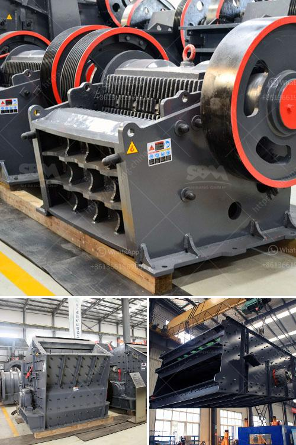

<h3>آلة عملية مطحنة الأسطوانة</h3>
مطحنة الأسطوانة هي آلة تُستخدم في صناعة الطحين وتعتبر أحدث التقنيات المستخدمة في هذا المجال. تتكون المطحنة من مجموعة من الأسطوانات الموازية الطويلة المصنوعة من الفولاذ المقاوم للصدأ والتي تدار بسرعات مختلفة.

تعتبر مطحنة الأسطوانة أكثر كفاءة من المعدات التقليدية الأخرى المستخدمة في صناعة الطحين. فهي قادرة على إنتاج كميات كبيرة من الطحين بشكل سريع وفعال. واستخدام الأسطوانات المتواجدة يسمح بتكسير الحبوب بشكل متساوٍ، مما يحسن جودة الطحين الناتج. وبفضل استخدام تقنيات التحكم المتقدمة، يمكن تعديل الأداء وتكييفه وفقًا للمواد المصنعة واحتياجات العملاء.

بفضل تكنولوجيا الأسطوانات، يمكن أيضًا تحقيق توفير في الطاقة والتكاليف. وتعد مطحنة الأسطوانة هي الخيار المثلى لتقليل تكلفة الإنتاج وزيادة الإنتاجية. فهي تتيح طحن الحبوب بسرعة وكفاءة عالية، مما يقلل من الوقت والجهد المطلوبين لإنتاج الكميات الكبيرة.

علاوة على ذلك، توفر مطحنة الأسطوانة طحنًا بشكل متساوٍ ويساعد على الحفاظ على القيمة الغذائية للحبوب. وتحقق أعلى مستوى من الدقة في طحن الحبوب، بحيث يمكن تحقيق منتجات طحين ذات جودة عالية وقوام متجانس.

بالإضافة إلى ذلك، فإن مطحنة الأسطوانة متعددة الوظائف، فهي تُستخدم أيضًا في صناعات أخرى، مثل صناعة الأعلاف والعديد من التطبيقات الصناعية الأخرى التي تتطلب طحن المواد الصلبة.

لخلاصة القول، مطحنة الأسطوانة هي تقنية حديثة مبتكرة في صناعة الطحين توفر كفاءة عالية ونتائج ممتازة. تعتبر الإضافة المثالية لأي مصنع للطحين وتعزز جودة المنتج وتحسن الإنتاجية وتقلل من استهلاك الطاقة والتكاليف، مما يعني أن المطحنة تلبي احتياجات السوق وتحقق الربحية للشركات المصنعة للطحين.
<h3>Contact us</h3><ul><li><strong>Whatsapp:&nbsp;<a href="https://wa.me/8613661969651">+8613661969651</a></strong></li><li><a href="https://swt.shibang-china.com/?git&amp;zhl&amp;آلة عملية مطحنة الأسطوانة"><strong>Online Service(chat now)</strong></a></li></ul><h3>Related</h3><ul><li><a href='كسارة الفك الجديدة من نوع زينيث.md'>كسارة الفك الجديدة من نوع زينيث</a></li><li><a href='مطاحن الكرة للحجر الجيري في ماليزيا.md'>مطاحن الكرة للحجر الجيري في ماليزيا</a></li><li><a href='تكلفة كسارة الفلسبار.md'>تكلفة كسارة الفلسبار</a></li><li><a href='أحزمة ناقلة الشيفرون في الفلبين.md'>أحزمة ناقلة الشيفرون في الفلبين</a></li><li><a href='مصنع معالجة أكسيد النحاس.md'>مصنع معالجة أكسيد النحاس</a></li></ul>