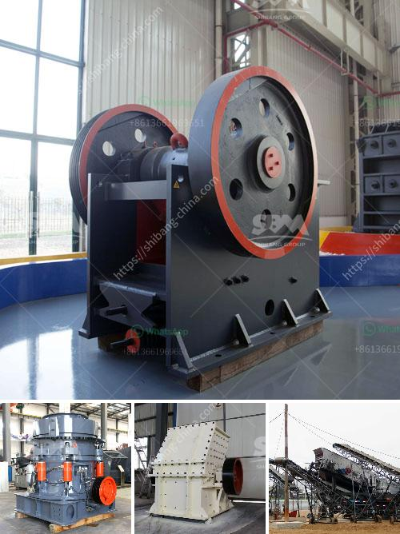

<h3>آلة غربلة الرمل للبيع في الفلبين</h3>
تعد آلة غربلة الرمل أحد الأدوات الأساسية التي تستخدم في مجال البناء والهندسة المدنية. وتتميز الفلبين بقوة قطاع البناء الذي يشهد نمواً كبيراً في السنوات الأخيرة، مما يدفع الكثيرين إلى البحث عن آلات غربلة الرمل للبيع في السوق المحلية.

تتواجد العديد من الشركات في الفلبين التي توفر آلات غربلة الرمل المعتمدة عالمياً، وهي متوفرة بمختلف السعات والمواصفات لتناسب احتياجات العملاء المختلفة. يتراوح سعر تلك الآلات عادة بين 200 و 400 دولار بالفلبين، وقد يتغير السعر وفقاً للعلامة التجارية والموديل.

تعتبر آلة غربلة الرمل جهازاً فعالاً وسهل الاستخدام يستخدم لفصل الرمال من المواد الأخرى مثل الأحجار والحصى والسبائك الأخرى. وتعتمد فعالية العمل على نظام الغربلة الذي تعتمده الآلة، حيث يتم تمرير المواد عبر شبكة ذات ثقوب معينة، ويتم فصل الرمل وفقاً لحجم حبيباته.

إحدى المزايا الرئيسية لآلة غربلة الرمل هي قدرتها على زيادة كفاءة عملية البناء، حيث يمكن استخدام الرمل المفرغ في أعمال البناء مباشرة بعد تصفية الشوائب عنه. وبالتالي، يتم توفير الوقت والجهد اللازمين للحصول على رمل نقي وجاهز للاستخدام.

بالإضافة إلى ذلك، تتيح آلات غربلة الرمل المعاينة المباشرة لجودة الشوائب المستخدمة في البناء، مما يساعد على توفير مكونات البناء عالية الجودة وتحسين العملية بشكل عام. كما أنها تعمل على تقليل الفاقد الذي يحدث عند استخدام شوائب غير مرغوب فيها.

وفي النهاية، يمكن القول إن آلة غربلة الرمل تعد جهازاً ضرورياً في قطاع البناء في الفلبين لتحسين جودة الرمال المستخدمة في العديد من التطبيقات الهندسية. وباعتبارها سهلة الاستخدام وفعالة في تنقية الرمل من الشوائب، فإنها تعد استثماراً جيداً لأي شركة أو فرد يهتم بمجال البناء ويرغب في تحسين جودة المواد المستخدمة في أعماله.
<h3>Contact us</h3><ul><li><strong>Whatsapp:&nbsp;<a href="https://wa.me/8613661969651">+8613661969651</a></strong></li><li><a href="https://swt.shibang-china.com/?git&amp;zhl&amp;آلة غربلة الرمل للبيع في الفلبين"><strong>Online Service(chat now)</strong></a></li></ul><h3>Related</h3><ul><li><a href='كسارة صغيرة متنقلة للحصى.md'>كسارة صغيرة متنقلة للحصى</a></li><li><a href='مصنع تكسير الجرانيت 200 طن في الساعة للبيع.md'>مصنع تكسير الجرانيت 200 طن في الساعة للبيع</a></li><li><a href='مطاحن الكرة لتعدين ٦ × ٦.md'>مطاحن الكرة لتعدين ٦ × ٦</a></li><li><a href='مصنع الإسمنت بسعة 100 طن في الهند.md'>مصنع الإسمنت بسعة 100 طن في الهند</a></li><li><a href='آلة طحن الطين المستخدمة للبيع.md'>آلة طحن الطين المستخدمة للبيع</a></li></ul>