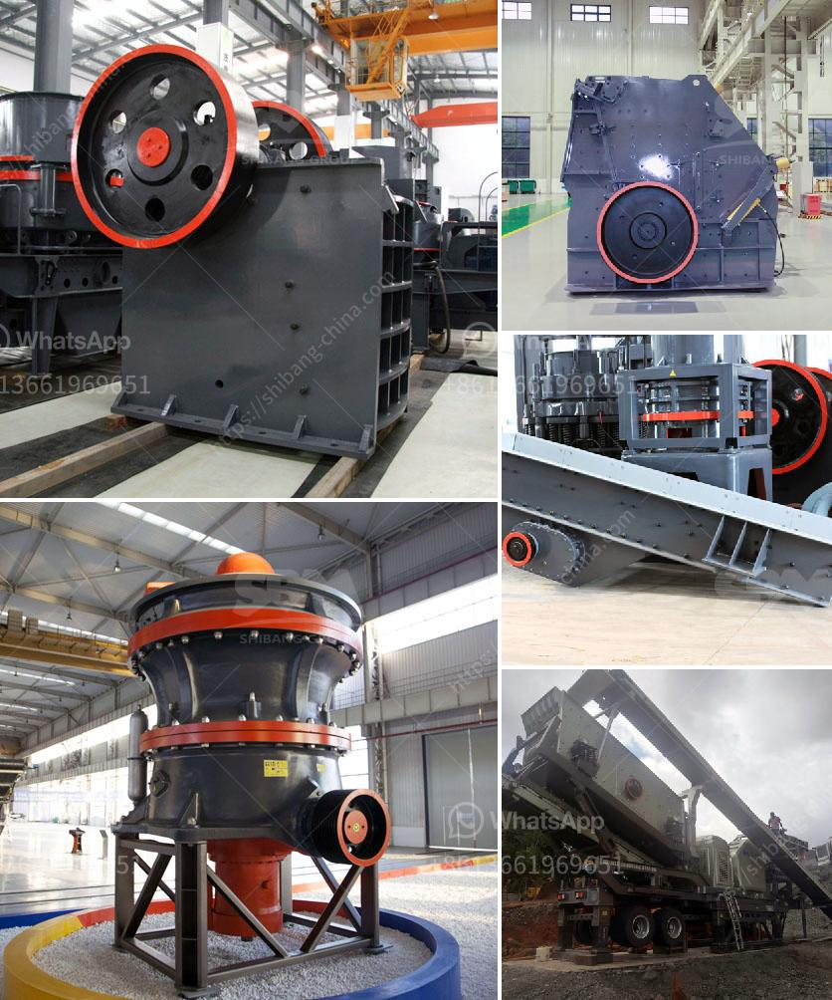

<h3>آلة غسيل الذهب</h3>
تعتبر آلة غسيل الذهب أحد الأدوات الهامة التي تستخدم في صناعة التعدين لفصل الذهب عن خامه. تستخدم هذه الآلة في عملية غسل الرمال والحصى لاستخراج معدن الذهب منها.

تعمل آلة غسيل الذهب عن طريق قوة الضغط المائية، حيث يتم ضخ الماء بقوة عالية داخل الآلة لغسل الحصى والرمال المحملة بالذهب. تتمثل العملية في تحريك المواد المتواجدة داخل الآلة بواسطة حركة دورانية للأسطوانة. يقوم الماء بغسل الأتربة والطمي المتراكم على الحصى والرمال، في حين أن الذهب الثقيل يكون متماسكًا بالحصى.

تعتمد آلات غسيل الذهب على عدة عوامل لضمان نجاح عملية الفصل. إحدى هذه العوامل هي حجم ونوع الرمال والحصى المستخدمة في العملية. فعلى سبيل المثال، تعتمد عملية الفصل على حجم الحصى؛ حيث يتم استخدام آلات ذات حجم أكبر لفصل الحصى الكبير وآلات أصغر للحصى الصغير.

كما يؤثر نوع الحصى في عملية الفصل، فبعض الأنواع تحتوي على نسبة عالية من الذهب بينما تحتوي الأنواع الأخرى على نسبة أقل. وبناءً على ذلك، تختار آلة الغسيل المناسبة لهذه العملية.

يمتاز استخدام آلة غسيل الذهب بعدة فوائد، فهي تعمل بسرعة ودقة، كما أنها تساهم في توفير الوقت والجهد المبذول في عملية فصل الذهب يدويًا. كما أنها تساهم في زيادة كفاءة الإنتاج وتقليل نسبة الفشل في عملية الفصل.

من الجدير بالذكر أن استخدام آلة غسيل الذهب يتطلب الالتزام بالقوانين والتشريعات المحلية المتعلقة بالتعدين والحفاظ على البيئة. فمن المهم اتباع الممارسات السليمة للتعدين والتنقيب عن الذهب لضمان سلامة البيئة والمحافظة على الموارد الطبيعية.

باختصار، آلة غسيل الذهب هي أداة حديثة وفعالة في صناعة التعدين تستخدم لفصل الذهب عن الرمال والحصى. تعتمد العملية على قوة الضغط المائية لغسل المواد المحملة بالذهب وتحريكها داخل الآلة. يتم اختيار آلة الغسيل المناسبة حسب حجم ونوع الحصى المستخدم. استخدام هذه الآلة يساهم في زيادة كفاءة الإنتاج وتوفير الوقت والجهد، بالإضافة إلى تقليل الأخطاء في عملية الفصل. ومن المهم الالتزام بالقوانين والممارسات البيئية للحفاظ على البيئة والموارد الطبيعية.
<h3>Contact us</h3><ul><li><strong>Whatsapp:&nbsp;<a href="https://wa.me/8613661969651">+8613661969651</a></strong></li><li><a href="https://swt.shibang-china.com/?git&amp;zhl&amp;آلة غسيل الذهب"><strong>Online Service(chat now)</strong></a></li></ul><h3>Related</h3><ul><li><a href='البوكسيت من مصانع الأسمنت في الهند.md'>البوكسيت من مصانع الأسمنت في الهند</a></li><li><a href='كيفية تصميم كسارة الحجر.md'>كيفية تصميم كسارة الحجر</a></li><li><a href='موردين طاحونة الفحم.md'>موردين طاحونة الفحم</a></li><li><a href='أكبر معدات تحسين خام الحديد في الصين.md'>أكبر معدات تحسين خام الحديد في الصين</a></li><li><a href='كسارة تعدين الحجر الجيري في فيتنام.md'>كسارة تعدين الحجر الجيري في فيتنام</a></li></ul>