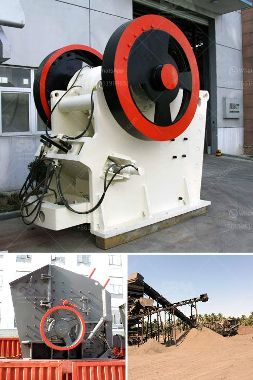

<h3>آلة غسيل الرمال للبيع</h3>
آلة غسيل الرمال للبيع هي آلة تستخدم لغسل وتنظيف الرمال الموجودة في الأنهار، والبحيرات، والبحار، والمحاجر. تُستخدم هذه الآلة في العديد من الصناعات مثل البناء والمشاريع الهندسية، حيث يتطلب استخدام الرمل النظيف عالي الجودة.

تتألف آلة غسيل الرمال صومعة التغذية وشاشة الرمل وعجلة القيادة وناقل الرمل وشفرات التنظيف ومضخة الماء ومرجع الغسيل. تتمثل وظيفة الآلة في غسل الرمل وفصله عن الشوائب والطمي والأوساخ الأخرى التي قد تكون موجودة في الرمال.

يُعد اختيار آلة غسيل الرمال المناسبة مهمة حيث يجب أن تكون الآلة فعالة من حيث استهلاك المياه والطاقة وأن تكون مزودة بميزات تضمن الحصول على رمل نظيف وعالي الجودة. تختلف الآلات في سعة الإنتاج والسرعة وكذلك في استهلاك الطاقة والماء.

تجدر الإشارة أيضًا إلى أن السوق يوفر العديد من النماذج والعلامات التجارية لآلات غسيل الرمال. ولذلك، من المهم أن يقوم المشترون المحتملون بالبحث والاستفسار قبل شراء الآلة المناسبة. ينبغي التحقق من صلاحية وجودة الآلة من خلال قراءة التقييمات والمراجعات عبر الإنترنت، والتعرف على العلامات التجارية الموثوقة ومقارنة الأسعار والمواصفات.

من المهم أيضًا أن يتم الحصول على آلة غسيل الرمال من موردين موثوقين وذوي خبرة، حيث يضمن ذلك الحصول على منتج ذو جودة عالية وخدمة ما بعد البيع الممتازة.

بالإضافة إلى ذلك، يجب على المشترون أن يأخذوا في الاعتبار احتياجاتهم الخاصة والميزانية المخصصة لشراء الآلة. إذا كانت الاحتياجات كبيرة، فقد يكون من المناسب استثمار في آلة غسيل الرمال ذات السعة العالية والقوة الإنتاجية الكبيرة.

في الختام، آلة غسيل الرمال للبيع هي آلة مهمة في العديد من الصناعات ومشاريع البناء. يجب على المشترون البحث عن الآلة المناسبة والاستعانة بموردين موثوقين ومتخصصين لضمان الحصول على منتج ذو جودة وأداء عالي.
<h3>Contact us</h3><ul><li><strong>Whatsapp:&nbsp;<a href="https://wa.me/8613661969651">+8613661969651</a></strong></li><li><a href="https://swt.shibang-china.com/?git&amp;zhl&amp;آلة غسيل الرمال للبيع"><strong>Online Service(chat now)</strong></a></li></ul><h3>Related</h3><ul><li><a href='سعر آلة صنع الرمل الاصطناعي.md'>سعر آلة صنع الرمل الاصطناعي</a></li><li><a href='مصنع سحق وطحن.md'>مصنع سحق وطحن</a></li><li><a href='كيفية إعداد شركة محجر حجر.md'>كيفية إعداد شركة محجر حجر</a></li><li><a href='مورد مصنع الكسارة.md'>مورد مصنع الكسارة</a></li><li><a href='آلة طحن السلاغ الفرن العالي في الهند.md'>آلة طحن السلاغ الفرن العالي في الهند</a></li></ul>