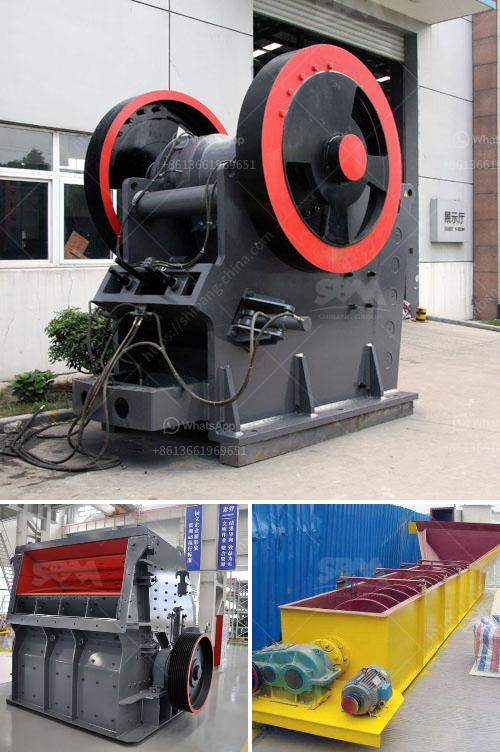

<h3>آلة غسيل الرمال</h3>
تعد آلة غسيل الرمال أحد الأجهزة المهمة في صناعة البناء والمعدات الهندسية. تستخدم هذه الآلة لفصل الشوائب والمواد الضارة عن الرمال والحصى، مما يؤدي إلى الحصول على رمال ناعمة ذات جودة عالية تلائم استخدامها في البناء والإنشاء.

تعمل آلة غسيل الرمال عن طريق تغذية مواد الرمال إلى الغربال الاهتزازي، الذي يقوم بفصل الشوائب الكبيرة عن الرمال والحصى. بعد ذلك، تتم إضافة الماء إلى الغربال الاهتزازي لغسل الرمال وفصل الشوائب الدقيقة عنها. يتم تنظيف الرمال تحت ضغط المياه المناسب، مما يزيل الرواسب العضوية والشوائب الكيميائية والمواد الأخرى التي قد تكون موجودة في الرمال.

تمتاز آلة غسيل الرمال بفعاليتها وكفاءتها في تنقية الرمل وتحسين جودته. فهي تزيل الأتربة والطمي والشوائب الأخرى، مما يحسن خواص الرمال ويزيد من قدرتها على الالتصاق والتماسك. بالإضافة إلى ذلك، يتم تقليل محتوى الخمور والمواد العضوية الأخرى بفضل عملية الغسيل، مما يعزز استخدام الرمل في صناعات متنوعة مثل صناعة الزجاج والإسمنت والمواد الكيميائية.

تحظى آلة غسيل الرمال بشعبية كبيرة في السوق بسبب فوائدها العديدة. فالرمل المُغسول يمتاز بملمس ناعم ونظافة طبيعية، مما يسهل استخدامه في العديد من التطبيقات. كما أنها تساهم في توفير الماء وتقليل استهلاكه بشكل كبير، حيث يتم إعادة استخدام المياه المستخدمة في عملية الغسيل للمزيد من الدورات.

باختصار، تعتبر آلة غسيل الرمال من الأجهزة الأساسية في صناعة البناء، حيث تساهم في تحسين جودة الرمال وتجهيزها للاستخدامات المختلفة. إن تطبيقاتها المتعددة وفوائدها العديدة تجعلها اختيار العديد من الشركات والمصانع في جميع أنحاء العالم، مما يسهم في تحقيق التنمية المستدامة في صناعة البناء والهندسة.
<h3>Contact us</h3><ul><li><strong>Whatsapp:&nbsp;<a href="https://wa.me/8613661969651">+8613661969651</a></strong></li><li><a href="https://swt.shibang-china.com/?git&amp;zhl&amp;آلة غسيل الرمال"><strong>Online Service(chat now)</strong></a></li></ul><h3>Related</h3><ul><li><a href='أسعار كسارة الحجر بسعة 500 طن في الساعة.md'>أسعار كسارة الحجر بسعة 500 طن في الساعة</a></li><li><a href='صنع مسحوق الكالسيوم.md'>صنع مسحوق الكالسيوم</a></li><li><a href='أنظمة ناقلات الحصى للمسافة.md'>أنظمة ناقلات الحصى للمسافة</a></li><li><a href='آلة صنع المسحوق في جنوب أفريقيا.md'>آلة صنع المسحوق في جنوب أفريقيا</a></li><li><a href='عملية سحق الكسارة.md'>عملية سحق الكسارة</a></li></ul>