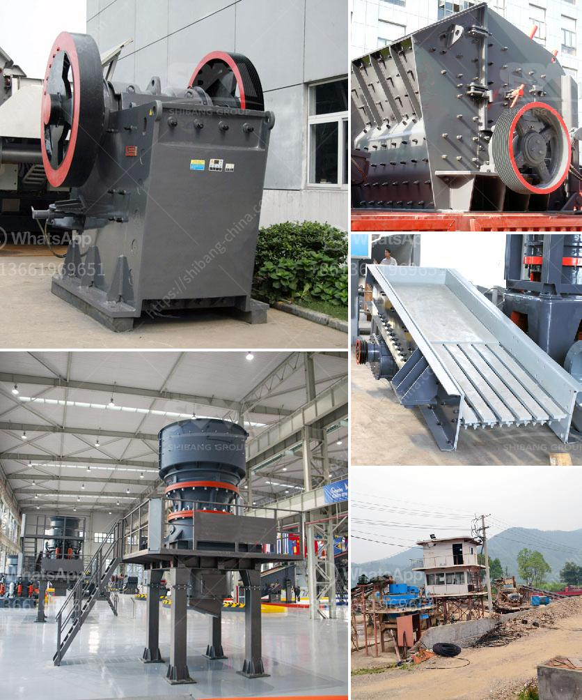

<h3>آلة غسيل الرمل السيليكا في جنوب أفريقيا</h3>
تعد آلة غسيل الرمل السيليكا معدة مهمة في قطاع التعدين في جنوب أفريقيا. تُستخدم هذه الآلة لفصل الرمال السيليكا عن المواد الأخرى الموجودة فيها، مما يسهم في تحسين جودة الرمل المنتج واستخدامه في الصناعات المختلفة.

تعتبر الرمال السيليكا من المواد الخام الهامة في الصناعة، إذ تستخدم في صناعة الزجاج، والسيراميك، والخرسانة، وصناعة الإلكترونيات، والمنتجات الكيميائية ، وغيرها. ولكن، قد يحتوي الرمل السيليكا على شوائب مثل الأتربة والأوساخ والمعادن الثقيلة. لذلك ، يتم استخدام آلة غسيل الرمل السيليكا لإزالة هذه الشوائب وتصفيتها.

تتكون آلة غسيل الرمل السيليكا من أجزاء رئيسية تشمل الحوض والمكبس والسلة الناقلة. يتم وضع الرمال في الحوض، الذي يحتوي على ماء ومواد كيميائية خاصة للتنظيف. ثم يتم تفعيل المكبس الذي يقوم بدفع الماء والمواد الكيميائية مع الرمال عبر الفتحات الموجودة في الحوض، وبالتالي يتم فصل أي شوائب عن الرمال. تنتقل الرمال النظيفة في السلة الناقلة ويتم تصريف الماء الملوث.

تمتلك جنوب أفريقيا احتياطيًا كبيرًا من الرمل السيليكا، وهو ما يجعل استخدام آلة غسيل الرمل السيليكا ضروريًا في المناجم لخلق منتجات عالية الجودة. وتلتزم الشركات المعدنية العاملة في جنوب أفريقيا بتطبيق أعلى المعايير الصناعية والبيئية في استخراج ومعالجة الرمال السيليكا، وذلك للحفاظ على البيئة وضمان سلامة الموظفين.

باستخدام آلات غسيل الرمل السيليكا في جنوب أفريقيا، تتمكن الشركات المتخصصة في التعدين من إنتاج رمل سيليكا نقي وعالي الجودة. وهذا يساهم في تلبية احتياجات الصناعة المحلية والعالمية وتعزيز الاقتصاد. كما يُعزز استخدام آلات غسيل الرمل السيليكا في جنوب أفريقيا التنمية المستدامة والحفاظ على الموارد الطبيعية.

باختصار، تعد آلة غسيل الرمل السيليكا في جنوب أفريقيا أداة أساسية في صناعة التعدين، حيث تساهم في تحسين جودة الرمل المنتج واستخدامه في الصناعات المختلفة. تمتلك جنوب أفريقيا احتياطيًا كبيرًا من الرمال السيليكا، وتلتزم الشركات المعدنية بمعايير صارمة للحفاظ على البيئة وضمان جودة المنتجات. ومن خلال استخدام تلك الآلات، يتم تلبية الاحتياجات المحلية والعالمية وتعزيز الاقتصاد والتنمية المستدامة في البلاد.
<h3>Contact us</h3><ul><li><strong>Whatsapp:&nbsp;<a href="https://wa.me/8613661969651">+8613661969651</a></strong></li><li><a href="https://swt.shibang-china.com/?git&amp;zhl&amp;آلة غسيل الرمل السيليكا في جنوب أفريقيا"><strong>Online Service(chat now)</strong></a></li></ul><h3>Related</h3><ul><li><a href='تدريب مطحنة ريموند.md'>تدريب مطحنة ريموند</a></li><li><a href='مصنع غسيل الرمل للبيع.md'>مصنع غسيل الرمل للبيع</a></li><li><a href='خط إنتاج مواد الجص الخام مع التعبئة.md'>خط إنتاج مواد الجص الخام مع التعبئة</a></li><li><a href='كسارة صخور محمولة مستعملة في كندا.md'>كسارة صخور محمولة مستعملة في كندا</a></li><li><a href='كسارات الحجر المحمولة للبيع في جنوب أفريقيا.md'>كسارات الحجر المحمولة للبيع في جنوب أفريقيا</a></li></ul>