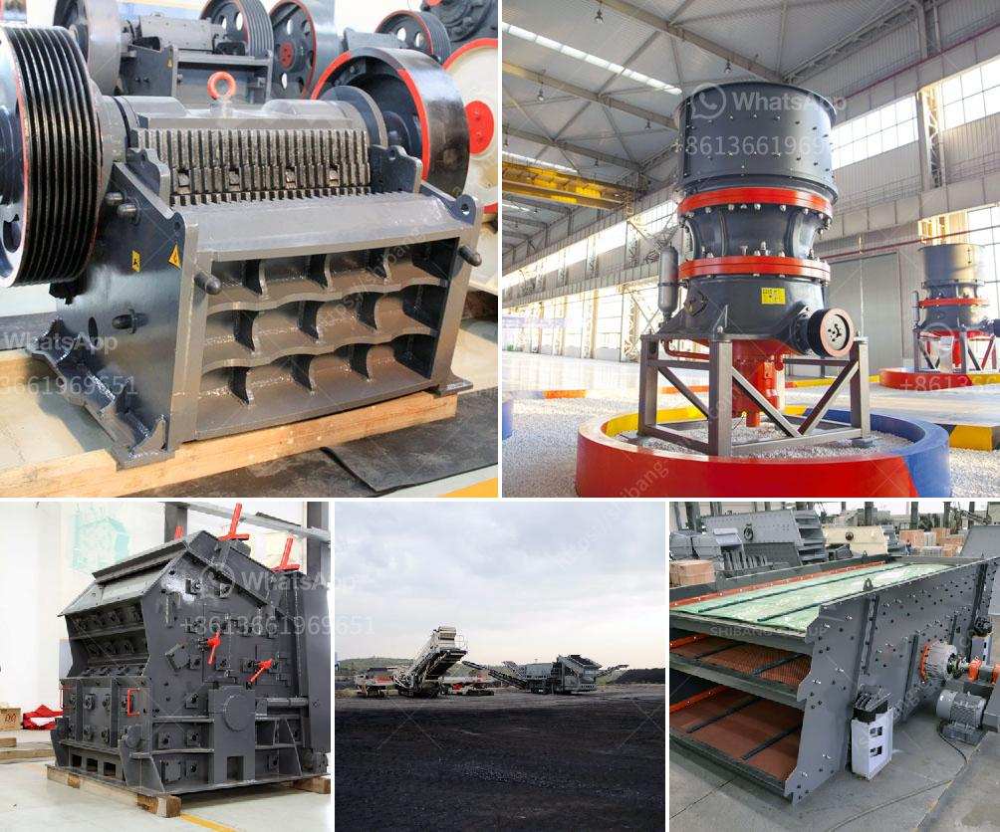

<h3>آلة غسيل الرمل في المملكة العربية السعودية</h3>
تعتبر آلة غسيل الرمل من الأدوات الحديثة التي تستخدم في المملكة العربية السعودية في عمليات تنظيف وغسل الرمال. تعتبر الرمال من الموارد الطبيعية الهامة وتستخدم في العديد من الصناعات مثل البناء والإنشاءات والزراعة. ومع ذلك، قد تتأثر جودة الرمل بشوائب مثل الأتربة والطمي والأجسام الغريبة الأخرى.

تعمل آلة غسيل الرمل على إزالة هذه الشوائب وتحسين جودة الرمل، وبالتالي تعزز استدامة استخدام الموارد الطبيعية. تعمل الآلة عن طريق تغطية الرمال بالماء وتحريكها بشكل متكرر للتخلص من الشوائب. بعد ذلك، يتم تصفية الرمال لإزالة الماء الزائد والشوائب المتبقية الأخرى. يتم ضبط عملية الغسيل وفقًا لنوع الرمل والشوائب الموجودة به.

من فوائد استخدام آلة غسيل الرمل في المملكة العربية السعودية هو تحسين جودة الرمال المستخدمة في صناعات البناء والإنشاءات. فالرمل النظيف يعزز القوة والمتانة للمواد الإنشائية مثل الخرسانة والأسمنت. كما أنه يسهم في تحسين جودة التربة المستخدمة في الزراعة ويزيد من إنتاجية المحاصيل.

بالإضافة إلى ذلك، تعمل آلة غسيل الرمل على تقليل تلوث البيئة وتحسين صحة الأفراد. فقد يحتوي الرمل الملوث على مواد ضارة مثل الكائنات الحية الدقيقة والكيماويات الضارة، والتي يمكن أن تؤثر سلبًا على الصحة العامة عندما يتم تعريضها للبيئة أو الإنسان. بواسطة غسيل الرمال، يتم التخلص من هذه المواد الضارة وتنقية الرمال منها.

في الختام، آلة غسيل الرمل تعد أداة مهمة في المملكة العربية السعودية لتحسين جودة الرمال والحفاظ على البيئة الصحية. يجب استخدامها بشكل منتظم في صناعات البناء والزراعة وغيرها للتأكد من جودة ونقاء الرمال المستخدمة. ينصح المشترين بالبحث عن الشركات الموثوقة التي توفر آلات غسيل الرمل ذات الجودة العالية وكفاءة الأداء.
<h3>Contact us</h3><ul><li><strong>Whatsapp:&nbsp;<a href="https://wa.me/8613661969651">+8613661969651</a></strong></li><li><a href="https://swt.shibang-china.com/?git&amp;zhl&amp;آلة غسيل الرمل في المملكة العربية السعودية"><strong>Online Service(chat now)</strong></a></li></ul><h3>Related</h3><ul><li><a href='شاشات الفحم المتنقلة.md'>شاشات الفحم المتنقلة</a></li><li><a href='مكاتب CAD لمعدات التعدين.md'>مكاتب CAD لمعدات التعدين</a></li><li><a href='قائمة مصانع الأسمنت في نيبال.md'>قائمة مصانع الأسمنت في نيبال</a></li><li><a href='خطة عمل كاملة لمصنع تكسير الحجارة.md'>خطة عمل كاملة لمصنع تكسير الحجارة</a></li><li><a href='كسارة الحجر ومصنع المحجر في بنجلاديش.md'>كسارة الحجر ومصنع المحجر في بنجلاديش</a></li></ul>